## 总线

> 总线重点部分  

    总线判优控制  

    1. 链式查询  

    2. 计数器定时查询  

    3. 独立请求  

    总线通信控制  

    1. 同步通信  

    2. 异步通信
         不互锁  
         半互锁  
         全互锁  

    3. 半同步通信  

    4. 分离式通信  

### 总线的基本概念

#### 为什么要用总线  
在冯丶诺依曼的计算机体系结构中，将计算机分为运算器，控制器，存储器，输入输出设备  

只有将这些硬件设备都连接起来，这些部件才能组成计算机的硬件系统,能够协调的进行工作。

将这些部件连接起来，可以采用分散连接的方式  
> 将需要通讯的两个部件，用线连接起来  

    当两个设备之间需要连接的线假设需要100条，同时需要与n个设备连接，那么就需要 `n(n-1)/2` 条线  
    将这些线都制造到印刷电路板上，成本非常高，难度也非常大。  
    同时设备之间连接的接口需要占用大量的空间  

这种连接方式也导致了一个致命的问题：
* 硬件系统无法拓展
* 必须在硬件设备制造之前就预料到以后会用到多少接口

为了解决这个问题，就引入了总线  

#### 什么是总线
总线是连接各个部件的信息传输线，是**各个部件共享的传输介质**
> 在任何时刻，只能有一对设备或一对部件使用总线  
其他设备要是想使用总线，只能等待正在使用总线的这对设备释放总线使用权

#### 总线上信息的传输

串行通信  
> 数据在单条1位宽的传输线上，一位一位的按顺序分时传送  

并行通信  
> 数据在多条并行1位宽的传输线上，同时由源传送到目的地  

    并行方式需要多条数据线进行传输，如果传输距离比较长，数据线平行传输，线和线之间会产生干扰  

所以通常情况下  
**并行传输的距离都比较短，可以集中在计算机机箱的内部**  
**串行传输的距离都比较长，可以在机器与机器之间或者机器与更远的设备之间进行传输**  

*串行可以采用低压差分信号，可以大大提高它的抗干扰性，所以可以实现更高的传输速率，尽管并行一次传多个数据位，但是时钟远远低于串行，所以目前串行传输是高速传输的首选*

#### 总线结构的计算机举例

1. 单总线结构框图

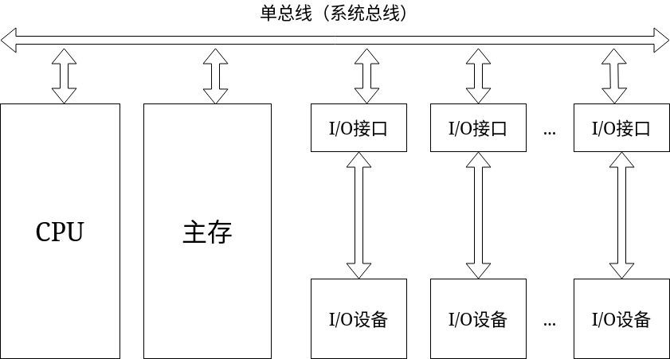

* 如果一个I/O设备通过I/O接口与主存进行传输，那么CPU和主存就无法通过这条系统总线进行数据传输，CPU所运行的程序就会停止，严重影响CPU的运行效率  
* 如果I/O设备很多，那么这条系统总线就会很长，就会导致主存或CPU向远端的I/O设备进行传输数据，会产生延迟。同一时刻只能有一对设备使用总线，就会产生总线的征用

2. 面向CPU的双总线结构框图

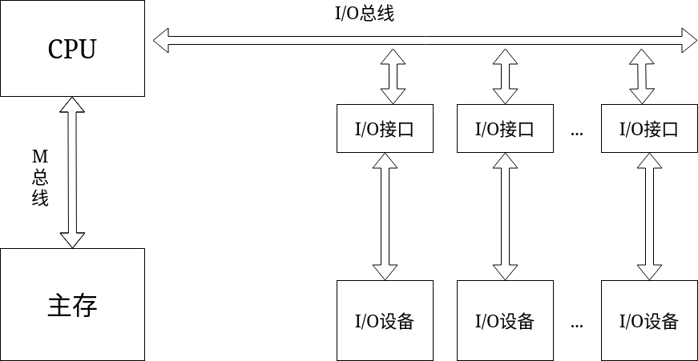

* CPU和主存之间的信息交换是非常繁忙的，所以在CPU和主存之间增加一条总线
* 主存和外部设备之间进行信息传输时，由于它们之间没有数据通路，所以这些数据需要经过CPU进行处理，CPU还是会被打断

3. 以存储器为中心的双总线结构框图

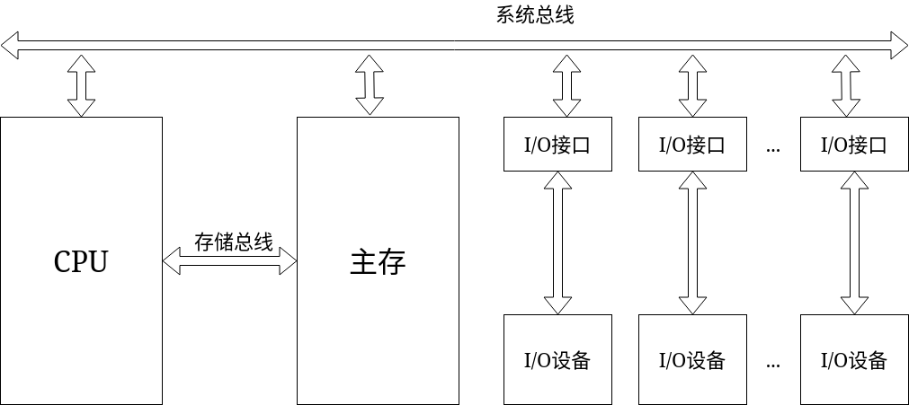

* 通常情况下，系统总线和存储总线不能同时工作，以为现代的RAM虽然是双口的，但是双口的存储器给两个端口送数据时，使用的是分时来操作的

### 总线的分类

1. 片内总线  
> 芯片内部的总线

2. 系统总线  
> 计算机各部件之间的信息传输线  

     数据总线
        双向与机器字长、存储字长有关
     地址总线
        单向与存储地址、I/O地址有关
     控制总线
        有出：存储器读、存储器写、总线允许、中断确认  
        有入：中断请求、总线请求

3. 通信总线
> 用于计算机之间或计算机系统与其他系统之间的通信

    串行通信总线
    并行通信总线

### 总线特性及性能指标

总线被印刷到主板上，然后在总线上留出一些接口，计算机系统的其他部件或者模块就通过这些接口连接在总线或者主板上，为了实现这些部件和总线的有效连接，总线就需要一些特性  

特性：  
1. 机械特性  
     > 尺寸、形状、管脚数、排列顺序  
     部件需要与总线的这些机械特性相匹配，才能连接在一起

2. 电气特性  
    > 信号的传输方向和有效的电平范围  
    数据总线是双向的、地址总线是单向的，只能从CPU发出，传到内存或I/O设备  
    假设高电平表示1,低电平表示0。那么什么电压范围表示1,什么电压范围表示0

3. 功能特性  
    > 每根传输线的功能，即每根线上传输的信号到底是什么信号

4. 时间特性  
    > 信号之间的时序关系

性能指标：  

1. 总线宽度  
    > 数据线的根数

2. 标准传输率  
    > 每秒传输的最大字节数（MBps）

3. 时钟同步/异步  
    > 同步、不同步

4. 总线复用  
    > 地址线与数据线复用  

        例如8086,20条地址线其中16条同时也作为数据线  
        在进行数据传输时，CPU先给出地址，然后对地址进行锁存，之后再利用20根地址线当中的16条数据线进行数据传输

    > 通常管脚的数量对芯片的体积影响非常大  
    复用的目的是减少芯片的管脚数，管脚数减少，芯片的封装体积也相对的减少  

5. 信号线数  
    > 地址线、数据线和控制线的总和

6. 总线的控制方式  
    > 突发、自动、仲裁、逻辑、计数

7. 其他指标  
    > 负载能力

### 总线标准

现在的计算机越来越复杂，生产、设计、制造也越来越专业化，生产商单独生产某一个部件。将不同生产商生产的部件集成在一起，成为一个计算机硬件系统。要想完成这个集成，大家在生产设计不同部件时，需要有一个约定。遵守这个约定，这些部件就能组成一个协调运行的计算机硬件系统。

### 多总线结构

1. 双总线结构  

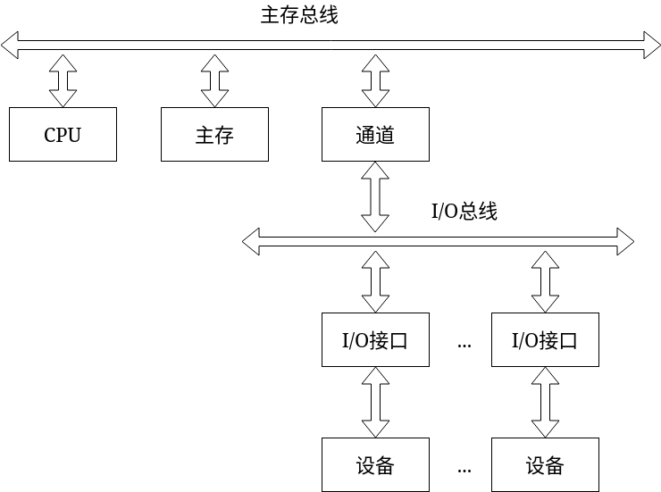

> 
    将存储总线和I/O总线进行分离  
    存储总线只连接CPU和存储器  
    I/O总线上连接各种I/O设备
    中间通过通道连接主存总线和I/O总线，实现I/O设备和主存储器、I/O设备和CPU之间的通信

    其中通道是具有特殊功能、结构简单的处理器，专门用于输入输出操作，由通道对I/O统一管理  
    一般来说，通道有自己的控制器、有自己指令统、能够执行简单的指令，执行通道程序  
    其中通道程序是由操作系统来编写的

2. 三总线结构

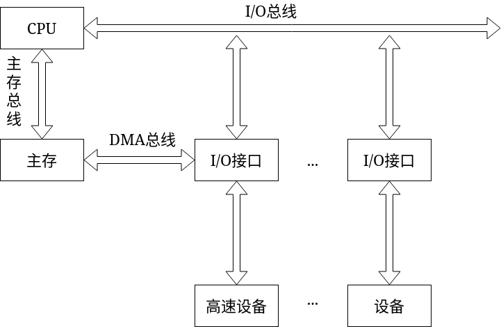

> 
    DMA 直接存储器访问

    CPU为中心，其中高速外部设备如果想要与主存进行信息交换，可以通过DMA总线来高速的进行，而不需要通过I/O总线，通过CPU来进行。但是低速设备与主存进行数据交换，则还是需要走I/O总线。

3. 三总线结构的由一形式

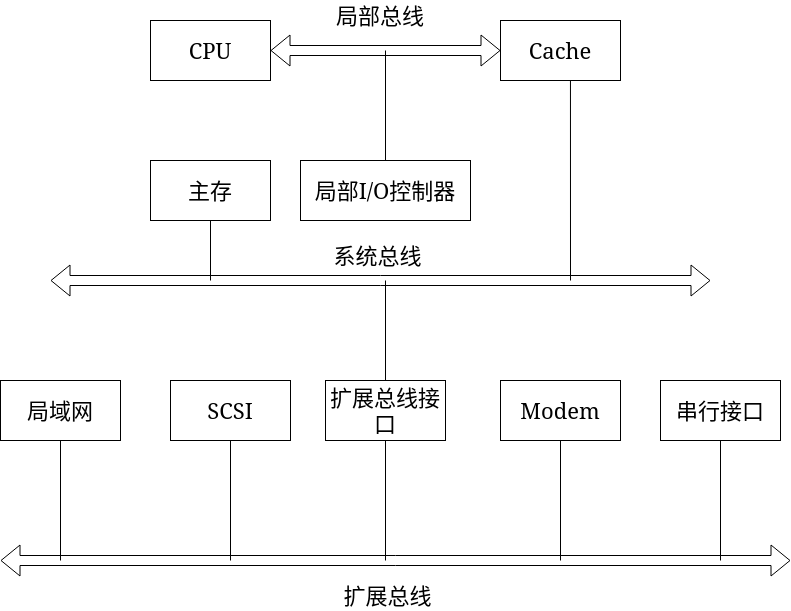

> 
    局部I/O控制器用于连接高速的局部设备

    其中扩展总线用于连接外部设备，通过扩展总线接口将外部设备的数据传输到系统总线

**多种速度类型的外部设备都连接到扩展总线，会影响高速外部设备的工作速度**

4. 四总线结构

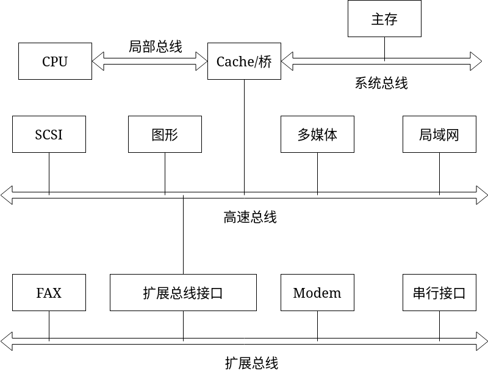

> 
    CPU和主存通过局部总线和系统总线并经过Cache/桥进行数据交换

    Cache/桥：Cache缓存和桥电路

    桥电路扩展出了高速总线，高速设备都可以连接到高速总线上

    低速设备通过扩展总线接口连接到扩展总线上

多层PCI总线结构

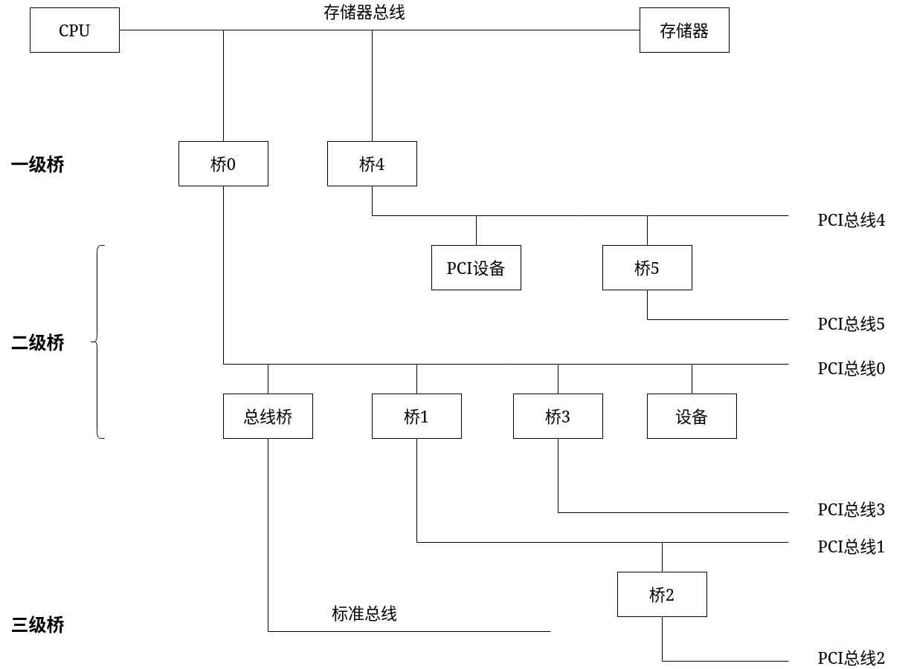

> 
    总线之间的桥
    也可以说是总线转换器，实现各类微处理器总线到PCI总线、各类标准总线到PCI总线的连接，并允许它们之间互相通信。因此，桥的两端必有一端与PCI总线连接，另一端可连接不同的微处理器或标准总线。
    桥内部包含一些相当复杂的兼容协议的单元电路，也可以与内存控制器或外设控制器包装在一起。
    实现这些总线桥接功能的是一组大规模集成专用电路，称之为PCI总线芯片组（Chiplet）或PCI总线组件

### 总线判优控制

基本概念

* 主设备（模块）  
    > 对总线有控制权

* 从设备（模块）  
    > 响应从主设备发来的总线命令

* 总线判优控制  
    * 集中式  
        * 链式查询
        * 计数器定时查询
        * 独立请求方式
        > 将总线的判优逻辑做在一个部件上
    * 分布式
        > 将总线判优逻辑分布做在各个设备或设备的端口上

1. 链式查询方式

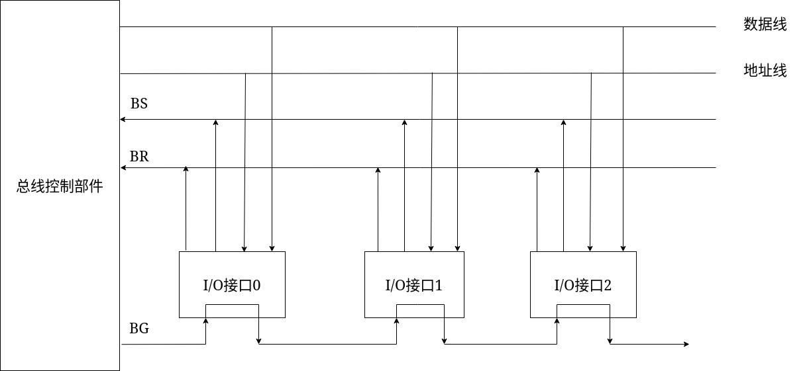
> BS 总线忙  
BR 总线请求  
BG 总线同意  

数据总线
* 用于信息交换过程中信息的传输  

地址总线
* 主设备占用了总线之后，要和从设备进行数据传输，就需要地址总线找到需要通信的从设备

BR  
* 所有设备都通过BR发出总线占用请求

BS  
* 如果某个设备占用了总线的控制权，那么就通过BS来通知其他部件，总线忙

BG  
>  由于BR只有一根线，所以当多个设备同时向BR发出总线控制请求时，总线控制部件不知道是谁发出的，同时也不知道多个部件同时请求时，应该给谁  
此时通过BG,当BR有信号时，不管是谁发出，通过BG发出总线同意信号  
这时BG的信号会先到达接口0,但是接口0并没有向BR发出信号，所以接口0不会向BS发出信号，同时BG信号接着向下  
当到达了接口1,由于接口1发出了BR信号，同时接口1收到了BG信号，所以接口1向BS发出信号，并不将BG信号再向下传输
此时接口2虽然有向BR发出信号，但是没有收到BG信号，所以不会向BS发出信号

通过BG的传输特性，可以知道当多个设备同时向BR发出信号时，这些设备对总线的控制优先级是通过BG的传输顺序来决定的，也就是在BG线上，谁更靠前，谁的优先级就越高

**这种总线控制结构的优点是结构非常简单，并且增删设备很简单，同时在进行可靠性设计时，比较容易实现，比如将BG的线数增加为两条，但是缺点是对电路故障特别敏感，尤其是BG的那条线，在向下传送的过程当中，当中间设备接口出现故障，那么BG的信号就无法向下传输，也就意味着此故障设备接口之后的设备都无法接收到BG信号。同时速度也比较慢，因为BG是顺序向下查询**

所以这种结构一般用于简单计算机或嵌入式当中

2. 计数器定时查询方式

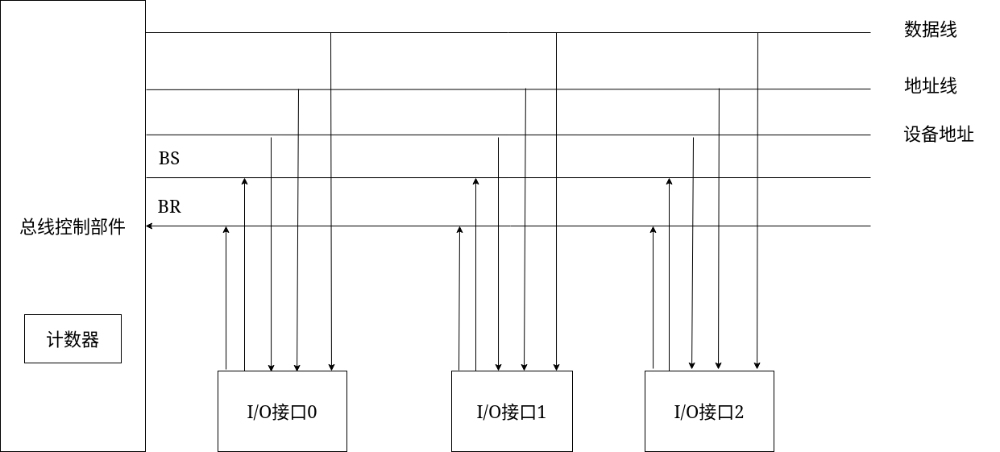

相比于链式查询方式，减少了BG,增加了设备地址线

设备地址线是用于计数器来查找设备的

> 假设接口1和接口2同时向BR发出总线占用请求，此时总线控制部件的计数器初始值假设为0,那么总线控制部件就会通过设备地址线，向接口0发出信号，此时接口0因为没有向BR发出请求，所以不会向BS发出信号。接着计数器+1,向接口1发出信号，因为接口1向BR发出信号，所以接口1向BS发出信号，当总线控制部件受到BS的信号，就会停止计数器继续+1

优点  
* 优先级确定非常灵活  
    > 可以通过软件，对计数器的初始值进行控制，进而改变优先级

缺点  
* 对于链式查询方式，计数器定时查询需要增加一些线，用于表示设备地址  
    > 需要增加$\log_2 n$，向上取整个设备地址线  
    n为设备数

3. 独立请求方式

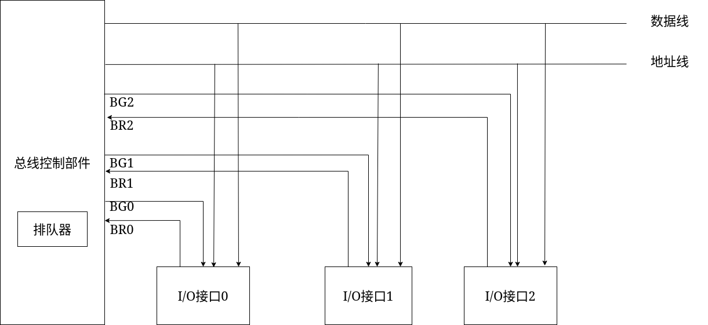

此结构，每个设备接口都有一根BR和BG  
哪一个BG有效，相应的接口就占用了总线的使用权  

总线的优先级是由总线控制部件内部的排队器来决定的，因此优先级的确定很灵活

虽然独立请求方式的速度非常快，但是需要的总线数却很多  
> 总线数需要2n+2,BR和BG+数据线和地址线  
n为设备数

### 总线通信控制

主设备在获得总线的使用权后,需要和从设备进行信息交换  
总线通信控制就是用来解决通信双方协调配合通信的问题

总线的传输周期
> 主设备和从设备之间，完成一次完整的并且可靠的通讯需要的时间

* 申请分配阶段  
    > `主模块申请`，总线仲裁决定

* 寻址阶段  
    > 主模块向从模块`给出地址`和`命令` 
    主设备通过地址找到从设备，并通过命令控制从设备完成相应的操作

* 数据传输阶段  
    > 主模块和从模块`交换数据`

* 结束阶段  
    > 主模块`撤销有关信息`  
    同时从模块也撤销有关信息

总线通信的四种方式
* 同步通信  
    > 由统一的、定宽、定距的时标来控制数据传送  
    每一个操作、每一个信号的给出，都是在固定的时间点由固定的时标进行控制

* 异步通信  
    > 采用应答方式，没有公共时钟标准  
    主设备发出请求，从设备给出应答信号，之后再进行信息传输

* 半同步通信  
    > 同步和异步结合  
    主要解决不同速度的两个模块或两个设备之间通讯的问题

* 分离式通信  
    > 充分挖掘系统总线每个瞬间的潜力，发挥系统总线最大的效能

#### 同步式数据输入

同步式传输需要一个定宽定距的时标来控制整个数据的传输过程

CPU采用同步式数据输入，从外部设备进行数据输入

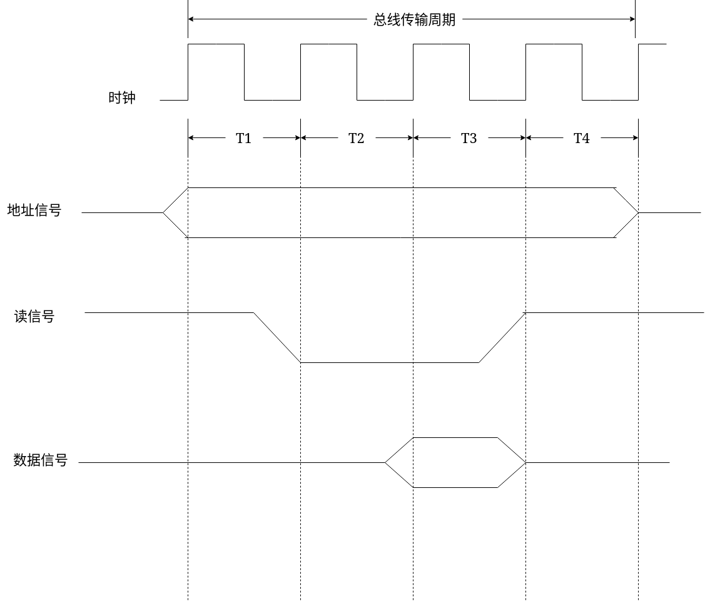

整个总线周期由四个时钟周期组成，这四个时钟周期可以完成一次完整的、可靠的数据传输  

除了时钟信号之外，CPU还需要地址信号和读信号，另外从设备在给定的时间点上要给出数据的输出，对CPU来说是数据的输入

同步式的特点是在固定的时间点上要给出固定的操作

1. 在T1时钟的上升沿，必须要给出地址信号  
    > 此地址信号是主设备给出的  
    由于地址信号是主设备传输到地址总线上的，地址也是数据，所以地址总线上是0和1,也就是图中变化的部分，高电压表示1,低电压表示0

2. 在T2时钟周期的上升沿，必须给出读命令信号  
    > 告诉从设备，主设备要从从模块或从设备读入数据  
    由于读命令只是一个控制命令，不需要那么多数据，所以一位就够了，这里低电压0表示读命令

3. 在T3时钟周期的上升沿到达之前，从设备必须要通过数据总线给出数据信号  
    > 这里信号的表示和地址信号一样，都是数据

4. 在T4时钟周期的上升沿，数据信号和控制信号就可以撤销  
    > 撤销也就是将这个总线上的信号变为初始状态

5. 在T4时钟周期结束时，也就是总线传输周期结束，地址信号也撤销  
    > 最后总线上都变为一开始的状态

**同步式传输，所有的从模块都用同一个时标进行控制，要在同一个时限当中完成规定的操作，主从模块是强制同步的，所以对多个速度不同的模块，就必须要选择速度最慢的模块作为统一的时标。这就导致即使有些设备速度比较快，也需要按照速度慢的设备的速度进行数据的传输**

所以这种同步方式，适用于总线长度较短，模块存取时间较一致的情况下使用
> 同步方式对任何两个设备之间的通信都给予同样的时间安排。就总线长度来说，必须按距离最长的两个设备的传输延迟来设计公共时钟。但是总线长了势必降低传输频率

#### 异步通信

主设备发起这次总线的通讯，从设备受主设备的控制。  
与同步方式相比，没有定宽定距的时标。但是增加了两条线：  
* 请求线  
    > 由主设备发出请求信号用

* 应答线  
    > 从设备对主设备发出的请求进行应答

1. 不互锁  

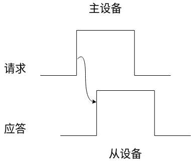

主设备发出通信请求，从设备接收到主设备的通信请求之后，进行应答  
之后主设备撤销请求信号，从设备也撤销应答信号

**在这个过程中，主设备不管是否接收到了应答信号，经过一定的延时之后，都会撤销请求信号。从设备也不管主设备是否接收到了应答信号，过一段时间之后都会撤销应答信号**

2. 半互锁

从设备接收到这个请求之后，发出应答信号。主设备接收到应答信号之后，再撤销请求信号。如果接收不到这个应答信号，那么将会一直保持请求信号。  
但是从设备发出应答信号之后，不管主设备是否接收到了应答信息，过一段时间之后都会撤销应答信号

**半互锁可能会造成请求信号一直保持高电平。因为主设备没有收到应答信号，而从设备过一段时间又关闭了应答信号的发送，则主设备始终处于高电平状态**

3. 全互锁

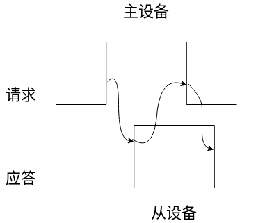

主设备发出请求，从设备接收到这个请求之后发出应答信号。主设备接收到应答信号之后，主设备才会撤销请求信号。只有主设备的请求信号撤销之后，从设备才会撤销自己的应答信号

**这种全互锁可以完成可靠的数据传输**

#### 半同步通信

同步和异步的结合

同步  
* 发送方用系统时钟前沿发信号  
* 接收方用系统时钟后沿判断、识别

异步  
* 允许不同速度的模块协调工作
* 为了调整主从设备速度的差异，增加了一条”等待“响应信号 `WAIT`，这个`WAIT`由从设备给出

以输入数据为例

T1时钟周期的上升沿，主模块发出地址  
T2时钟周期的上升沿，主模块发出命令  
> 就是读信号

> 在正常情况下，在T3的上升沿到来之前，从模块要能够提供出数据，并且把数据放到数据总线上。主模块开始在数据总线上接收数据

> 如果主模块和从模块之间速度不一致，例如主模块是CPU,从模块是存储器，CPU的存储速度比存储器的存储速度快。在T3时钟到来之前，从模块无法向主模块提供数据。如果在同步中，就会出错。  
所以在T3到来之前，从模块就会发出`WAIT`信号，低电平有效。主模块检测`WAIT`这条信号线，如果检测到`WAIT`是低电平，主设备就会插入Tw这么一个周期，等待数据的到来  
在下一个时钟周期到来之前，主模块还会检测`WAIT`信号是否为低电平，如果还是低电平，那么主模块还会等待一个时钟周期  
知道在某一个时钟周期到来之前，主模块发现`WAIT`信号上已经变成了高电平，从模块已经准备好发送数据，此时进入T3周期

Tw 当`WAIT`为低电平时，等待一个T  
Tw 当`WAIT`为低电平时，等待一个T  
.  
.  
.

T3时钟周期的上升沿，从模块提供数据  
T4时钟周期的上升沿，从模块撤销数据，主模块撤销命令  
T4时钟周期结束时，主模块撤销地址

#### 分离式通信

其它三种通信的共同点  
一个总线传输周期（以输入数据为例）  
* 主模块发地址、命令
    > 占用总线

* 从模块准备数据  
    > 不占用总线  
    总线空闲

* 从模块向主模块发数据  
    > 占用总线

总线上连接了多个模块或设备，总线是系统的瓶颈。总线在数据传输这段时间或总线传输周期当中，有空闲对于总线资源是一种浪费

因此分离是通信就是将这个空闲时间利用起来

一个总线的传输周期：  
* 子周期1  
    > 主设备发出地址，发出命令，占用总线。地址和命令发送以后，主设备和总线的连接断开。  
    主模块申请占用总线，使用完后即放弃总线

* 子周期2  
    > 从设备准备好了接受或发送数据，从模块申请占用总线，将各种信息送至总线上  
    此时从模块已经从从模块变成了主模块

**通过这两个周期，就将之前总线传输周期的中间部分的总线使用权让出来，即设备或模块准备数据的过程**

举例：  
一个硬盘挂在通道上，在执行程序的过程当中，需要从硬盘读数据或程序  
这就需要对硬盘分定位的三步操作  
1. 寻找指定的磁道  

2. 寻找指定的扇区

3. 之后才能开始读数据

此时如果使用半同步的方式，通道发出磁盘的读操作，一直到读完，大部分的时间总线都处于等待状态，等到磁头找到指定的磁道，等到磁头转到指定的扇区，才能开始进行通信

当使用分离式通信，通道发出定位命令之后，通道与总线断开，不再占用总线。硬盘的控制器控制磁盘完成定位操作。完成定位操作之后，变成主设备向通道发出请求。通道再次发出找扇区的请求，找扇区的操作结束之后。硬盘控制器再次向通道提出请求，通道再让它进行数据传输。

**分离式通信特点**  
1. 各模块有权申请占用总线
2. 采用同步方式通信，不等对方回答  
    > 在主模块发送地址和命令时，是通过同步方式  
    发送地址占用一个时钟周期，控制命令占用一个时钟周期
3. 各模块准备数据时，不占用总线
4. 总线被占用时，无空闲
