# 输入输出系统

## 接口

为什么要设置接口  

1. 实现设备的选择  
    > 计算机采用总线的方式，来进行外部设备与系统主机之间的连接  
    外部设备需要地址，主机通过地址来确认这次与哪个设备进行数据传输  

2. 实现数据缓冲达到速度匹配  
    > 外部设备类型多样，工作速度差异也非常大  
    有的速度非常快，如硬盘  
    有的速度非常慢，如键盘  
    需要接口的数据缓冲，将速度慢的设备的数据缓存到数据缓冲区  

3. 实现数据串——并格式转换  
    > 接口和主机之间采用并行传输，一次传输一个字节或一个字  
    外部设备和接口之间可能会采用串行传输  
    数据要在接口当中完成组装或拆解，做格式转换  

4. 实现电平转换  
    > 主机和I/O设备工作的电平不一致  
    通过I/O接口完成电平的转换，使主机和I/O设备能够协调的工作

5. 传送控制命令  
    > CPU将控制命令传输到接口当中  
    由这个命令来控制外部设备进行工作  

6. 反映设备的状态（“忙”、“就绪”、“中断请求”）  
    > 接口当中要有一些状态标志  

**为了完成这些功能，就需要在主机和外部设备之间加上接口**  
> 这些功能也决定了接口硬件的结构  

### 接口的组成

#### 接口与外部设备的连接

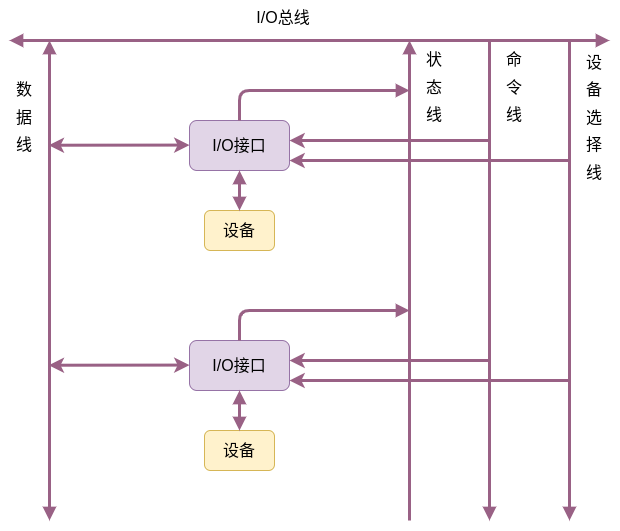  

1. 设备选择线  
    > 传输参与本次信息交换的设备的设备码或端口号  
    实际上就是设备的地址或端口的地址  
    这个地址传输给I/O接口，在I/O接口当中进行匹配，看是否是这个接口上连接的某个设备要参与这次数据传输  

2. 数据线  
    > 完成数据的输入和输出  
    条数与接口的类型有关  

3. 命令线  
    > 来自主机的命令，通过命令线输入到I/O接口当中  
    命令经过缓冲和译码之后，可以控制设备做相应的输入或者输出操作  

4. 状态线  
    > 将I/O设备的状态通过I/O总线送到主机，让主机了解I/O设备的工作状态

#### 接口的功能和组成

|功能|组成|
|----|----|
|选址功能|设备选择电路|
|传送命令功能|命令寄存器、命令译码器|
|传送数据功能|数据缓冲寄存器|
|反映设备状态的功能|设备状态标记|

**需要反应设备的哪些状态**  
* 完成触发器D  
    > 用于标记设备是否准备好，数据是否准备好  
* 工作触发器B  
    > 用来表示外部设备的工作状态是否忙  
* 中断请求触发器INTR  
    > 设备准备好以后，主动的向主机提出中断请求  
    > 因此接口当中需要有中断请求触发器  
* 屏蔽触发器  
    > 如果屏蔽触发器等于1，表示尽管设备已经完成了工作，依然不能向主机或CPU发出中断请求  

#### I/O接口的基本组成

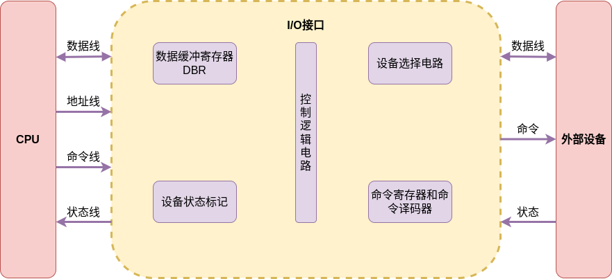  

**设备选择电路**  
> 确定是否是某一个设备要参与给定的输入或输出操作  

**命令寄存器和命令译码器**  
> 确认本次操作是输入操作、输出操作还是其他类型的操作  

**数据缓冲寄存器（DBR）**  
> 用于缓存输入的数据或输出的数据  

**系统状态标记**  
> 由一系列的触发器来完成  

**控制逻辑电路**  
> 四大部分电路要协调的按时序进行工作，就需要控制  

接口的一端连接外部设备，另一端连接CPU  
地址线给出外部设备的地址，供设备选择电路使用  
命令线给出操作命令，放在命令寄存器当中进行锁存，进而进行译码  
状态是外部设备的状态，将外部设备的状态输入到I/O接口，对状态标记进行置位或复位

**在时序电路的控制下，给出各个操作以及操作之间的时序关系**  

## 程序查询方式

### 查询流程

**单个设备**  

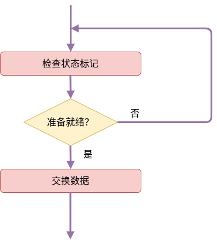  

如果在传输过程当中，只有一个设备参与内存和I/O之间数据的传输  
在执行程序当中，CPU会执行到一个输入输出指令，由这个输入输出指令发出启动设备的命令  
相应的设备接收到这个命令之后，就开始进行数据准备，数据准备好之后再传输给CPU  

**CPU在发出设备启动命令之后，就开始检查状态标记，看I/O接口当中的数据是否已经准备好进行输入和输出。如果准备就绪，就进行数据交换。如果没有准备就绪，CPU就处于一种踏步状态，通过循环的方式检查状态标记，直到设备准备好，开始交换数据为止**  

此过程当中需要使用3条指令：  
1. 负责检查状态标记，主要是一条测试指令  
2. 负责检查设备是否准备就绪，就需要一条转移指令或分支指令  
3. 交换数据使用的是数据传送指令或输入输出指令会访存指令  

**多个设备**  

如果有多个设备都要通过程序查询方式与CPU、内存进行数据交换  
那么就需要将参与传输的这些设备，根据它的优先级、根据轻重缓急，对它进行排序  
优先级越高的设备，被查询到的时间就越早  

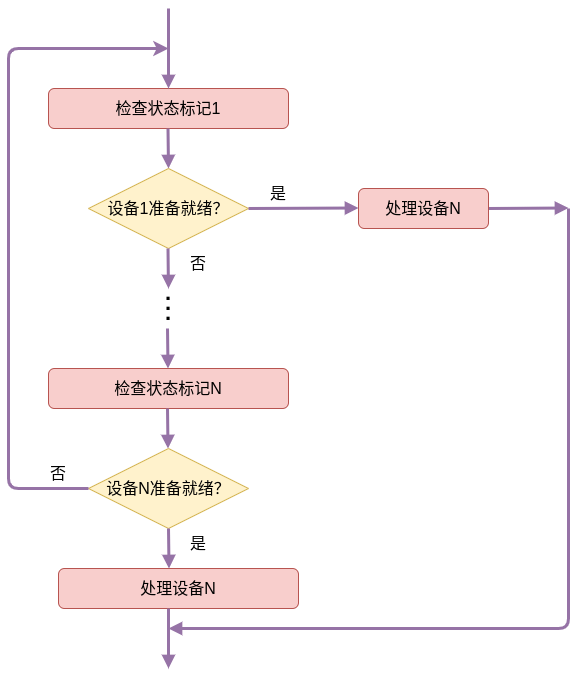  

此图中，设备1的优先级最高，CPU检查设备1的状态标记，看它是否已经准备就绪。如果准备就绪，就处理设备1和内存之间的信息交换。如果没有准备就绪，就会检查次优先级的设备。按照优先级的顺序，逐步向后进行检查，完成数据的数据输出。  

### 程序流程

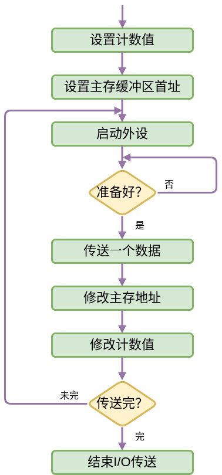  

首先需要保存寄存器的内容，因为程序查询方式要完成内存和外部设备之间的数据输入输出，需要借助CPU中的某一个寄存器，对数据进行暂存  
如果这个寄存器中的数据是有用的，就需要对这个寄存器当中的数据进行保存  
可以将它存入堆栈当中或者放入内存的其它闲置的内存单元当中  

保存了这个值之后就需要设置计数器的值，设置计数器的值的目的是为了控制传输的数据量。此次内存和I/O之间到底传输多大量的数据，计数值的设置有两种方式：  
* 如果要传输N个字，就将计数器的值设置成N，每完成一个字的传输，计数值的值就减1，直到减到0为止就完成了数据的传输。  
* 将计数器的值设置成-N，并且负数用补码来表示。每传输一个字，就对计数器的值加1，直到计数器发生溢出，计数器当中的值变成0，数据传输才会结束  

设置了计数值之后，为了完成内存和I/O之间数据的传输，就需要知道内存的这个块的起始地址是什么，所以就需要设置主存缓冲区的地址。保存数据或读取数据，就从这个缓冲区的起始地址或者首地址开始。  

在设置计数器的值和设置主存缓冲区首址都完之后，就可以启动外部设备，让外部设备进行准备和数据传输  

启动设备之后，因为是程序查询方式，CPU开始查询I/O接口的状态或者设备的状态。如果没准备好，CPU就通过原地踏步的方式反复的进行查询。一直到状态标志表明数据已经准备好，查询操作才会停止。开始进行数据传输，传送一个字。  

这个字传送完之后，前面设置的一些初始值，就需要进行修改。例如，内存的地址需要进行加1或减1，为输入或输出下一个数据做准备。同时，为了表明还有多少数据需要进行传输，计数器的值也要进行修改，进行加1或减1。  

然后通过计数值来判断这批数据是否已经传输完了，如果没有传输完，CPU需要再一次启动外设，循环进行这个过程。直到数据传输完，就结束这个I/O传输

> 程序员编写一个程序，要用程序查询方式来完成数据的输入输出  
在他的应用程序中，就需要将这个程序流程嵌入进去，由这段程序来完成数据的输入和输出操作  

### 程序查询方式的接口电路

由设备选择电路来确定一个设备是否就是参加这次传输的设备  
设备选择电路给出的`SEL`设备选择信号，实际上是整个I/O接口电路的选择信号，只有这个选择信号是有效的，这个I/O接口电路才是有效的  

如果`SEL` 信号有效，并且启动命令有效，I/O接口就会开始工作。  

**以输入为例**  

将外部设备当中的数据，输入到内存的某一个存储单元当中  

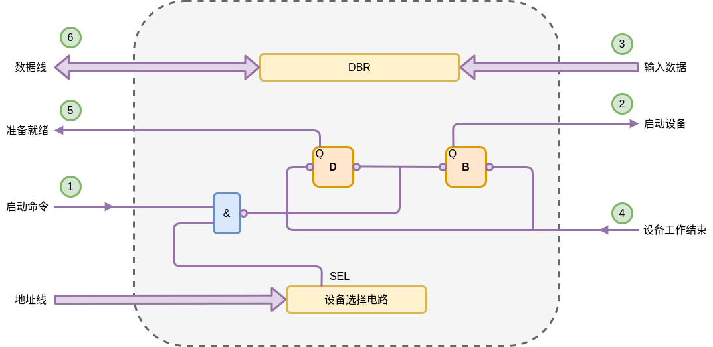  

CPU通过地址线给出外部设备的地址  
设备选择电路将自己的设备地址或者端口号，和地址线上的地址进行比较。如果相同，说明这次启动的就是连接在这个接口电路上的设备。`SEL` 信号会有效。  

启动命令和`SEL` 都有效的前提下，对两个状态标记进行置位或复位。  
到目前为止，设备还没开始工作，因此标记`D` 应该为0，表示数据还没有准备好。标记`B` 应该被置为1，表示设备需要开始工作，此后设备应处于忙的状态。  

设备接收到`B` 的标记信号以及启动命令之后，设备开始工作  

设备将数据准备好，并通过输入数据线将数据保存到`DBR` 数据缓冲当中  

此时，设备的工作结束。设备会通过设备的状态线，向接口送入设备工作结束信号。这个信号会修改接口电路当中的两个标记  
此时标记`D` 被修改为1，表示数据已经准备好，也就是准备就绪信号  
同时标记`B` 被修改为0，表示设备工作完成，不是忙状态  

最后，准备就绪信号被送出，CPU通过数据线，将`DBR` 中的数据读入  

**在整个过程当中，一直到信号D变为1之前，CPU都在原地踏步的进行查询，查询的信号就是D，看D是否为1。只要D不为1，CPU就会一直查询下去**  

## 程序中断方式

### 中断的概念

CPU在执行程序的过程当中，如果发生意外事件或特殊事件，**CPU需要中断当前程序的处理或当前程序的执行，转而去执行这个特殊事件或异常事件**。  
通过执行中断服务程序的方式来处理，**处理结束之后，需要返回到被中断的程序的程序断点，继续去执行原来的程序**  
这个过程就称为中断

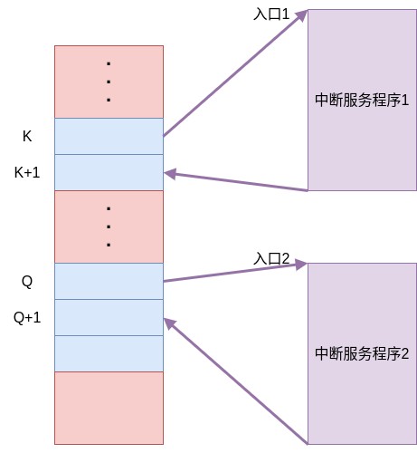  

假设图中的就是主程序，CPU在执行主程序的过程中，假设执行到了第`K`条指令，此时某一个外部设备需要向主存输入数据，外部设备就会通过中断请求线向CPU发出中断请求，CPU在执行完第`K`条指令之后，会去查询有没有中断请求  
如果有，能不能进行响应  
如果可以响应，CPU就会中断现行程序的执行，此时需要将程序的断点保存起来。因为中断服务执行完之后，返回需要知道从哪里开始继续执行指令。同时也要保存一些寄存器当中的值  

以上都做完之后，就会去执行中断服务程序  
中断服务程序执行结束，就会根据保存的程序断点，程序的控制流就会回到第`K+1`条指令  
接着继续向下执行

在执行主程序的过程当中，如果执行到了第`Q` 条指令，外部设备又发出了中断请求，CPU还要去执行中断服务程序  
中断服务程序1和中断服务程序2可能会不同  
执行完中断服务程序2之后，返回到`Q+1` 条指令，继续向下执行

### I/O中断的产生

中断都是由中断源产生的

中断源  
> 在主机的外部、内部，CPU的外部、内部能够引发CPU发生中断的因素  

以打印机的打印为例  

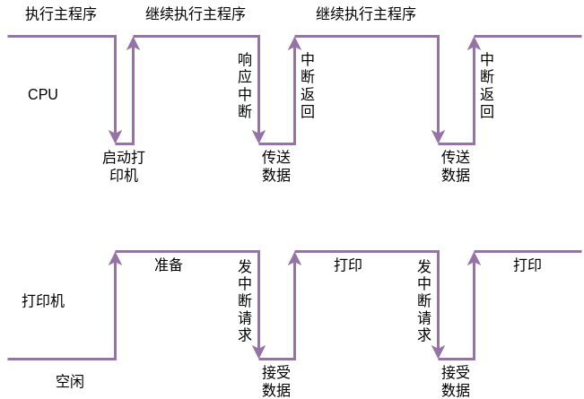  

CPU执行主程序的过程当中，假如有一条打印命令  
CPU通过打印命令来启动打印机  
打印机开始进行打印前的准备，CPU继续执行原来的程序  
打印机准备好之后，可以进行数据的接收和数据的打印，打印机会向CPU发出中断请求  
CPU响应这个中断请求，执行一个中断服务程序，向打印机传送数据，打印机再接收数据  
传送数据结束之后，CPU中断返回，继续执行原来的主程序  
打印机将接收到的数据对外进行打印  
打印完之后，打印机的缓冲区空了，还可以接收新的数据。打印机就会向CPU再一次发送中断请求  
CPU响应这个中断请求，CPU和打印机之间再次进行数据的交换  
交换结束，CPU中断返回，继续执行原来的程序。打印机执行打印的操作  

### 程序中断方式的接口电路

#### 配置中断请求触发器和中断屏蔽触发器  

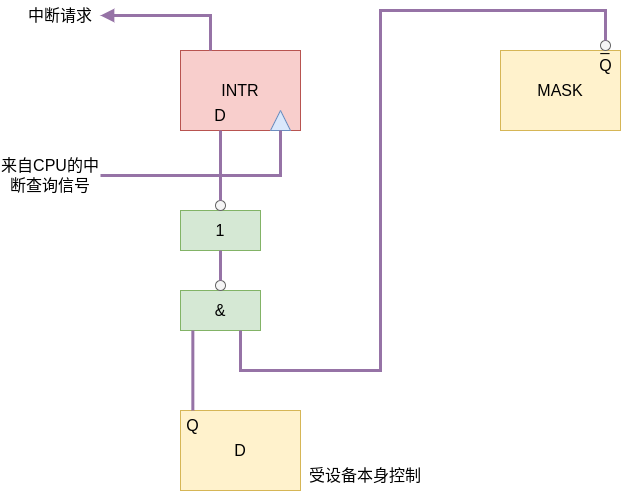  

* INTR （中断请求触发器）  
如果INTR的输出端的值为1，表示有中断请求  
并且通过中断请求线，可以把中断请求送给CPU，通知CPU，外部设备有一个中断请求  

* MASK （中断屏蔽触发器）  
INTR = 1 表示有请求，INTR = 0 表示没有请求  
MASK `Q` 端输出如果是1，表示这个中断会被屏蔽掉  
MASK `Q` 端输出如果是0，表示这个中断不会被屏蔽掉  

要进行数据传输时，数据已经准备好了。I/O接口当中的设备状态标记，应该是工作就绪状态。也就是说当`D` = 1 ，完成触发器等于1，设备已经准备好了数据，并且把数据放到了`DBR` 当中。  
就绪触发器等于1，并且不被屏蔽，MASK 的`Q` 端输出端为0，`Q` 非端的输出就应该是1  
当触发器`D` 的`Q` 端为1，并且 MASK 的`Q` 非端也为1  
中断请求触发器会被设置为1，表示有中断请求  
另外指令执行周期结束之前，CPU会发出中断查询信号。中断查询信号会使 INTR 的输入被送入到输出当中，产生中断请求信号

每一个设备如果采用程序中断方式进行数据传输，接口当中都需要配置中断请求触发器和中断屏蔽触发器

#### 排队器  

如果有多个设备同时发出请求，就需要采用中断排队器，来把优先级最高的中断请求进行排队

通过硬件实现排队  
在CPU内或在接口电路中（链式排队器）  

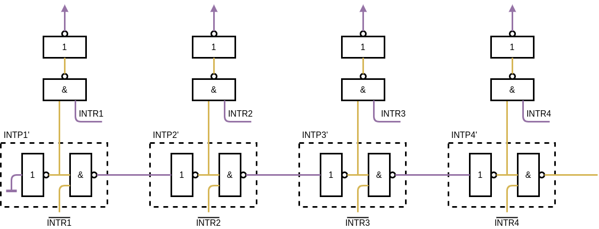  

这个排队器中，输入为中断信号`INTR`的非  
每一个接口的排队线路包含了两个门电路：一个非门、一个与非门  
将这些接口的排队电路相互连接在一起就构成了一个链式排队器  
从设备的优先级来说，越向图的左侧，设备的优先级越高  
所以在现在给出的中断源当中，1、2、3、4 的优先级是按照降序进行排列  

如果所有的中断源都没有中断请求，`INTR`的非值就是1，每一个`INTP'` 的输出都是1  

----

如果某一个设备有中断请求  

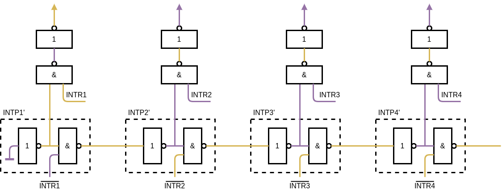  

假设设备1有中断请求，`INTR` 就是1，`INTR非` 就是0  
通过链式排队器1的与非门，将信号1输入给排队器2，排队器2再经过非门转换，将信号1转换为0  
此时排队器2的输出就为0，依次类推，之后的排队器的输出信号都为0  

----

如果有多个设备同时中断请求  

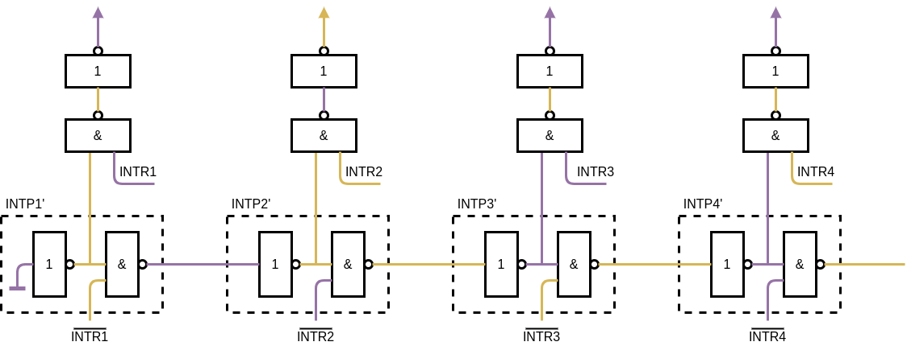  

假设排队器2和排队器4同时发出中断请求  
此时根据与非门的规则，排队器2的输出有效，排队器4的输出无效  
但是由于是从排队器2开始的，所以排队器1的输出依旧为1  
如果需要准确定位优先级高的排队器，就需要再加一些硬件设备来筛选  
这里就用到一个与非门和一个非门，将`INTR` 和`INTP` 进行比较  
最后就通过每个排队器最后得出的信号来确定需要对那个中断请求的设备响应  

#### 中断向量地址形成部件  
当筛选出优先级最高的中断源  
下一步最重要的就是找到中断服务程序的入口地址  

通过硬件方式产生中断服务程序的入口地址  
**硬件向量法**  
由硬件产生向量地址，再由向量地址找到中断服务程序的入口地址  

**中断号**  
是中断的编码，即中断类型码，每个中断类型码对应不同的中断  
通过中断号来寻找对应的中断服务程序  

**中断向量**  
中断向量可以理解为中断服务的程序入口地址  
可以理解为x86中中断服务程序的段地址和偏移量组成的向量  
有时也指程序状态字，比如CPU发生中断时，一些非体系寄存器或表示程序状态的寄存器，这些寄存器指令无法进行读取。在计算机的内部就将其集成成一个字，这个字就称为程序状态字。此时的中断向量实际上就是指和中断服务程序相关的入口地址，包括段地址和偏移量，也包括执行中断服务程序时需要的一些状态信息  

**向量地址**  
就是指中断向量保存的内存单元的地址  
中断服务程序入口地址它所保存的内存单元的地址  
可以利用一条跳转指令把它跳转到中断服务程序，这个跳转指令它在内存中保存的地址就称为向量地址  

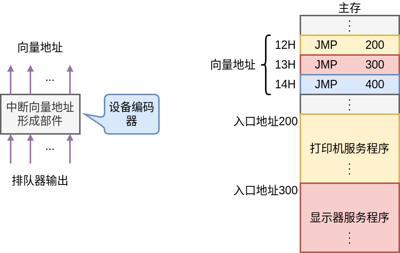  

中断向量地址形成部件的输入：排队器通过筛选高优先级的中断源所组成的输出  

中断向量地址形成部件的输出：向量地址  

向量地址指定了中断向量在内存中所保存的地址  

1. 中断向量地址形成部件生成了向量地址为12H  
2. 就会通过数据线将这个向量地址传送给CPU  
3. CPU接收到这个数据，就会去相应的内存地址寻找这条指令  
4. 接着跳转到中断服务程序（打印机服务程序）的入口地址开始执行中断服务程序  

#### 程序中断方式接口电路的基本组成以及I/O中断处理过程  

**CPU响应中断的条件**  
CPU内部有一个允许中断触发器 EINT  
> 用开中断指令将 EINT 置 “1”  
  用关中断指令将 EINT 置 “0” 或硬件 自动恢复位  

**CPU响应中断的时间**  

在每条指令执行阶段结束前  
CPU会通过中断查询信号，把每一个接口当中，有中断请求的接口的中断请求触发器置1  

------

以输入输出为例  

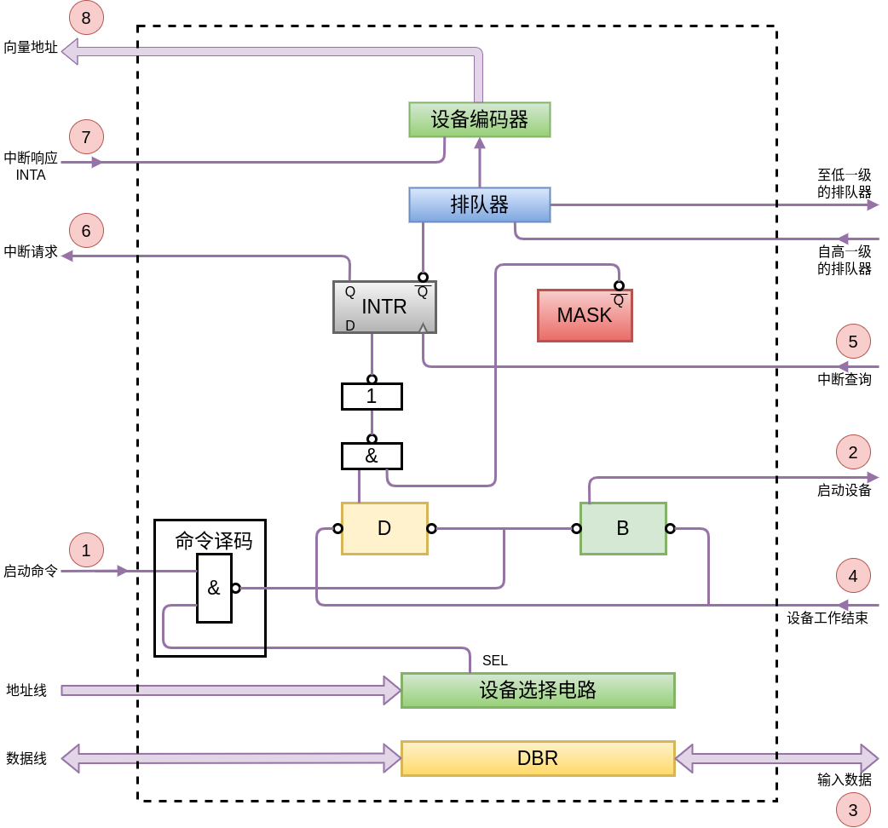  

CPU在执行主程序的过程当中，会执行到一条输入指令，这条输入指令要求指定的外部设备将数据输入到主机当中  

CPU根据这条指令在数据线上给出设备的地址 
设备地址送到接口电路当中之后，利用设备选择电路和设备地址进行比较 
如果相同，这个接口以及相对应的设备就被选中，`SEL` 信号有效 
由CPU送来启动命令或控制命令，这个命令在接口中进行译码 
这个命令和`SEL` 信号同时有效，才会使触发器`B` 和触发器`D` 被设置 
此时，触发器`B` 被设置为1，用于启动设备 
同时，数据还没有准备好，所以触发器`D` 被设置为0 
设备工作结束之后，会将数据送入到接口当中的数据缓冲寄存器（DBR） 
同时根据设备工作结束信号将触发器`B` 和触发器`D` 进行修改 
将触发器`D` 置为1，表示数据准备好，CPU可以随时取走数据 
将触发器`B` 置为0，表示设备处于空闲状态 
如果触发器`MASK` 的非端为1，表示接口提出的中断请求没有被屏蔽 
由于触发器`D` 和触发器`MASK` 的输出都为1 
再经过一个与非门和一个非门之后，信号依然为1 
将这个信号送入触发器`INTR` 的输入端 
CPU在执行指令阶段结束前，会发出中断查询信号 
这个中断查询信号会将接口当中，触发器`INTR` 的值置为1，中断请求信号便送入CPU 
同时启动排队器进行排队，然后输出排队器的输出值 
CPU发出中断响应信号，这个信号发出之后，设备编码器生成的向量地址便会经过数据线传给CPU，传给`PC` 
`PC` 利用这个地址，去取出中断服务程序的入口地址（中断向量） 
最后执行中断服务程序将接口中数据缓冲寄存器的数据取走

### 中断服务程序流程

1. 保护现场  
    * 程序断点保护  
    * 寄存器内容保护  
    > 这部分由硬件来完成，中断隐指令完成  
    中断隐指令本身并不是一条指令，是硬件要自动执行的一系列的操作  
    将其称为中断隐指令，但其不是一条指令  

    > 如果一些通用寄存器或者体系结构寄存器在中断服务程序当中，需要利用到这些寄存器，那么这些寄存器的值也需要保存起来  
    因为中断返回之后，主程序还可能需要这些寄存器的值  
    这些寄存器的值一般在中断服务程序当中，利用进栈指令进行保存  

    > 在保护的过程中，不一定需要使用进栈指令  
      可以将其保存在内存单元的指定位置  
      如果CPU内部有大量的寄存器，也可以将其转存到一些寄存器当中  
      只要能够保存这些数据，使得中断返回之后，还可以恢复这些寄存器的值便可以

2. 中断服务  
    不同设备的中断请求，其中断服务的内容是不一样的  
    也导致不同功能的设备所编写的中断服务程序也是不一样的  

3. 恢复现场  
    如果使用的是进栈指令保存的寄存器值，可以使用出栈指令恢复  
    如果保存在指定内存当中，需要一系列的取数指令，把保存的寄存器的内容进行恢复  

4. 中断返回  
    使用中断返回指令  

#### 单重中断和多重中断

单重中断：  
**不允许中断**现行的**中断服务程序**  

多重中断：  
**允许级别更高** 的中断源**中断** 现行的**中断服务程序**  
> CPU当前执行的程序就是一个中断服务程序  
  但是在执行中断服务程序的过程中，如果来了优先级更高的中断服务请求  
  允许当前正在执行的中断服务程序再一次被中断掉，CPU去处理更紧急的事务  

**单重中断和多重中断的服务程序流程**  

单重  

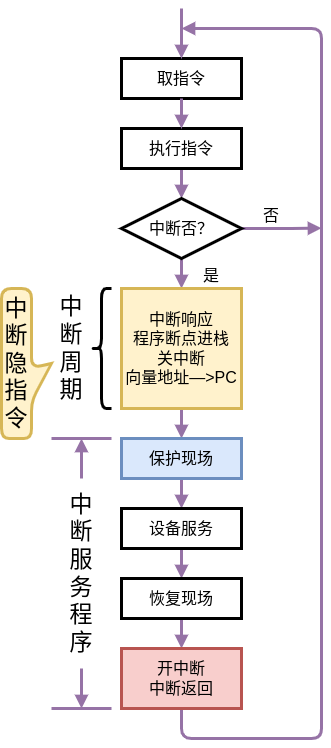  

首先取指令，然后执行指令  
在指令快要执行完之前，查询是否有中断请求  
如果没有中断请求，接着进行取指令和执行指令的操作  
如果在某一条指令执行结束之后，CPU经过查询发现有中断请求  
就需要响应这个中断请求  
从指令周期的角度来看，就进入到了中断周期  
中断周期主要做了三件事：保护断点、形成中断服务程序的入口地址、关中断  
> 中断周期是在一条指令解释的几个阶段当中的一个阶段  
比如说，将一条指令的解释过程分成取指令、形成操作数的地址、取操作数、执行  
执行之后就是中断周期  
保护断点、形成中断服务程序的入口地址、关中断这些操作就是在中断周期当中做的  
这些操作都是由硬件按照一定的时序来完成的，将这个硬件来完成的操作称为中断隐指令  
实际上，中断隐指令并不是一条指令，但是也需要完成一系列的操作，并且操作之间也有一定的先后顺序  

中断周期结束，已经给出了中断服务程序的地址  
进入中断服务程序的执行  
在中断服务程序开始执行时，首先需要保护现场，就是在中断服务程序当中我们要用到的寄存器的值，需要保存起来，压入到栈中  
然后进行设备服务
恢复现场就是一系列的出栈指令
最后的操作非常重要：开中断、中断返回  
> 在中断服务程序执行要结束的时候，要进行中断返回的时候，我们才把中断打开，放EINT的值为1  
在保护现场、设备服务、恢复现场，整个过程当中，中断允许标记（EINT）都为0。在这个过程中，即使有优先级更高的中断请求，CPU也不会去响应

----

多重  

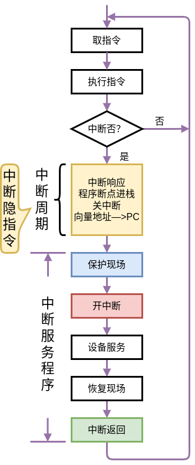  

同样需要取指令，执行指令，判断是否有中断  
如果没有中断请求，接着取指令、执行指令，循环往复  
如果有中断请求，还是需要保护断点、形成中断服务程序的入口地址、关中断  
这些操作也是由中断隐指令完成  
实际上前面这几个操作：取指令、执行指令、中断周期。对应着指令解释过程中的几个阶段  
下面也是进入中断服务程序  
区别就是在中断服务程序执行过程当中
在多重中断当中，为了使在中断服务程序或为设备服务的过程当中，如果有优先级更高的中断请求发生，CPU能够去响应  
这里就把**开中断的位置进行了提前**  
**保护现场之后，马上开中断**  
在设备服务的过程当中，是允许响应优先级更高的中断服务请求的  

----
**主程序和服务程序抢占CPU示意图**  

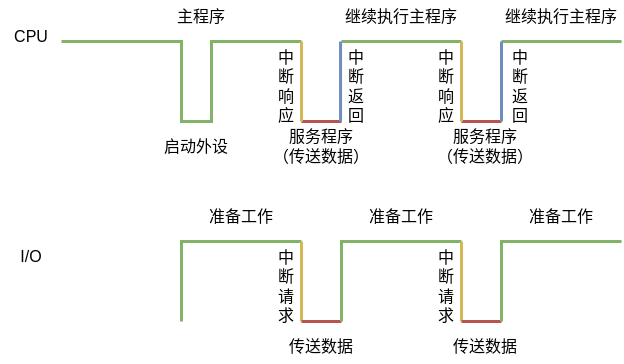  

CPU在执行主程序的过程当中，执行到了一条输入输出指令  
CPU利用这条输入输出指令启动外设  
外部设备接收到了启动的命令，并通过设备选址电路知道这个接口这个设备被选中，外部设备就开始去做准备工作  
CPU发出启动命令之后，在主程序中接着执行下一条指令  
> 这个过程，CPU依然在连续的执行主程序的指令  

当外部设备准备好之后，这个外部设备向CPU发出中断请求  
> 这里能够发出中断请求的条件为 `MASK` 的输出为0，非端输出为1，表示允许这个接口提出中断请求  

在一条指令执行阶段结束的时候，CPU进行中断查询  
如果可以响应，那么CPU就会响应这个中断请求，去执行中断服务程序，来完成数据传送的工作  
> 这里能够中断响应的前提：CPU内部的中断允许触发器（EINT）为1，表示可以响应中断  

数据传送工作结束之后，CPU返回到被中断的主程序继续去执行主程序。  
直到设备下一次把数据准备好，并发出中断请求  
CPU再一次中断主程序的执行，去执行中断服务程序  
> 同样需要 EINT 为1  

----

**宏观上 CPU 和 I/O并行 工作**  
> 这个并行主要体现在设备进行数据准备和状态准备的过程当中，CPU依然在执行主程序  

**微观上 CPU 中断现行程序 为I/O服务**  
> CPU需要中断现行程序的执行，为I/O设备进行服务  
响应了中断请求，CPU就去执行中断服务程序  
这里就断开了主程序的执行  

## DMA方式

### DMA方式的特点

#### DMA和程序中断两种方式的数据通路

对于程序中断方式和程序查询方式，即使做的是内存和外部设备之间进行数据交换，这个信息首先也要经过CPU作为缓冲，再由CPU完成转存的操作  

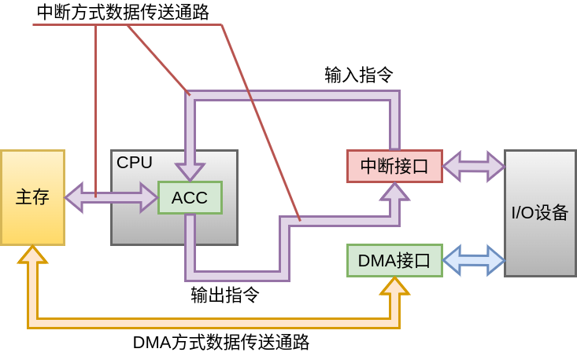  

此图中的中断方式：  
I/O设备的数据想要输入到主存或主存当中的数据想输出到I/O设备时，都必须经过CPU当中的寄存器  
这里指定寄存器为`ACC`  

假设输出操作，主存当中的数据先送入到CPU当中的某个寄存器当中  
再通过输出通路送入到中断接口  
再由中断接口送给I/O设备，由I/O设备完成输出操作  
> 这个过程当中，尽管采用程序中断方式  
外部设备在进行数据准备或状态准备时，不需要CPU的参与。此过程中，CPU和外部设备可以并行工作  
但是，一旦设备的数据或状态准备好了，要真正开始进行数据的输入输出操作  
CPU必须要中断正在执行的主程序或现行程序，来执行中断服务程序  
由中断服务程序来完成数据的输入和输出操作  

**在真正的数据输入或输出时，还是需要CPU的参与，会降低CPU的效率**  

----

DMA方式和程序中断方式和程序查询方式不一样，DMA方式进一步把CPU从数据传送过程当中解放出来，进一步实现了外部设备数据传输的独立性  

采用DMA接口，外部设备和内存之间的数据交换可以通过DMA接口直接进行传送，不需要CPU作为中间媒介进行转存

#### DMA与主存交换数据的三种方式

1. 停止CPU访问主存  
    控制简单  
  > 只要外部设备要和内存进行数据交换  
  在一块数据交换的过程当中，从第一个数据开始  
  CPU就放弃了总线的控制权，放弃了对内存的访问  
  总线的控制权和内存的访问权交给DMA接口  

  所以在控制上说，是比较简单的方式，适合大量的数据进行传输  
  但是这种方式在传输的过程当中，如果在CPU内部的指令缓冲器当中有指令，或指令已经被取入到了cache。CPU还可以继续工作，继续执行指令，只要执行指令的过程当中不访问存储器就行  
  但是如果CPU内部没有指令可以执行，CPU就处于不工作状态或保持当前状态  
  在这种方式当中，并不能充分发挥CPU对主存的利用率  
  > 因为即使是一块数据进行传输，数据也是一个字一个字在外部设备和主存之间进行数据传输。传输的间隔可能会比较大，这个时间会超过一个主存周期  
  虽然DMA接口没有直接使用主存，但是依然占用主存的访问权，CPU不能利用这段时间进行数据传输或访问主存  

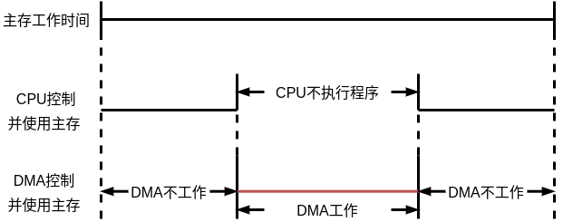  

如果DMA要工作，CPU放弃对主存和总线的控制权，DMA接口控制主存的访问和控制总线的使用权，完成DMA操作  
> 在这个操作过程当中，有很长的一段时间，DMA接口并没有直接使用内存  
没有充分发挥CPU对主存的利用率  

2. 周期挪用（或周期窃取）

这里提到的周期是访存周期  

如果DMA接口准备好了数据传输，就申请建立总线的使用权，占用一个或几个内存访问周期，完成数据的传输  
在数据传输的间隔或数据准备阶段，DMA放弃对内存的使用权，放弃对总线的占用

**DMA访问主存有三种可能**  

* CPU 此时不访存  
  > 存储器的使用权和总线的使用权就直接分配给 DMA  
* CPU 正在访存  
  > DMA 只能等待，不能进行抢占  
* CPU 与 DMA 同时请求访存  
  > 此时 CPU 将总线控制权和内存控制权让给 DMA  
  DMA上连接的都是高速设备，如果不响应，可能会造成数据丢失  

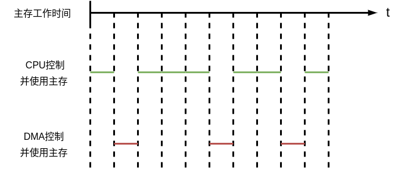  

第一条横线为主存的工作时间  
第二条线是CPU控制总线并且控制主存的时间  
最下面的一条线为DMA控制总线并且使用主存的时间  

数据准备好了，DMA就会窃取一个或几个主存周期完成数据的传输  
在数据的准备过程当中，CPU可以利用这个间隙完成访存操作，使主存储器和总线的利用率变高  

**在现代计算机的结构当中，最影响机器效率和机器速度，就是主存储器**  

**存储墙**  

3. DMA与CPU交替访问  

实用性不是很高  

将CPU的工作周期分为：  
* C1专供DMA访存  
* C2专供CPU访存  

由于在固定的时间点，存储器和I/O总线的使用权是固定的  
所以就不需要提出DMA申请来建立对总线的控制权和内存的使用权  
所以速度会比较快  

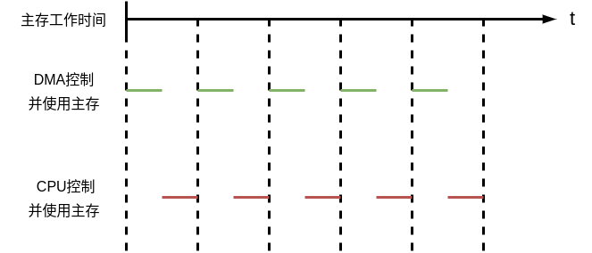  

主存的工作时间被分成若干个工作周期，这个周期就是CPU的工作周期  
工作周期被分为两部分：  
* 前一部分时间供DMA使用，由DMA控制并使用主存  
* 后一部分时间供CPU使用，由CPU控制并使用主存  

过程当中不需要申请、建立、归还总线的使用权  
由时序来直接确定总线和内存的使用权  

### DMA接口的功能和组成

#### DMA接口功能

1. 向CPU申请DMA传送  
2. 处理总线控制权的转交  
3. 管理系统总线、控制数据传送  
4. 确定数据传送的首地址和长度  
   修正传送过程中的数据地址和长度  
5. DMA传送结束时，给出操作完成信号  

#### DMA接口组成

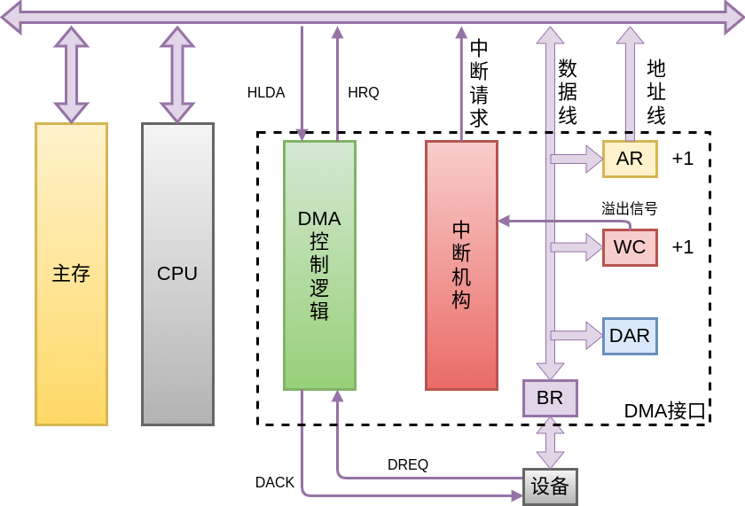  

要进行数据传输，CPU首先要通知DMA接口，传输的地址是什么  
> 也就是在内存的哪个地址进行数据传输  
或输入的数据从内存的哪个地址开始存放  

所以就需要一个地址寄存器`AR`   
需要传输的数据量，就需要一个寄存器`WC` 对传输的数据量进行计数  
> 这个寄存器`WC` 采用补码的方式进行存储  
例如，需要传送N个字，就将`WC` 设置成-N，通过对其+1，加到0停止  

假设我们把数据传入内存或从内存当中进行输出  
是从低地址开始，并且假设每次传输的数据单位和编址单位是相同的  
所以每完成一个数据的输入或输出，就需要对地址寄存器进行修改  
从低地址向高地址，每完成一个输出或输入，就需要给这个地址+1  
同时，也需要对字数寄存器进行+1  

另外还需要数据缓冲器`BR`  
> 外部设备的数据或存储单元当中输出的数据，需要暂存在接口的数据缓冲器当中  

还需要设备地址寄存器`DAR`  
> 供设备选择电路使用，判断此次访问的设备是否为这个接口当前连接的设备，是否由这个DMA接口管理。可以将设备地址保存在这个寄存器当中  
对硬盘这样的设备进行访问时，寄存器`DAR` 还可以用于保存柱面号、磁道号、扇区号等，以供在数据传输时确认传输的数据的地址  

`AR` 通过地址线，将要访问的内存的地址送给主存  
> 这里DMA接口接管了总线、主存  

通过数据线给寄存器`AR` 置值  
> 传输的内存里面的初始地址  

数据的数量也通过数据线进行设置  
设备的地址通过数据线进行设置  
数据的输入输出也通过数据线传输  

外部设备和数据缓冲器直接相连  

输入输出过程需要DMA控制逻辑进行控制  
> 这个控制逻辑需要控制接口内部进行协调的工作  
控制在给定的时序发出给定的信号  
比如向CPU发出DMA请求  
向主存发出读写控制信号  

外部设备如果要进行DMA数据传输，外部设备要向DMA控制逻辑发出请求信号`DREQ` (设备请求的缩写）  
DMA要向CPU发出控制信号，DMA控制器要对设备给出应答信号`DACK`  
同样，要想使用总线，占用主存的控制权。DMA控制器通过总线要向CPU发出总线使用的请求信号`HRQ` ，CPU也可以发出应答信号`HLDA` ，由DMA控制器进行接收。  

在DMA接口电路当中，还有一个中断机构  
> 这个中断机构用于数据传输完以后，对后续的工作进行处理  
计数器`WC` 一但等于0，表示传输结束，就会向中断机构发信号，给中断机构的中断请求触发器置1  
当一条指令执行结束之后，由中断机构向CPU发出中断请求，由CPU做数据传输后的处理

### DMA的工作过程

#### DMA传送过程

传送过程可以分为三部分：预处理、数据传送、后处理  

**预处理**  
在数据进行传输之前，需要做的响应的设置  
通过几条输入输出指令预置如下信息：  
* 设置传输的方向，是从内存到I/O，还是I/O到内存  
* 设置设备地址，就是通过数据线设置DMA接口当中的`DAR` 寄存器  
* 设置主存地址，就是通过数据线设置DMA接口当中的`AR` 寄存器  
* 设置传送字数，就是通过数据线设置DMA接口当中的`WC` 寄存器  

这些工作做完，设备开始准备数据或状态准备。之后才能开始进行数据传输  

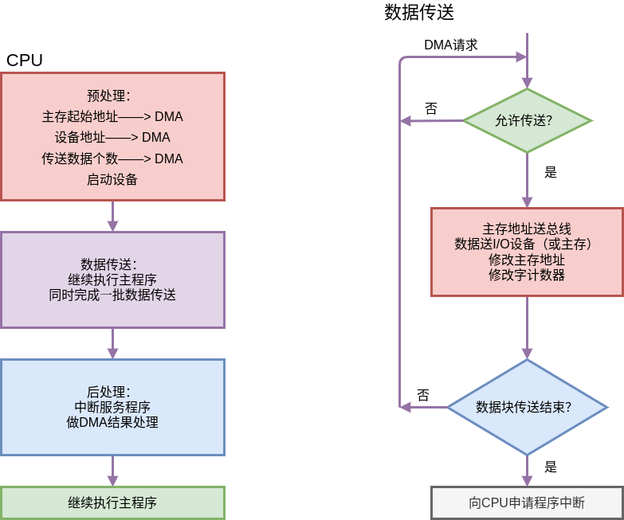  

CPU首先做预处理  
> 主存起始地址、设备地址、传送数据个数、启动设备  
这些都是通过输入输出指令进行设置的  

启动设备之后，CPU继续执行主程序当中输入输出指令后面的那些指令  
> 真正的数据输入输出操作由DMA接口来完成  

DMA接口控制完成一批数据的传送  
> 在这个过程当中，CPU除了执行完一条输入输出指令对哦I/O接口当中的寄存器进行设置之外，CPU和接口、外部设备的工作是完全并行的  

数据传送完之后才能进行后续的处理  

是否允许传送，不允许进行传送，接着进行查询  
> 能否占用总线和内存的使用权  
如果当前CPU正在使用总线或正在使用内存，DMA接口就只能等待  
如果可以使用，主存地址就要送入到总线  
> 由DMA接口当中的`AR` 寄存器  
因为只有这个寄存器才知道要交换的信息需要保存或存储到主存的哪个地址当中  

然后由DMA控制逻辑控制进行一个字的传输  
传输完之后，需要修改主存的地址，为下一次传输做准备。同时要修改字计数器  
> 字计数器当中，实际上指出了剩余的要传输的数据量  
用这个计数器可以判断数据块的传输是否结束  
用补码表示字计数器的值，就可以通过判断字计数器的值是否为0，来判断数据块传输是否结束  

如果没有结束，再看数据是否允许传输  
如果已经结束，会向CPU申请程序中断  
向CPU发出程序中断请求，就进入到了后处理  
> 执行中断服务程序，做DMA结束处理  

做完CPU中断返回，继续执行主程序

**数据传送过程（输入）**  

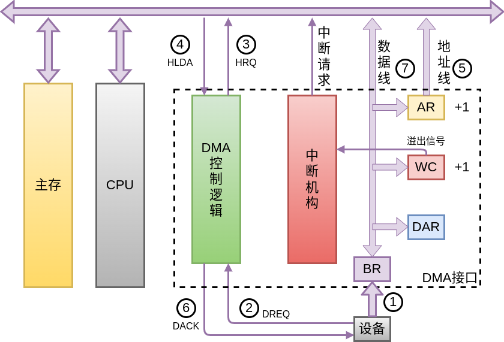  

输入输出是以主机、CPU作为出发点  
输入是指数据从外部设备送入到主存储器  
首先数据要从外部设备送入到`BR`，`BR` 当中保存了要输入的数据  
设备完成了将数据送入`BR` 之后，通过设备请求信号`DREQ` ,通知DMA控制逻辑，数据已经准备好了  
DMA控制逻辑通过总线，向CPU发送信号`HRQ` ，提出总线和主存储器的占用请求  
CPU在允许的情况下，会给出应答信号`HLDA` ，此时CPU会放弃对总线和主存的占用  
之后，总线和主存就由DMA接口来进行控制  
要进行数据传输，就要给出主存的地址，不管是读还是写  
这个地址就是通过寄存器`AR` 给出，使系统总线上地址总线是有效的  
接着由DMA控制器通知设备，给出设备一个应答信号`DACK` ，告诉设备已经开始进行数据传输  
数据和控制信号就由DMA控制器以及`BR` 发出  
DMA控制器发出对内存的读写控制指令，同时`BR` 数据通过数据线送到数据总线上  
每传输一个数据，`AR` 和`WC` 的内容就+1  
然后判断是否传输完  
如果没有传输结束，会继续这个传输过程。下一次设备同样要把数据放入到`BR` 当中，继续执行一开始的操作流程  

如果传输结束，`WC` 的值会发生溢出，这个溢出信号会送给中断机构，使中断机构当中的中断请求触发器置1，参加中断排队。之后就是中断接口当中的一系列电路  

中断机构发出中断请求，CPU接收到这个中断请求之后，去执行中断服务程序做后处理

**数据传送过程（输出）**  

  

首先要将`BR` 当中的数据送入设备当中  
此时`BR` 已经空了，数据传输完  
需要由设备发出信号`DREQ` 通知DMA控制器，`BR` 已经空了，可以用于接收下一个数据  
DMA控制器向CPU发出信号`HRQ` ，提出总线和主存储器的占用请求  
CPU在允许的情况下，会给出应答信号`HLDA`  
此时，总线和内存的控制权都交给了DMA控制逻辑或DMA接口  
如果要进行数据输出，还需要给出要访问的内存单元的地址，这个地址还是通过`AR` 给出  
同时，DMA要给设备做出应答`DACK` ，告诉设备已经开始了新的传输  
同样，通过这些控制信号，以及给出的地址信号，主存当中的数据就会被再次写入到`BR` 当中  
同时修改`AR` 和`WC` 的值+1  
修改完字计数器之后，要判断传输是否结束  
如果传输，还没有结束，还要循环刚才这个过程。再一次向CPU提出总线和内存的占用请求  
如果数据传输完成  
用`WC` 的溢出信号告诉中断控制机构，把中断控制机构中的`INTR` 信号置1  
由中断机构向CPU发出中断请求信号，进行后处理  

**后处理**  

校验送入主存的数是否正确  

是否继续使用DMA进行数据传输  

测试传送过程是否正确，错则转诊断程序  

执行完数据的输入输出之后，`WC` 的值发生溢出，就提出中断请求  
这些后处理的操作，就是CPU在响应了DMA接口的中断请求以后，执行中断服务程序来完成  
> 中断服务程序包括了：校验数据、是否继续使用DMA进行数据传输、测试传送过程是否正确，错则转诊断程序  

#### DMA接口与系统的连接方式

一台机器上，可以有多个DMA接口  
这多个DMA接口都要连接在总线上  

**连接方式**  

1. 具有公共请求线的DMA请求  
  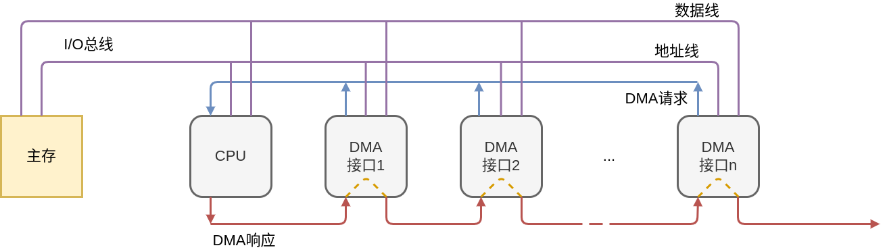 
    与总线进行仲裁是采用的穿行链接方法相似  
    DMA接口通过地址线、数据线和主存进行连接  
    同时，所有的DMA接口共享一条DMA请求线，这条请求线送给CPU  
    进行DMA响应时，各个DMA接口也拥有优先级排序  
    CPU通过一条查询线，一个一个接口进行查询  
    越靠近CPU的DMA接口，它的优先级就越高  
    优缺点与总线的链式查询类似  

2. 独立的DMA请求  

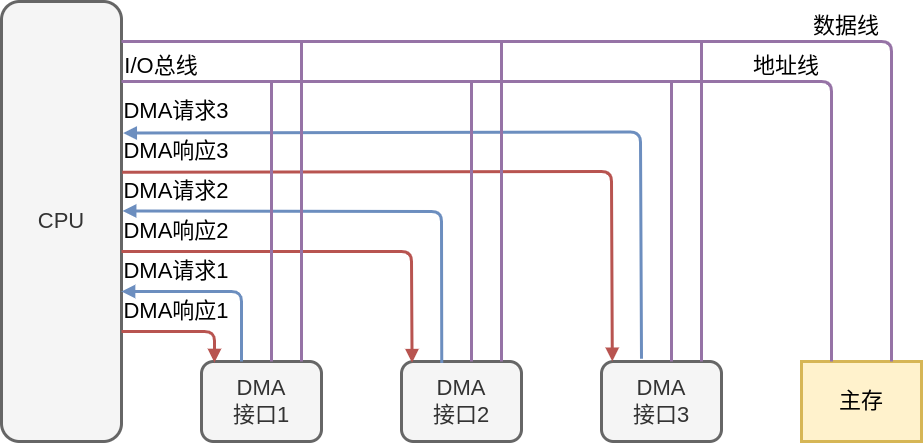  

  与总线进行仲裁是采用的独立请求方式相似  
  每一个DMA接口依然和地址线数据线进行连接，因为DMA接口要控制数据的传输过程  
  每一个DMA接口都有独立的DMA请求信号和响应信号  
  排队的工作在CPU内部完成  
  优缺点与总线的独立请求类似  

根据总线的其他方式，可以模拟出其他连接请求的方法

### DMA方式与程序中断方式的比较

||中断方式|DMA方式|
|----|----|----|
|数据传送|程序|硬件|
|响应时间|指令执行结束|存取周期结束|
|异常处理情况|能|不能|
|中断请求|传送数据|后处理|
|优先级|低|高|

数据传送  
> 中断方式 由中断服务程序来传送，需要CPU的参与  
  DMA方式  直接由硬件进行控制，不需要CPU的参与  

响应时间  
> 程序中断方式的响应时间是在指令执行结束时进行中断查询、响应中断、执行中断服务程序  
  DMA方式  外部设备与主存直接进行数据交换，所以是在存储周期结束进行响应  

处理异常情况  
> 在程序执行过程当中发生异常，可以使用DMA方式进行处理，但是DMA方式不行  

中断请求  
> 双方都会产生中断请求  
  中断方式通过中断请求，执行中断服务程序，来完成数据的传输  
  DMA方式用于后处理  

优先级  
> DMA方式是内存和外设之间直接进行交换，通常连接的都是高速设备  
  所以DMA方式在内存和I/O进行数据传输的模式下  
  DMA方式的优先级更高  
  中断方式的优先级会低

### DMA接口的类型

1. 选择型  
在物理上连接多个设备  
在逻辑上只允许连接一个设备  
> 在数据准备和数据传送的整个过程当中，在逻辑上接口只能连接一个设备  

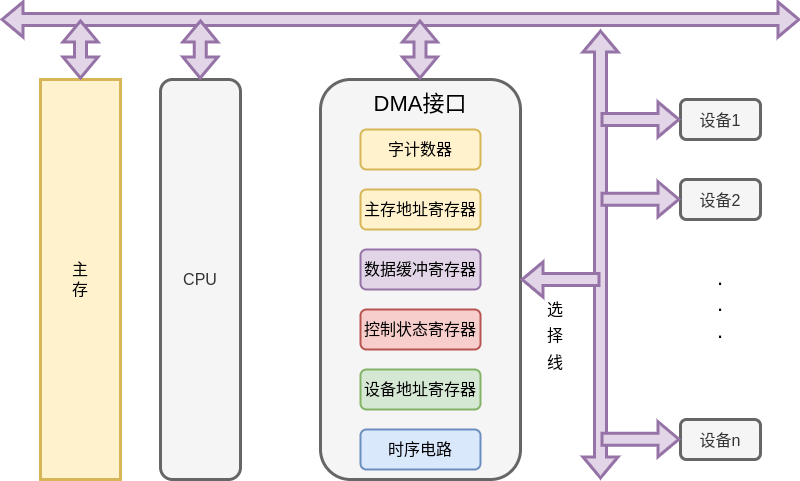  

选择型的接口，这些寄存器、时序电路就只有一套  
某一个设备要使用这个接口进行数据传输，CPU通过输入一条输入输出指令，需要对这些寄存器的值（字计数器、主存地址寄存器、设备地址寄存器等）进行设置，设置成某一个设备要和主存之间进行数据交换所需要的那些值  
那么其他设备就无法和主存之间再提出DMA请求，无法和主存之间进行数据交换  

**从物理上将，可以有多个设备进行传输**  
**但是从CPU运行到那条输入输出指令，到准备数据、数据准备好、传输、一直到传输结束。这个过程当中，只能有一个设备使用这个接口**  

2.多路型  
在物理上连接多个设备  
在逻辑上允许连接多个设备同时工作  
> 但真正的进行数据传输的时候，也只能有一个设备和内存之间进行数据传输  
  但是数据准备阶段可以有多个设备同时进行数据准备  

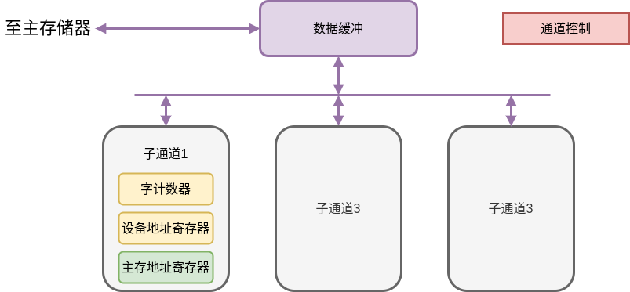  

通道是一种小型的DMA处理机，也是一种DMA接口  
一个通道，下面包含了若干个子通道，每一个子通道都有主存地址寄存器、设备地址寄存器、字计数器等，这些子通道就可以同时控制多个设备  
设备进行数据传输时，CPU执行到了输入输出指令，要控制某一个设备进行输入输出，就对相应的子通道当中的寄存器进行设置  
设置完之后，CPU就会继续执行主程序  
碰到下一条输入输出指令，如果两个使用的是不同的子通道，就会对其他的子通道当中主存地址寄存器、字计数器、设备地址寄存器等，再次进行设置  
外部设备在之后的时间里，可以进行数据准备。这个数据准备是多个外部设备并行进行的  
外部设备准备好了，通过子通道向通道提出数据传输请求  
此时，不同设备的数据传输就是串行执行  

3. 多路型DMA接口的工作原理  

假设磁盘每隔30微秒提出一次DMA请求  
> 这30微秒包含了数据的传送时间和数据的准备时间

假设磁带每隔45微秒提出一次DMA请求  
假设打印机每隔150微秒提出一次DMA请求  
> 其他时间在进行数据准备，准备好了才能提出请求  

假设真正用于数据传送的时间为5微秒  
> DMA接口当中的数据送入到主存，或主存当中的数据送入到DMA接口，这个时间需要5微秒  

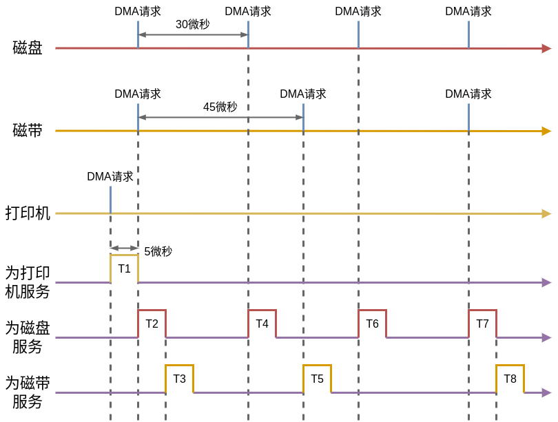  

一个多路型接口现在连接了这3个设备  

由于打印机是最早提出请求的，首先响应打印机的请求，将5微秒的时间给打印机，由打印机进行数据传输  
这个数据传输结束之后，向后时间延续  
磁盘和磁带同时发出了传输请求，要使用总线和DMA接口，总线和内存进行数据交换  
由于速度越高的设备，设备优先级就越高，此时就响应磁盘的操作，用5微秒完成数据传输  
因为是多路型的数据，在请求之前，数据就已经被放入到DMA接口当中的数据缓冲器里，所以这5微秒就单独用于接口当中的数据和内存当中的数据进行传输  
这个响应完之后，响应磁带的请求，又经历5微秒  
在往后延续，就又是磁盘的请求，依次往后进行  
当到最后，又是磁盘和磁带同时提出请求，还是响应磁盘的请求，因为磁盘的速度更高  

**尽管一个多路型的通道连接了多个设备，但还有很多时间通道处于空闲状态，还可以连接更多的设备**  

