# 主存储器

## 概述

### 存储器分类

#### 按存储介质分类  

1. 半导体存储器  易失  
    * TTL  
        > 晶体管逻辑类型  
        集成度较低，功耗较高，但速度快
    * MOS  
        > 金属氧化物半导体  
        集成度较高，功耗较低，但速度较慢

    一般现在尤其是计算机的内存，主要是由MOS型的半导体构成的

2. 磁表面存储器  非易失  
    需要有磁头、载磁体

3. 磁芯存储器  非易失  
    硬磁材料、环状元件

4. 光盘存储器  非易失  
    激光、磁光材料

#### 按存取方式分类

1. 存取时间与物理地址无关（随机访问）  
    * 随机存储器  
        > 在程序执行过程中可读可写
    * 只读存储器  
        > 在程序的执行过程中只读

2. 存取时间与物理地址有关  
    * 顺序存取存储器  
        > 磁带
    * 直接存取存储器  
        > 磁盘

#### 按在计算机中的作用分类

1. 主存储器  
    * RAM    随机访问存储器，可读可写  
        * 静态RAM
        * 动态RAM
    * ROM    只读存储器  
        * MROM
        * PROM
        * EPROM
        * EEPROM

2. Flash Memory

3. 高速缓冲存储器

4. 辅助存储器  
    * 磁盘、磁带、光盘

## 主存

### 概述

#### 主存的基本组成

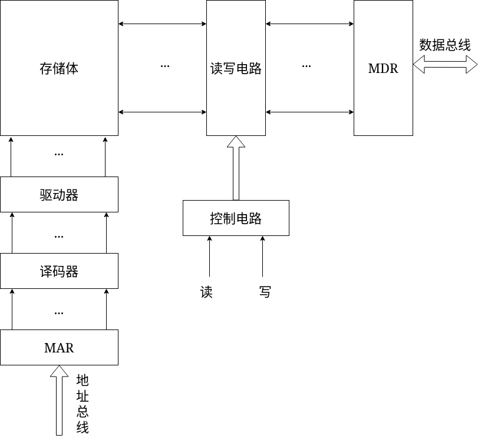

* MAR  
    > 保存了要访问的存储单元的地址

* 译码器  
    > 将MAR当中的数据进行译码  
    用来解释MAR当中数据是指向哪个存储单元

* MDR  
    > 保存了需要读出或写入的数据

* 读写控制电路  
    > 用来控制对存储体是读还是写  
    如果是读，就根据MAR当中的地址，将指定存储单元的数据送到MDR  
    如果是写，就根据MAR当中的地址，将MDR当中的数据写入到MAR指定的存储单元  
    读写控制电路来控制数据传输的方向

#### 主存和CPU的联系

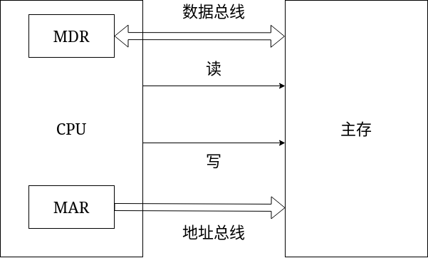

MAR和MDR都是集成在CPU上的，但是属于主存部分

CPU和主存之间的连接信号分成三类  
* 数据总线  
    > 完成CPU和主存之间的信息传输，所以数据总线直接连在MDR寄存器上
* 地址总线  
    > 连接在MAR寄存器和主存的地址总线之间
* 控制总线

#### 主存中存储单元地址的分配

假设存储字长为32位，也就是说对这个存储器某一个单元进行读或写，一次可以读出或写入32位个0和1

主存的编址单位是字节，每一个字节都有一个地址。此时一个存储字为32位，一个字节为8位，它们都有一个地址  

> 存储单元和按字节编址没有关系，32位机器字长，此时存储单元为32位，也就是4字节  
这里存储单元就包含了4个字节，也就反映出存储单元所占位数不等价于一个字节所占位数

12345678H 这个数据如何在主存储器中进行存储？

1. 高位字节地址为字地址，大端、大尾方式  

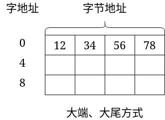

2. 低位字节地址为字地址，小端、小尾方式

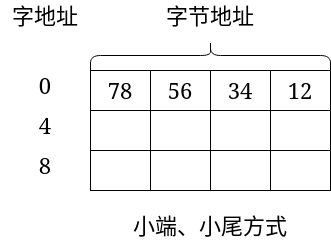

**大端方式的机器与小端方式的机器传输数据时，需要对字节的顺序进行调整**

设地址线24根，按字节寻址，则存储器容量为16MB（2的24次方）  
若字长为16位，按字寻址，则存储器容量为8MW（W为word）  
若字长为32位，按字寻址，则存储器容量为4MW

> 地址线所表示的只能是字节   
如果想要以字为存储容量单位，假设字长16位，按字寻址，其中因为字长16位等于2字节，所以需要拿出一根地址线来区分这两个字节，剩余的地址线则表示以字为存储单位的容量范围  
字长为32位，意味着包含4个字节，所以需要2根地址线来区分这4个字节，其余的地址线用来表示以字为存储单位的容量范围

#### 主存的技术指标

1. 存储容量  
    > 主存存放二进制代码的总位
2. 存储速度  
    * 存取时间  
        > 存储器的访问时间  
        从存储器给出地址，一直到得到稳定的数据输出或数据输入  
        根据是读出还是写入有分为读出时间和写入时间  
        读出时间：从存储器给出地址信号开始，到数据线上有稳定的数据输出  
        写入时间：从存储器给出地址信号开始，到数据写入到指定的存储单元
    
    * 存取周期  
        > 连续完成两次独立的存储器操作（读或写）所需的最小间隔时间  
        第一次开始到第二次开始所进行的存取操作中间的最小间隔时间

**一般来说存取周期要比存取时间长**
> 任何一种存储器，在读写操作后，总要有一段恢复内部状态的复原时间。对于破坏性读出的存储器，存储周期往往比存取时间大得多，因为存储器中的信息读出后需要马上进行再生。这个再生阶段是不能对存储器进行操作的

> 存储器中由于读出放大器、驱动电路等都有一段稳定恢复时间，读出后不能立即进行下一次访问

> 存储器的访问过程直接读取内容，而实际从虚拟内存的虚拟地址转译到内存物理地址是额外消耗时间的

3. 存储器的带宽  
位/秒

## 半导体存储芯片简介

### 半导体存储芯片的基本结构

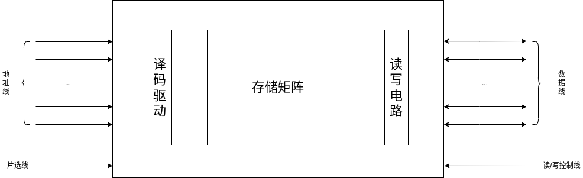 

这里的半导体存储芯片基本结构只有译码驱动、存储矩阵和读写电路，而MAR和MDR则是在外部。
除了这些核心结构之外，还有接口，与CPU和外部设备的控制器连接，从而进行数据交换。

CPU或外部设备给出地址，表示要存或取的数据在存储矩阵的哪个位置，这些地址信号经过译码驱动电路选择指定的存储单元,完成读写操作。

片选线是芯片选择信号，指出这次操作给出的地址是否针对这个芯片，被选择的存储单元、被选择的字节是否在这个芯片当中。
> 在内存条上，两面都有许多芯片，片选线就是来选择到底要对哪一个或哪几个芯片进行读写操作的。

半导体存储器的片选线一般有两种标识方式：  
* 芯片选择信号：CS
    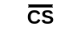 
* 芯片使能信号：CE
    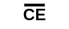  

> 其中，cs和ce上面有一横，表示低电平有效，高电平无效

读写控制线标识了对半导体存储芯片是读操作还是写操作，可以用一根线或两根线来表示：  
一根线表示：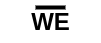 (低电平写，高电平读）  
两根线表示：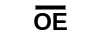 （允许读）  （允许写）  

#### 存储芯片片选线的作用

**让某个芯片或某些芯片同时工作** 

用 16K * 1位的存储芯片组成 64K * 8位的存储器

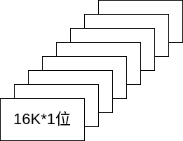 

每一组8个芯片需要同时进行工作，才能够在每个存储芯片中读出或写入一位二进制信号。也就是地址译码驱动器译码出的一个地址，假设为1，那么就会同时选中这8个存储芯片地址为1的区域。在此例中，就是一个地址对应8位信号。  

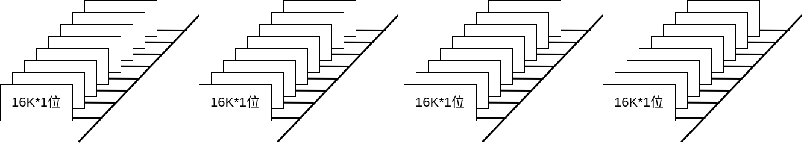 

解决了存储单元的问题，就可以直接通过增加地址线和地址译码器的长度来扩大存储容量。  
此例中，地址`0~16K-1` 的地址就分配到第一组当中，地址`16K~32K-1` 的地址分配到第二组，地址`32K~48K-1` 的地址分配到第三组，地址`48K~64K-1` 分配到第四组。  
当地址为65535时，第四组存储芯片有效，也就是片选信号有效（低电平），其他三组的片选信号无效（高电平)。

### 半导体存储芯片的译码驱动方式

**给出地址信号，如何找到给定的存储单元** 

#### 线选法

地址译码器：完成从编码到数据的翻译  

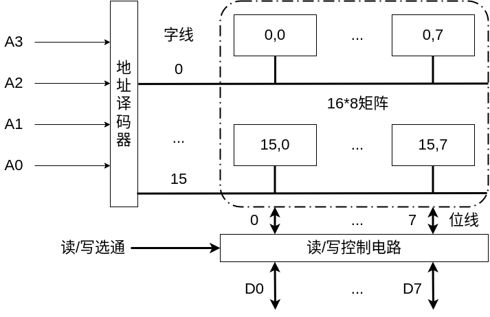 

给定一个地址输入，地址译码器的输出端只有一根线有效，会控制相应的存储单元当中所有的存储元件进行输入或输出操作。读/写控制电路用来决定是对数据进行写入还是输出。

这个简易的存储芯片只有`16*8` ，一般的存储芯片都比这个大的多。假设一个较小的存储器`1M*8` ,此时有20根地址线，地址译码器译码出来的结果就是1M条线，1M就是一百万，做在芯片里就会很密集，就很难将内存芯片的集成度做高。

#### 重合法

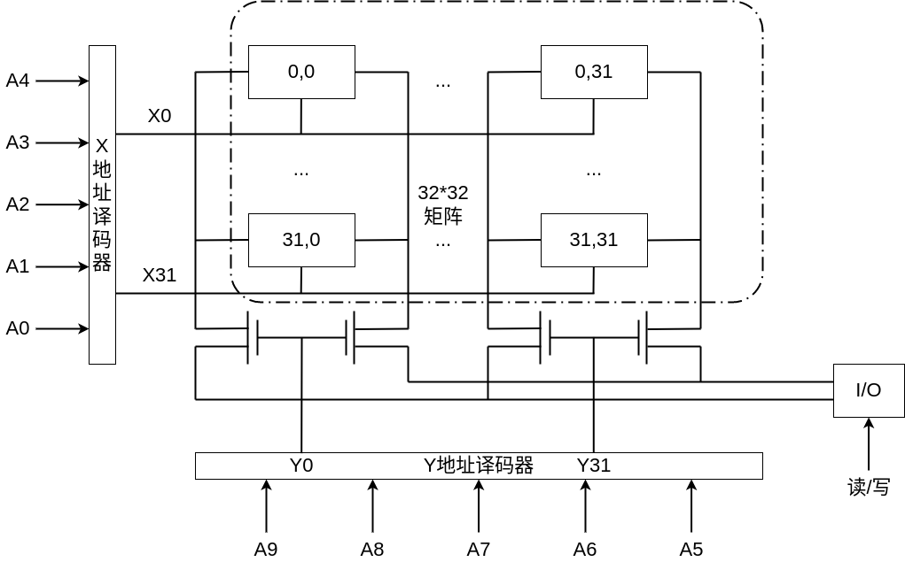 

线选法是将其布局成线性的数组  
重合法进行布局是将所有的存储单元布局成二维阵列  

这里将地址分为两部分：行地址(X)和列地址(Y)  
行列地址分别进行译码，行和列都只能有一条线有效

此例中，数据线只有一位，每个存储单元的个数也只有一位。假如给出行、列地址都是0的地址，行地址译码器经过译码之后，只有X0线是有效的，此时X0线上的存储单元都被选中，都可以进行读写操作。列地址译码器经过译码之后，只有Y0线是有效的，此时Y0上面的开关才会打开，Y0线可以进行数据的输入和输出。  
此时，只有`0,0` 存储单元的数据才可以进行输出。  

实际上，`0,1~31` 的数据也会进行输出，但是由于Y31是无效的，下面的开关没有打开，电路没有导通。所以尽管数据进行了输出，但是送不到数据线上。  

--------

线选法如果有20根地址线，由一个译码器来进行译码，输出是1M条线。如果采用重合法，将20位地址分成两部分，每一部分都是10位。那么行译码和列译码译码出来的线都是1K条，总共2K条。  

所以使用重合法这种译码驱动方式进行芯片制作，集成度就会比较高。

## 随即存取存储器（RAM）

### 静态RAM（SRAM）

**静态RAM基本电路** 

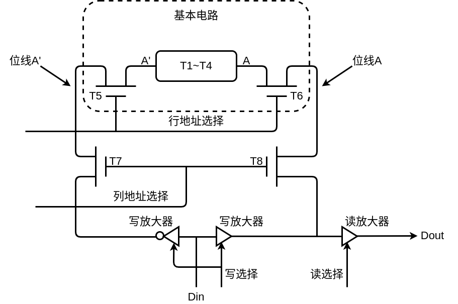  

这里Tx表示晶体管  

静态RAM的核心就是触发器，这个触发器由四个管子构成~~T1到T4~~ ,这个触发器是一个双稳态的触发器。两端（A'和A）用来存储信息。A是触发器的原端，A'是触发器的非端。如果A'端是0,那么A端就是1。如果A'端是1,那么A端就是0。
> T1到T4解决了用什么样的方式来存放0和1。  

T5和T6都由行地址选择来进行控制，一但行地址选择有效，T5和T6就会被导通。  
与重合法类似，T1到T6只是一个基本单元电路，在一个芯片内，一行上不会只有一个基本单元电路，通常会有很多这种基本单元电路，与列选择结合使用。

> T5和T6用于解决对存储元件进行读或写  

**静态RAM的基本单元电路就包含了两部分：**  
* 存放0和1的部件
* 控制对这个部件进行读写的两个晶体管

一共是六个晶体管

与重合法类似，T1到T6只是一个基本单元电路，在一个芯片内，一列上不会只有一个基本单元电路，通常会有很多这种基本单元电路，与行选择结合使用。

T7和T8是这一列上所有的存储元件共有的控制开关，通常叫做列开关。当这一列被选择，那么T7和T8就会被导通。

如果某一个单元被选中，那么这个单元的T5和T6就会被打开。实际上这个行地址选择线会向下延续，这一行上所有的存储单元，都是由这个行地址选择线进行控制。这一行上的所有T5和T6都会被打开，存储的数据都会送到相对应的位线上。  
但是只有列地址选择线有效的那一列与行地址选择线有效的那一行的交叉点的存储单元可以进行读写操作。
> 因为只有T5、T6、T7和T8都打开的存储单元的数据才能传输到数据线上  

对于数据的读出与写入，当行地址和列地址选择都选中时，T5、T6、T7和T8开关都打开，触发器的原端和非端的信号都可以传输到位线上。  
当读数据时，就直接从位线A到读出放大器进行输出。但是当信号到达两个写放大器时，会被阻挡。  

当写数据时，行地址和列地址都选中，开关都打开，此时数据从Din输入，经过两个写放大器进行信号的放大。右边放大之后还是原数据，左边放大之后通过三态门进行取反变成与原数据相反的数据。  
> 这是因为触发器的两端互为相反，所以写入数据时也需要遵守这个规则  

**静态RAM基本电路的读操作** 

如果要进行读操作，需要给出行选信号，行选信号控制了T5和T6,让T5和T6打开。然后给出列选信号，让T7和T8打开。因为是读操作，所以读放大器这根管子导通。存放在A中的数据就会通过T6将其送到位线上，同时T8也是导通的，所以数据会继续向下送，直到送到数据总线。  
> 一但行选和列选被选中，那么T5和T7也都会被打开。数据也会向下送，但是到达写放大器就截止。  

**静态RAM基本电路的写操作** 

写操作中，与A'对应的写放大器是经过取非操作后信号才进行输出的，这保证了触发器的A端和A'端的信号是相反的。行地址和列地址都被选择之后，T5、T6、T7和T8打开。两个写放大器导通，数据经过Din这根线进行输入，沿着左右两条位线一直输入到A和A'当中。  

Intel 2114 RAM 矩阵（64\*64）

怎样才可以将存储单元的位数提高
> 通过重合法，实现一个列选择信号可以控制4列

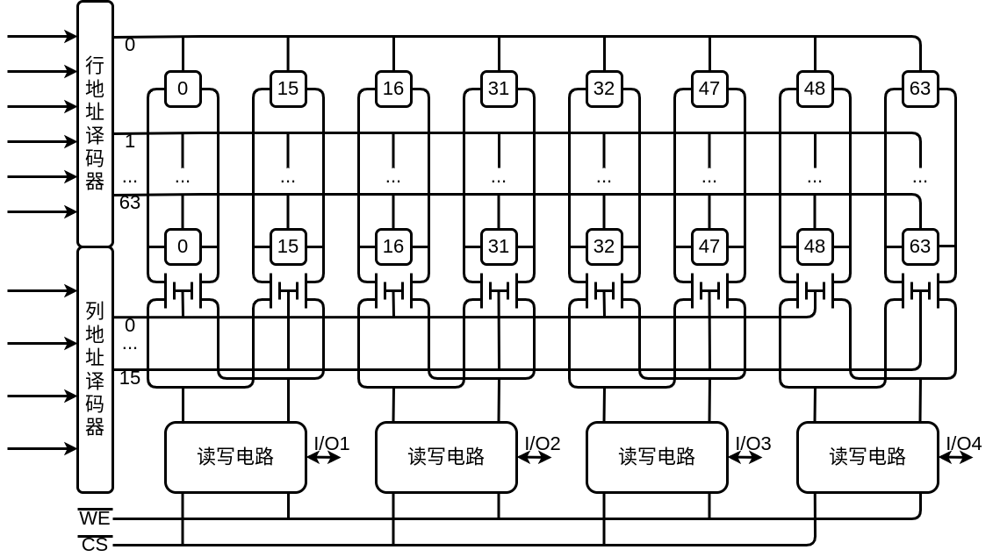 

可以将64列分成4组，每一个列选信号都可以控制这4组里相同的一列。  
就比如，将`0到15` 列分为第一组，`16到31` 列分为第二组，`32到47` 列分为第三组，`48到63` 列分为第四组。  
当一个行选信号选中指定行之后，例如第0行，此时列地址信号为0。
这里列地址就会选择每一组的第0列  
> 这里就可以看作以第一组为模板，第一组的地址选择信号直接对应后三组的地址选择信号  
以第一组为例，当行地址选择信号为0时，会将行地址为0的基本单元电路都选中。当列地址选择信号为0时，会将每组的第0列都选中，此时就会输出第0行的每组的第0列。输出4位信号，这些信号都来自第0行的每组的第0列。

实际上，这里只有10根地址线，如果列选则信号没有拓展到第二、三、四组，那么实际上能够选择的基本单元电路只有第一组的基本单元电路。而剩余的二、三、四组则继续使用与第一组相对应的地址信号。

### 动态RAM（DRAM）

静态RAM保存信息使用的是触发器（双稳态触发器），而动态RAM保存信息则是使用电容。  
电容当中如果保存了电荷，存储的信息就是1  
电容当中没有电荷，存储的信息就是0

**大致动态RAM基本单元电路** 

三管DRAM  

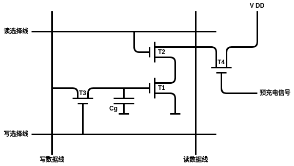 

信息保存在电容`Cg` 上，T1、T2和T3是控制管，通过这三个控制管进行读出和写入  
读选择线有效，T2会导通  
写选择线有效，T3会导通，外部的数据可以通过T3向`Cg` 进行读或写。  

读数据  

当预充电信号有效，T4就会被打开  
`V DD` 通过T4对读数据线进行充电，使读数据线变成高电平，表示1  
如果进行读出，读选择信号线有效，T2导通  
> 如果`Cg` 中没有电荷，即保存的数据为0，就导致T1的栅极没电，T1不会导通，读数据线就会保持高电平，读数据线的数据为1  
如果`Cg` 中有电荷，即保存的数据为1，就导致T1的栅极有电，T1导通，读数据线预充电的时候保存的是1。此时读数据线就会通过T2、T1进行放电  

**从读出的过程中可以看到，读出的信息与原存的信息是相反的。所以想要读出的信息是正确的，就需要在读数据线的输出端加一个非门。** 

写数据  

写选择线有效，T3导通，写数据线通过T3向`Cg` 进行充电或放电  
如果写入的数据是1，写数据线是高电平，写数据线会通过T3向`Cg` 进行充电，使`Cg` 当中保存的是1。  
如果写入的数据是0，写数据线是低电平，`Cg` 会通过T3进行放电，使`Cg` 当中保存的是0。

**从写入的过程可以看出，写入的信息与原存信息是相同的。** 

单管DRAM  

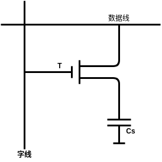   

信息保存在电容`Cs` 上  

字线也就是控制线，如果相应的行被选中，字线控制的T就会打开，电容就可以通过T进行充电或放电

读数据  
字线被选择  
如果`Cs` 上保存的是0，数据线上就不会有电流  
如果`Cs` 上保存的是1，数据线上就会有电流  

通过数据线上有还是没有电流，就可以知道`Cs` 是1还是0  

写入时，`Cs` 充电为1，放电为0

动态RAM芯片举例  

三管动态RAM芯片（Intel 1103）

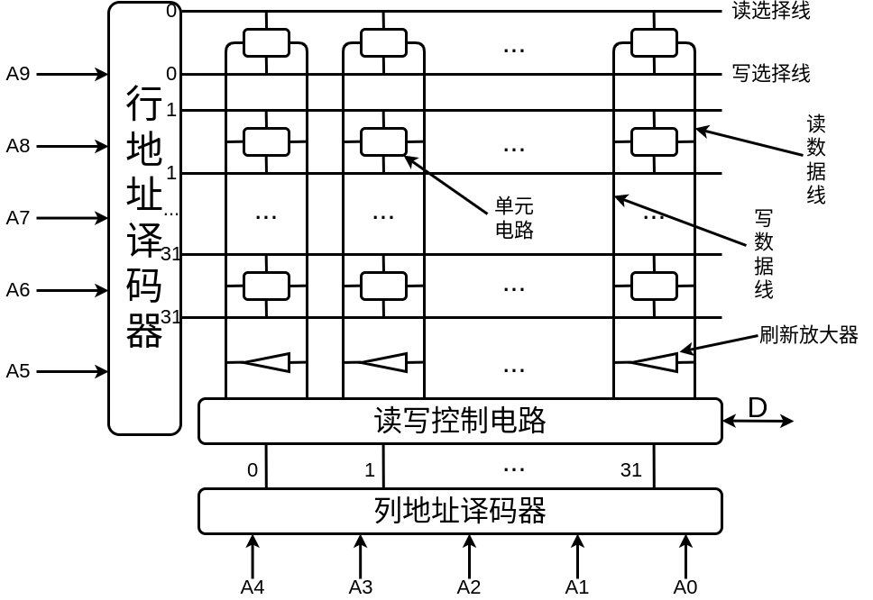 

可以看出这个芯片的有10位地址线，地址数就是1K。每次读出或写入只有1位数据，这个芯片的存储容量就是1K\*1。

行地址经过译码之后，每一行都对应两个控制信号，读和写用两个不同的信号来进行控制，也就是说在行地址译码器中，参加译码的不仅仅是地址，同时还有读写控制信号。  

读操作  

如果给出的行地址为0，进行的是读操作，第0行的读选择线有效，第0行所有的单元都被选中  
列地址也为0，第0行和第0列交叉点上的单元被选中  
这个单元通过读数据线将数据送到读写控制电路中，同时向外进行输出  

这里与SRAM不同，这里每一列上都使用了刷新放大器
> 这是因为动态RAM所采用的是通过电容存储电荷的方式来存储信息的。电容会漏电，经过一段时间后，电容上的信号会消失。所以采用刷新放大器就是对电容当中存储的信息进行重现，每经过一段时间都要对给定的存储单元电路当中的信息进行刷新。  

写操作  

如果给出的行地址为11111，第31行的单元都被选中，第31行的写选择线有效。列地址为00001，所以第31行的第2列的单元被选中，数据通过`D` 输入到读写控制电路。读写控制电路通过写数据线将数据写入到指定的存储元件

单管动态RAM 4116（16K\*1位）外特性  

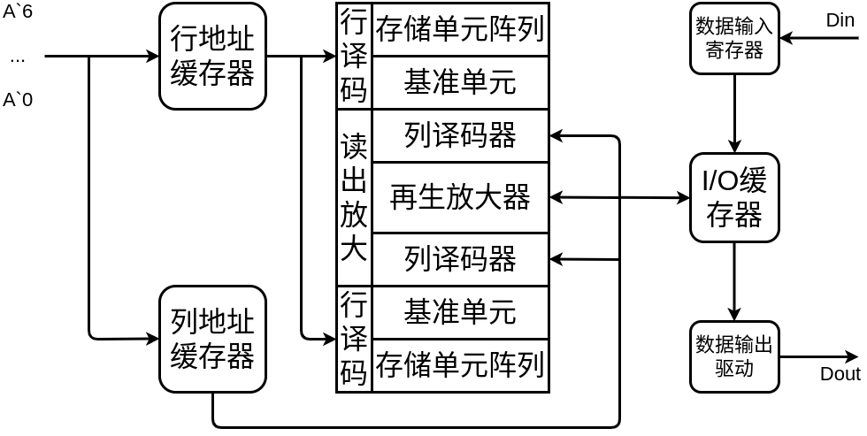  

从容量上看，16K\*1位的存储容量需要14根地址线  
但是4116只有7根地址线，这里就通过将地址分为两次进行传送  
第一次这个芯片的7根地址线接收到的是7位的行地址，这7位行地址被放到7位的行地址缓存器当中。然后接收7位的列地址放入列地址缓存器。经过译码之后选中给定的存储单元进行输入和输出。  

这里I/O缓存器完成数据的输入输出的缓冲，两端连接了数据输入寄存器和数据输出驱动，可以完成数据的输入和输出  

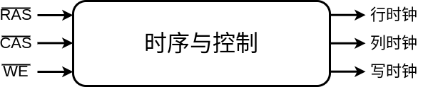  

另外，这个控制器还有一个自己的小的控制器，这个控制器由行选择信号、列选择信号和读写控制信号作为输入。产生行时钟、列时钟和写时钟。  
就是这个行时钟、列时钟和写时钟控制了芯片内部的读和写操作  

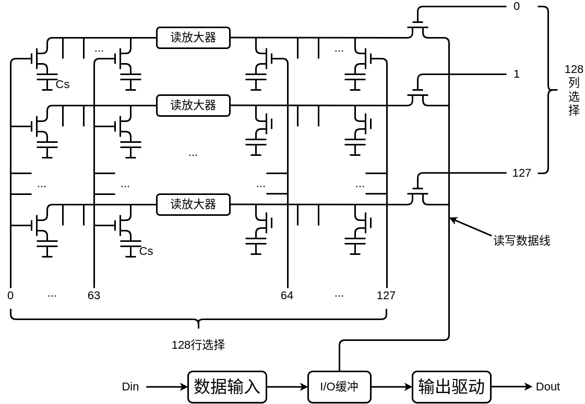  

这个芯片有128行和128列，在63行和64行之间，每一列上都有一个读放大器。这个放大器是一个翘翘板电路  
> 翘翘板电路的意思是在读放大器的一端如果将其强制成1，那么在它的另外一端就会变成0  

读操作  

如果行地址信号为0111111，那么第63行就会被选中，第63行对应的行选线有效，第63行上的所有晶体管都会被打开  
电容当中保存的信息就会被送出，到读放大器的左侧  
如果电容中有电，那么读放大器的左侧就是1，右侧就是0  
如果电容中没有电，那么读放大器的左侧就是0，右侧就是1  
如果列地址为0000000，第0列被选中，第0列的列选信号有效，相对应的晶体管被打开  
数据就会从第0列的读放大器的右侧经过晶体管送到读写线上，然后经过I/O缓冲，经过输出驱动，数据被送出  

写操作  

如果行地址信号为0111111，那么第63行就会被选中，第63行对应的行选线有效，第63行上的所有晶体管都会被打开  
数据输入经过I/O缓冲被送到读写线上  
如果列地址为0000000，第0列被选中，第0列的列选信号有效，相对应的晶体管被打开  
数据经过列地址的这个晶体管将数据送到读放大器的右端，通过读放大器的左端将数据写入到电容当中  
如果要写入的数据是1，那么经过读放大器，存入电容的就是0，反之亦然  

**这里写入做一次反向，读出做一次反向，那么数据的写入和读出就是一致的**   

**动态RAM刷新**   

动态RAM是利用电容存储电荷的方式来存储信息的，电容做的非常小，很容易漏电。在一段时间内，如果不对电容当中的信息进行再生的话，电容的信息就会丢失  
> 一开始对电容进行充电，如果时间长了没有对电容再次充电，那么电容内的电就会慢慢漏掉，原来保存的1就会变成0  

**对动态RAM进行刷新只和行地址有关**  
> 每一次刷新操作，刷新的是动态RAM当中一行所有的基本单元电路  

对于三管动态RAM的1103的结构  
给出行地址之后，某一个行就会被选中，这个行上所有的基本单元电路的信息都会被送到读数据线上。这里在读数据线和写数据线之间加上一个刷新放大器，每一列都加，就可以完成对某一行全部信息的刷新  
> 当选中一行之后，信息通过读数据线向下传输，传输到刷新放大器的走侧，刷新放大器就会对这个信息进行放大，再传输到写数据线，最后经过写数据线将原本这列选中电容的信息再重新写入到这个电容当中  

**所以刷新只和行地址有关**  
每一次刷新，刷新的是一行的数据，而不是某一个存储单元的数据  

#### 动态刷新的方法

1. 集中刷新（存取周期为0.5微秒）

就是将刷新的这段时间，集中在一个相对集中的时间段里面来操作  

假设动态RAM中的电容刷新周期是2毫秒  
> DRAM这个芯片当中所有的电容在这2毫秒之内都要完成一次信息的再生  

以128\*128的矩阵为例，存取周期为0.5微秒  

从图中可以看出，集中刷新就是将刷新都集中在一起。2毫秒之内要求对动态RAM当中所有的行进行刷新  
> 2毫秒之内需要对128行的每一行都进行刷新  

2毫秒一共是4000个存取周期，这4000个存取周期当中，前面3872个周期可以供CPU或I/O对动态RAM芯片进行读写操作。后面的128个周期专用于芯片的刷新操作（这128个周期当中，CPU和I/O都无法对动态RAM进行信息交换）  
> 这128个周期是不能使用的，被称为死区  
是64微秒，占整个刷新周期4000个周期的3.2\%，也称为死时间率  

CPU和I/O如果在死区想要对动态RAM进行数据交换，就需要等待死区结束  

2. 分散刷新（存取周期为1微秒）  

以128\*128的矩阵为例，存取周期为1微秒

整个存取周期就是tc，它包含了两部分：  
* tM：原来的存取周期（0.5微秒）  
* tR: 专门用于动态芯片某一行的刷新（0.5微秒）  

实际上就是将存取周期tc变为了原来的两倍  
这个芯片原来是需要2毫秒来刷新128行，现在只需要128微秒就可以将128行数据刷新完  
2毫秒，每一行就被刷新15.6次。实际上是一种过度的刷新，动态RAM不需要这么频繁的刷新。  

**没有死区，但是加长了读写周期，芯片的性能下降**  

3. 分散刷新与集中刷新相结合（异步刷新）  

2毫秒需要刷新128行，每经过15.6微秒刷新一行就可以  
就将2毫秒分成128份，每一份15.6微秒，在每一段时间里对某一行进行刷新，可以将其放在每一段的最后，也可以放在前面  

**相对于15.6微秒这一段来说是集中刷新，相对于2毫秒来说是分散刷新**  

异步刷新每隔2毫秒会将128行都刷新一次，死区为15.6微秒当中的0.5微秒。  
如果将刷新安排在指令译码阶段，CPU和I/O不对动态RAM进行操作的时候，就不会出现死区  

#### 动态RAM和静态RAM的比较  

|   |DRAM|SRAM|
|----|----|----|
|存储原理|电容|触发器|
|集成度|高|低|
|芯片引脚数|少|多|
|功耗|小|大|
|价格|低|高|
|速度|慢|快|
|刷新|有|无|

> DRAM每一个单元电路都非常简单，包含了一个晶体管和一个电容  
SRAM则比较复杂，每一个单元电路包含了6个晶体管  
所以从集成度的角度来讲，DRAM的集成度较高，SRAM的集成度较低  

> DRAM的行地址和列地址可以分别进行传送，地址线的条数可以减少为原来的一般，所以芯片的管脚数也就相应的减少。管脚数减少了，芯片的封装体积就减少了  
SRAM价格比较贵，速度比较快。一般来说，在机器当中要使用SRAM，都是要发挥它高速度的优势。所以不会将行地址和列地址分别进行传送，传送之后在内部再进行译码，因为这样会花费较多的时间  
所以从引脚数的角度来说，DRAM的引脚数较少，SRAM的引脚数较多  

> DRAM只需要对电容进行充放电，进行刷新，只有这些需要耗电，功耗较低  
SRAM 由T1到T4组成的触发器，在工作以后，有三个管子一直保持着导通状态，有三个管子一直在漏电，所以功耗很高
所以从功耗的角度来说，DRAM的功耗较低，SRAM的功耗较高  

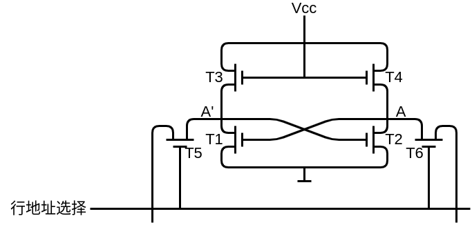  

> DRAM每一位的价格很低，因为结构简单  
SRAM每一位的价格相对较高，因为结构复杂  

> 对DRAM进行读写，需要对电容进行充放电，速度较慢  
SRAM采用触发器的方式来存放信息，速度比较快  

> DRAM因为电容会慢慢漏电，所以需要对电容中的信息进行刷新和重写  
SRAM是触发器方式存储信息，不需要刷新  

**所以通常情况下，DRAM用于做主存，SRAM一般用于做cache，速度快、功耗高、价格贵没有办法大规模使用，就使用小容量、速度高的SRAM放在CPU和主存之间作为主存信息的缓冲**  

## 只读存储器

只读存储器一般用于保存系统程序或系统的配置信息  

早期的只读存储器，在厂家就写好了内容（掩模ROM）  
行列选择线交叉处有MOS管为1  
行列选择线交叉处无MOS管为0  
> 用户买只读存储器只能使用，不能修改只读存储器当中的内容  
这种结构的只读存储器，如果是用于大批量的计算机的生产或者某种类型设备的生产是比较合适的  
因为这实现了节约化的生产，价格比较低  
但是对于科研和自己编制系统程序和配置信息，这显然不能满足  

改进1————用户可以自己写————一次性（PROM）  
用熔丝是否断裂来表示存储是信息  
熔丝断裂表示0  
熔丝没有断裂表示1  
> 这个写是破坏性的写，写了一次之后就不能再次写入  
如果需要该信息，就需要重新买芯片进行烧制

改进2————可以多次写————要能对信息进行擦除  
> 这种可擦除的芯片需要对应的擦除设备，需要单独购买  
擦除起来也不是非常的方便  

改进3————电可擦写————特性设备  
> 需要特性的设备对ROM进行擦写  

改进4————电可擦写————直接连接到计算机  

N型沟道浮动栅MOS电路
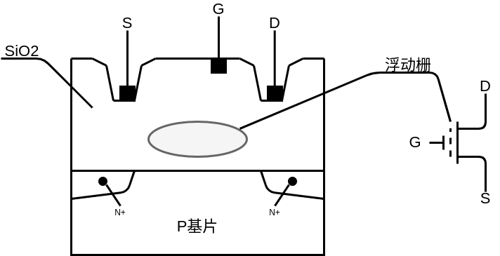  

在漏端D加上正电压，会形成浮动栅，可以阻止源S和漏D之间的导通，使MOS管处于0状态  

不对漏端D加上正电压，就不会形成浮动栅，MOS管就可以正常导通，处于1状态  

至此，就可以通过对漏端D施加正电压或不施加正电压来进行信息的存储  

如果用户需要新改变其状态，可以用紫外线照射，驱散浮动栅，再按需要将不同位置的MOS管D端重新置于正电压，又得出新状态的ROM，虽然可多次编程，但是信息的擦除比较麻烦  

EEPROM（多次性编程）  

电可擦写  
局部擦写  
全部擦写  

Flash Memory（闪存型存储器）  

EEPROM      价格便宜 集成度高  
EEPROM      电可擦洗重写  
Flash Memory      比EEPROM快 具备RAM功能  

## 存储器容量的扩展  

CPU执行指令所需要的数据都保存在主存当中，运行结果也需要保存在主存当中  
因此必须实现CPU和主存储器的正确连接，才能够实现CPU和主存储器信息交换  

通常情况下，CPU的地址线条数比较多，寻址空间的范围也比较大。要构成一个主存储器，需要多个存储芯片共同组成

### 位扩展  

位扩展的目的是增加存储字长  

用2片1K\*4位存储芯片组成1K\*8位的存储器  
1K\*8位需要10根地址线和8根数据线  

  

> 这里片选信号和读写信号一定要和两个芯片连接在一起，使两个芯片能同时工作  

### 字扩展  

字扩展的目的是增加存储字的数量  

用2片1K\*8位存储芯片组成2K\*8位的存储器  
2K\*8位需要11根地址线和8根数据线  

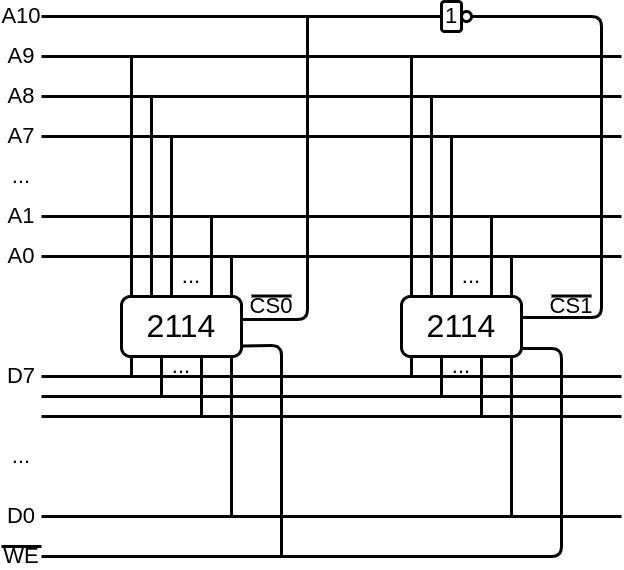  

> 当进行字扩展时，需要添加地址线，首先就是先将芯片内部寻址需要的地址先分配给芯片  
接着添加地址线用于区分到底是选择哪一个芯片，就是用来充当片选

### 同时扩展  

用8片1K\*4位存储芯片组成4K\*8位的存储器  

4K\*8位需要12根地址线和8根数据线  

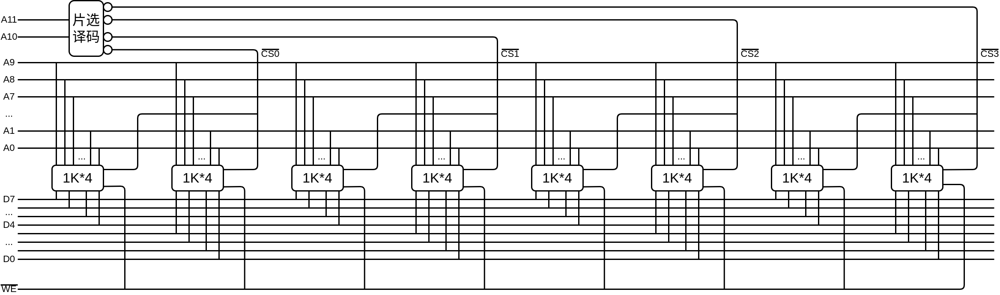  

> 这里片选需要片选译码器，因为片选生效需要低电压

## 存储器和CPU的连接

1. 地址线的连接  
> CPU给出地址，存储器需要根据CPU给出的地址找到相应的存储单元，这个存储单元是哪个芯片中的哪个存储单元  
一般来说进行地址连接时，都是把地址的低位作为地址送到存储器的地址线当中，高位做芯片选择信号  

2. 数据线的连接  
> CPU的数据线的条数可能比存储器的数据线要多，这时就需要做位扩展，使存储器输出的数据能够满足CPU的要求，或者输入的数据要满足CPU的要求  

3. 读/写命令线的连接  
> 一般来说，CPU给出读写命令，可以把读写线连接到每一个芯片的读写控制端上  
ROM除外，只读存储器只能读，不能写  

4. 片选线的连接  
> 这次访问的地址空间落在哪一个或者哪几个芯片上，就是由片选线来决定的  
进行片选线连接时，需要确认CPU这次访问操作访问的是存储器，而不是I/O  
所以对存储器的访问信号，一定要在片选信号当中体现  
每一个内存的芯片都有自己的地址范围，在和CPU构成的系统当中，给其分配了指定的地址范围，这个地址范围必须要满足CPU的要求  
也就是说每一根地址线，都需要用到。有一些地址作为存储芯片的内部地址，输入到存储芯片当中  
有一些地址需要用作片选信号来保证对某一个芯片的访问，一定是在给定的地址范围之内的访问  

5. 合理选择存储芯片  
> ROM和RAM需要合理的进行选择  
保存系统程序和系统配置新信息的用ROM，因为这些不是经常被改动  
用户程序区或系统运行区，这些区域都是可读可写的，就用RAM  
还需要根据技术参数和性能参数来考虑  
芯片数量尽可能的少，片选逻辑尽可能的简单  

6. 其他    时序、负载  
> CPU的时序和存储器的时序要能够相互配合  
CPU能够带多少个存储芯片  

## 存储器的校验

### 为什么要对存储器的信息进行校验  

内存是电子设备  
如果是DRAM，那么信息就是保存在电容当中  
如果是SRAM，那么信息就是保存在触发器当中  
如果内存所处的电磁环境比较复杂，或者是在空间环境下受到带电粒子的打击，就可能会造成电容的充电放电或者触发器的翻转，存放在存储器当中的信息就可能出错  
因此需要对存储器中的信息进行校验  

### 为了能够校验信息是否正确，如何进行编码  

代码能够进行校验，需要符合的条件  

* 合法代码集合  
> 在计算机当中保存的、传输的代码当中，哪些代码是合法的，哪些代码不在合法代码集当中，出现了就可以确定代码出错  
1. {000,001,010,011,100,101,110,111}  
> 假设000最后一位错了，变成了001，出错之后的代码依然是合法代码集中的代码，计算机根本检测不出这里出错  

2. {000,011,101,110}    检1位错，纠0位错
> 现在合法代码集只包含四个编码，编码的特点是1的个数是偶数个或者是0个  
如果000存放在内存的某个存储单元当中，下一次读取时，读出的数据是100，这里就可以检测出出错，因为100不是合法代码集的集合  
但是不能知道是哪一位出错，因为000出现一位错会变成100，但是101、110发生一位错，也会变成100。所以可以检测出代码发生一位错，但是不知道是哪一位发生错误，无法进行纠错  

3. {000,111}    检1位错，纠1位错
> 加入采用三倍冗余的方式来存储计算机中的0和1  
用三个0表示计算机中的一个0  
用三个1表示计算机中的一个1  

> 假如收到的代码是100，这个代码不在合法集合当中  
因为在存储器出错的过程中，有多种类型的故障，可能是1位错，也可能是2位错，也可能是3位错。但是在这些错误中，1位错的概率是最大的，甚至超过90%，位数越多的错误出现的概率就越小  
所以就可以判断这个代码原始保存的应该是000，并进行纠错  

> 假如收到的代码是110，这里000发生2位错，但111发生一位错也会产生110，纠错的过程当中就会把110之就纠错成111，而不会认为是000发生2位错造成的  

4. {0000,1111}    检2位错，纠1位错
> 采用四倍冗余  
用四个0表示计算机中的一个0  
用四个1表示计算机中的一个1  
这里就一位错没有问题  
但是如果是就两位错，比如1100，就不知道原始数据是哪个

5. {00000,11111}    检2位错，纠2位错
> 采用五倍冗余  
假如收到11000，可以判断原始信息为00000  
假如收到11100，就检测不出  

**纠错或检错能力与什么因素有关**  
> 1.中的合法代码集，只需要将合法代码改变一位就可以变成另一个合法代码  
所以没有检错能力  
因为任何一位错了，得到的代码依然是合法代码  

> 2.中的合法代码集，要想将一个合法代码变成另一个合法代码，至少要改变两位  
所以在存储过程中，发生一位改变，可以检测出发生错误  

> 3.中的合法代码集，要想将一个合法代码变成另一个合法代码，至少要改变三位  
所以在存储过程中，发生1位错误，可以判断是哪一位发生错误  

> 4.中一个合法代码要变成另一个合法代码至少需要改变四位  
可以检测到两位错并纠1位错  

> 5.中一个合法代码要变成另一个合法代码至少需要改变五位  
可以检测到两位错并纠2位错  

**可以看出检测能力与合法代码集合当中任意两组合法代码之间二进制数差异的最少位数有关**  
> 差异的位数越多，检测和纠错的能力就越强  

#### 编码的最小距离

任意两组合法代码之间二进制位数的最少差异  
编码的纠错、检错能力与编码的最小距离有关  
最小距离越大，检错和纠错能力就越强  

L - 1 = D + C（D>=C）  
* L —— 编码的最小距离  
* D —— 检测错误的位数  
* C —— 纠正错误的位数  

汉明码是具有一位纠错能力的编码

#### 汉明码的组成

汉明码采用奇偶校验  
奇校验：原来的数据位加上一个校验位使代码当中1的个数为奇数个  
偶校验：原来的数据位加上一个校验位使代码当中1的个数为偶数个  

汉明码采用分组的奇偶校验  

汉明码的分组是一种非划分的方式  
> 组和组之间是交叉的  

  

分成3组，每组有1位校验位，共包括4位数据位  

每一个圆圈表示一组 位置1、2、4的数据分别被分到三组当中，而且是每一组独有的一位  
现在分成三组，每一组都是采用偶校验的方式  
这三组当中每组包含四位数据，每组数据有1位校验位，就是位置1、2、4

