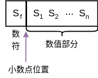
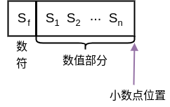
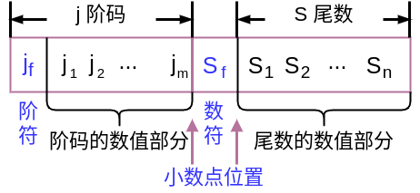
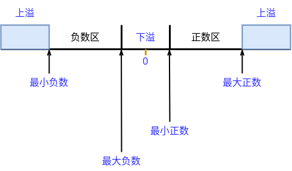
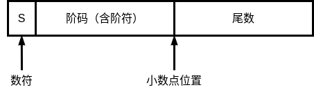

# 定点表示

小数点按约定的方式标出，在计算机当中，没有专门的硬件来表示小数点
小数点的位置是由计算机体系结构设计人员，在设计计算机体系结构的过程当中，约定的在硬件实现和软件实现过程当中都要遵守一个约定
软件编程人员要根据这个约定，在程序当中调整数值的大小，以适应这个约定
根据小数点约定位置的不同，主要有两种形式  

1. 小数点的位置在数据的数符的后面
计算机当中，存放或处理的定点数都是小数
如果是补码形式，可以表示的唯一整数就是-1  

  

2. 小数点的位置在数据的数值部分的最后
计算机当中的定点数，都是整数  

  

根据一台定点计算机约定的小数点的位置，可以把定点计算机分成两类：  
1. 小数定点机：小数点放在数符的后面、数值的前面  
2. 整数定点机：小数点的位置在数值部分的后面  

-------

一个有符号数存放在计算机当中，需要将数字转换成机器数的表示形式
|定点机|小数定点机|整数定点机|
|:----:|:----:|:----:|
|原码|-(1-2-n) ~ +(1-2-n)|-(2n-1) ~ +(2n-1)|
|补码|-1 ~ +(1-2-n)|-2n ~ +(2n-1)|
|反码|-(1-2-n) ~ +(1-2-n)|-(2n-1) ~ +(2n-1)|

# 浮点表示

为什么要引入浮点数表示
最早的计算机由于硬件技术的限制，只有整数定点机和小数定点机两种表示方式
但是在科学计算过程当中经常会用到浮点数
在定点机当中，需要使用浮点数，需要程序员自行调节小数点的位置，自行对计算结果进行矫正，就给程序要造成了很大的负担  

数的表示范围非常小，小数定点机能够表示的范围表示的值一定是小于等于1
如果想要表示两个大小相差非常大的数据，就需要很长的机器字长  

> 太阳的质量是0.2\*1034克，一个电子的质量大约为0.9\*10-27克，两者的差距为1061以上，若用定点数据表示：2x>1061，解得：x>203位。  

数据存储单元的利用率往往很低  
> 这也表示，当x>203位时，存储的数据大部分都没有太阳的质量这么大的数据，就会导致存储一个数据时，会浪费很多的存储资源  

因为这些原因，就引入了浮点数  

## 浮点数的表示形式

浮点数的一般形式：N = S \* rj
S：尾数
j：阶码
r：尾数的基值  

> 尾数的绝对值小于等于1
阶码是整数
尾数的基值r可以取2、4、6、8、16等  

当r = 2
N = 11.0101
&emsp;= 0.110101 \* 210&emsp;合法的，规格化数  

> 这里2的幂是二进制表示  

&emsp;= 1.10101 \* 21
&emsp;= 1101.01 \* 2-10
&emsp;= 0.00110101 \* 2100&emsp;合法的  

> 在计算机当中有两种表示形式是合法的
尾数采用小数定点形式来表示，尾数的值均小于等于1
其中数值的最高位为非零，就称为规格化数  

在计算机中，**S是尾数，用小数来表示，可正可负**
> 所以S的符号直接决定了这个浮点数的正负  

**j是阶码，用整数表示，可正可负**

数据在计算机当中的表示方式是机器数
浮点数在计算机当中存储，也要以机器数的形式存储
如果在设计计算机的过程当中，就已经约定了尾数的基值是2
在浮点数的存储当中，只需要存储浮点数的尾数部分和阶码部分（包括数符和阶符）
根据之前机器数的表示形式，按照计算机设计时的规定  

> 尾数取多少位、数符是1位或2位、阶符是1位等等  

  

Sf&emsp;&emsp;&emsp;&emsp;代表浮点数的符号
n&emsp;&emsp;&emsp;&emsp;&nbsp;其位数反映浮点数的精度
m&emsp;&emsp;&emsp;&emsp;其位数反映浮点数的表示范围
jf和m&emsp;&emsp;&nbsp;&nbsp;共同表示小数点的实际位置  

## 浮点数的表示范围

假设不考虑数据的规格化
无论是尾数还是阶码，都用原码形式表示
给定的一种浮点数的表示方式，在数轴上，就可以分析浮点数的表示范围  

最小负数：-2(2m-1) \* (1-2-n)
最大负数：-2-(2m-1) \* 2-n
最小正数：2-(2m-1) \* 2-n
最大正数：2(2m-1) \* (1-2-n)  

> 此时最小的负数，也就是绝对值最大的那个负数
尾数部分绝对值应该是最大的，用原码表示：
数符部分是1
数值部分位全1，此时值为1-2-n（尾数的长度为n位）
阶码部分一共是m位，因为是最小的负数，所以阶码就需要最大
阶码的符号为正数，数值部分为全1  

> 此时最大的负数，也就是绝对值最小
尾数部分绝对值应该是最小的，用原码表示：
尾符依然是1
后面数值部分一共是n位，前面的n-1位都是0，最后一位是1，值为-2-n
阶码为负的，绝对值最大的值，阶符的符号应该是1
阶码的值m位，也应该为全1

> 此时最小的正数
尾数最小
阶码为负的，绝对值最大  

> 此时最大的正数
尾符为0
数值部分全为1
阶码符号位为0，阶码的数值部分全1  

> 设 m = 4 ，n = 10
使用这种格式来表示浮点数
实际上这种表示方式，数据的长度一共是16位
其中，1位表示阶符，1位表示尾符，4位表示阶码，10位表示尾数的数值部分
能够表示的2进制数的个数为216
如果我们的机器使用这样的方式表示浮点数，就是使用216个数据来表示最小的负数和最大的正数之间的所有的数  

> 实际上，216的数据的个数是有限的，而且每一个数据相互之间都是离散的，所以实际上使用有限的数据，来表示无限多的实数  

如果表示的范围超出了计算机能够表示的范围
此时就有
上溢区
阶码 > 最大阶码
发生上溢，计算机系统会按照计算出错进行处理

下溢区
阶码 < 最小阶码
如果发生下溢，计算机在处理时按**机器零**处理  

练习：
设机器数字长为24位，欲表示 $\pm$ 3万的十进制数,
试问在保证数的最大精度的前提下，除阶符、数符各取1位外，阶码、尾数各取几位？  

$\because$ 214 = 16384&emsp;&emsp;215 = 32768
$\therefore$ 如果是定点数15位二进制数可反映 $\pm$ 3万的十进制数  

$\because$ 精度受尾数的位数控制
$\therefore$ 保证最大精度，就需要将尾数尽可能的长，就需要缩短阶码的位数

$\therefore$ 阶码设置为4位，出去阶符和尾符，剩下的18位都是尾数数值部分  

## 浮点数的规格化形式

为什么需要对浮点数进行规格化：
尽可能的保证数据的精度  

> 如果不进行规格化，尾数的小数点后面可能会有若干个0
如果用原码表示，这些0就表示真正的0
放到计算机当中，尾数的长度是有限的，超出给定长度的那部分尾数的值就要被丢弃，会严重影响数据的精度
为了尽可能保证数据的精度，就需要让尾数的有效位数尽可能的多
所以采用规格化的形式  

r = 2 时，也就是尾数的基值为2
尾数的最高位为1（这个1是真值部分）  

r = 4 时，也就是尾数的基值为4，两位2进制数表示了1位4进制数
要想进行规格化，就是尾数最高2位不全为0  

r = 8 时
尾数的最高3位不全为0  

可以看出：**尾数的基数不同，浮点数的规格化形式不同**  

## 浮点数的规格化

对浮点数规格化，实际上就是通过：将尾数的数据进行左移或者右移  
> 如果r = 2，使得尾数的最高位为1
r = 4，使得尾数的最高两位不等于0  

以r = 2为例：
进行规格化有两种方式：  

1. 左规，尾数左移1位，阶码减1
进行数据的左移  
> 将左侧出现的多余的零移掉，然后通过调整阶码部分，保证数据的真值不发生变化  

2. 右规，尾数右移1位，阶码加1
进行数据的右移  
> 小数点的位置不变，数据向右每移动一位，相当于数据值变为原来的二分之一，为了保证数据值不变，就需要将阶码部分加1  

以r = 4为例：
左规，尾数左移2位，阶码减1
右规，尾数右移2位，阶码加1  

以r = 8为例：
左规，尾数左移3位，阶码减1
右规，尾数右移3位，阶码加1  

**基数r越大，可表示的浮点数的范围越大**
**基数r越大，浮点数的精度降低**  

例如：设 m = 4, n = 10, r = 2
求尾数规格化后的浮点数表示范围  

最大正数： 2+1111\*0.1111111111&emsp;= 215\*(1-2-10)  

最小正数： 2-1111\*0.1000000000&emsp;= 2-15\*2-1 = 2-16  

最大负数： 2-1111\*(-0.1000000000)&emsp;= -2-15\*2-1  

最小负数： 2+1111\*(-0.1111111111)&emsp;= -215\*(1-2-10)  

> 这里最小正数和最大负数的尾数为什么是2-1：
因为这里需要规格化，所以尾数数值部分的第一位必须是1，其余的位都为0
如果不需要规格化，那么尾数数值部分的最小值为尾数数值部分最后一位为1，其余位为0
这时尾数数值最小值为2-10（也就是公式中的2-n）  

## 机器零  

当浮点数尾数为0时，不论其阶码为何值，按机器零处理
> 按照规格化要求，如果这个数是非零的，尾数的小数点后面的第一位数值部分的真值就是1
如果不是1，现在所有的尾数均为0，就不管阶码是什么样的值
都将其按照机器零进行处理  

当浮点数阶码等于或小于它所表示的最小数时，不论尾数为何值，按机器零处理  

----

例如：m = 4, n = 10
当阶码和尾数都用补码表示时，机器零为：  

1. x, xxxx；0.00...0  
2. 1, 0000; x.xx...x&emsp;（阶码 = -16）  

当阶码用移码，尾数用补码表示时，机器零为：  
> 在移码当中，加的是2的n次方。当阶码是-16，用移码表示就是全0  
1. x, xxxx；0.00...0  
2. 0, 0000；x.xx...x  

更有利于机器中“判0”电路的实现  

## IEEE 754 标准

  

S表示数符或尾符
小数点的位置：即是尾数的小数点的位置，也是阶码的小数点位置  

尾数必须为规格化表示：不管是原码、反码还是补码
假设尾数的基值为2，意味着尾数的第一位数值的真值一定是1
既然第一位一定是1，就可以将第一位隐含掉，不再数据当中表示，计算时补齐
**非“0”的有效位最高位为“1”（隐含）**
**实际上增加了尾数的位数，增大了尾数能够表示的精度**  

754 标准当中对实数有三种规定：  
||符号位|阶码|尾数|总位数|
|:----:|:----:|:----:|:----:|:----:|
|短实数|1|8|23|32|
|长实数|1|11|52|64|
|临时实数|1|15|64|80|

