# 移位运算  

## 移位运算的数学意义  

可以通过移位运算来完成：15 m = 1500 cm 的变换  
实际上在这个等式当中，小数点被隐含了  
> 在15m数值的最后，有一个小数点，因为用整数来表示，所以这个小数点被隐含掉了，没有体现出来  
同样在1500cm数值的最后，也有一个小数点  

在数学当中，通常说小数点向左或向右移位  
但是这样的说法在计算机中并不合适，在计算机当中，小数点是以约定的方式给出的，计算机当中没有任何硬件用于表示小数点  

因此，计算机当中的移位是指：  
数据相对于小数点进行左移和右移  
> 是数据移动，小数点的位置不发生变化  

在计算机当中，数据的存储采用和表示均采用二进制：  
数值相对于小数点左移1位，数值的绝对值扩大为原来的2倍  
数值相对于小数点右移1位，数值的绝对值缩小为原来的2倍  

在计算机中，移位与加减操作配合，能够实现乘除法运算

## 算术移位规则  

尽管二进制数的真值在计算机当中进行存储和表示的时候，有多种形式的机器数表示  
但是，有符号数进行算术移位的时候，不管是什么形式的机器数，一定要保障这条规则：  
1. 符号位不能变，正数还是正数，负数还是负数  
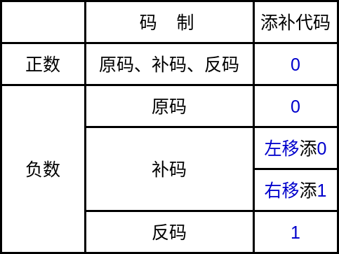  

如果是正数，原码、反码和补码，机器数形式都相同  
符号位为0，在真值的数值位部分都能够保存到计算机当中为前提，数值位部分和真值的数值位部分是相等的
在这种情况下，无论是左移还是右移，为了保障移位后的结果和真值相同，添补代码是都用0，因为在正数当中，0代表的就是0  

如果是负数，原码、反码和补码机器数的形式是不一样的  
原码，符号位为1，数值部分和真值是相同的。进行左移和右移，添加的都是0  
> 如果进行左移操作，符号位是不变的，数值的最高位被遗丢，右侧的最低位被空出来，在这个位置添0  
如果进行右移操作，符号位保持不变，最右侧的最低位被遗丢，左侧流出空位，这个最高位添0  

如果是反码的情况与原码相似，因为负数的反码，反码当中出现的1表示真值的0，反码当中出现的0表示真值的1  
要进行左移或右移操作，真值部分空出的位置需要添0，因此在反码当中，无论是左移空出的位置还是右移空出的位置，都添1来表示真值对应的0  

对于补码：  
设 x = -0.x1x2...xk100...000  
  

> 根据补码变换的规则，符号位是1，然后每位取反  
注意，取反之后的数字从100...000变成了011...111  
此时，每位取反之后，末位加1，对于后面的数字：  
最终变成100...000，与之前一样  

这里x1到xk都取反  
后面的数字100...000，都是一样的  
右侧从1开始后面都是0的情况下，原码是一样的  
左侧每位都取反，以反的形式出现，如果真值为1，补码的对应位置就是0，如果真值为0，补码的对应值就是1  
为了保持移位的效果与真值移位的效果相同  
此时在真值的位置需要添0，所以相对应的补码位置就添1  

**在补码的左移过程中，右侧的低位空出来的位，添0**  
**在补码的右移过程中，左侧的高位空出来的位，添1**  

**移位的过程当中，依然需要保持符号位不动，移位的仅仅是数值位部分**  

举例：  
设机器数字长为8位（含1位符号位），写出A=+26时，三种机器数左、右移一位和两位后的表示形式及对应的值，并分析结果的正确性  
$\because$ A = +26 = +11010  
$\therefore$ A原 = A补 = A反 = 0,0011010  
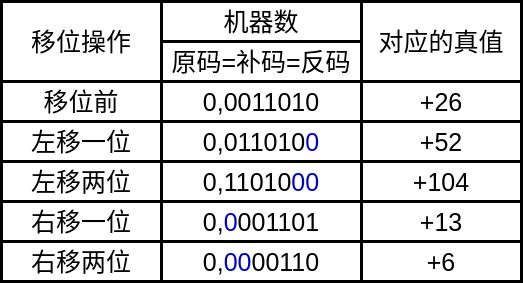  

> 实际上，按照除以2的规则，右移两位的值应该是6.5  
但是在计算机当中，这里机器是一个定点机，数据表示是定点数据表示，小数点固定在数值位的最后  
所以右移两位的值变成了6  

----
设机器数字长为8位（含1位符号位），写出A=-26时，三种机器数左、右移一位和两位后的表示形式及对应的值，并分析结果的正确性  
$\because$ A = -26 = -11010  
$\therefore$  
**原码**  
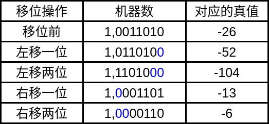  

**补码**  
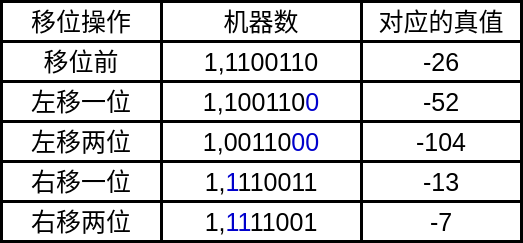  

**反码**  
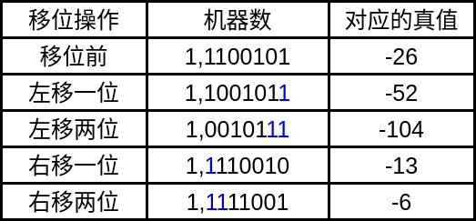  
> 右移两位，由于最右侧被移掉的是0，这个0由于是反码表示  
对应了真值里面的1，移掉一个最低位的1，就是数值部分-1  
相当于对这个数值减1，再除2  

## 算术移位的硬件实现  

### 真值为正  

**进行左移**

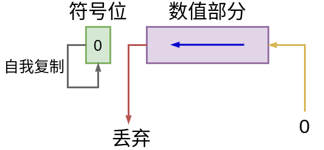  
> 原码、反码、补码添位的规则相同，最高位扔掉，最低为补0，符号位不变  

**进行右移**  

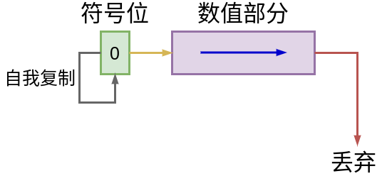  

> 最右侧的数值位扔掉，最左侧空出的位置添0  
由于符号位也是0，可以将符号位进行自我复制的同时，符号位移到数值位的最高位  

### 真值为负  

如果是负数，原码、反码和补码移位规则不同，需要分别进行分析  

#### 负数的原码  

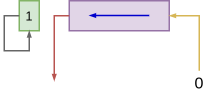  

> 负数的原码如果需要左移，高位移丢，地位补0，符号位不动  

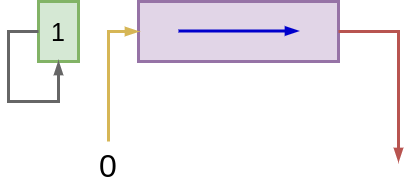  

> 负数的原码如果需要右移，符号位不动，高位补0，低位移丢  

#### 负数的补码  

  
> 左移，高位移丢，低位补0，符号位不动  

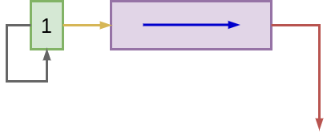  
> 右移，高位添1，低位移丢，符号位不动  
> 由于符号位也是1，可以将符号位进行自我复制的同时，符号位移到数值位的最高位

#### 负数的反码  

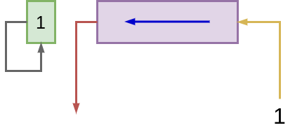  
> 左移，高位移丢，低位补1，符号位不动  

  
> 右移，高位添1，低位移丢，符号位不动  
> 由于符号位也是1，可以将符号位进行自我复制的同时，符号位移到数值位的最高位

#### 移位过程当中出现的问题  

**在移位过程当中，如果1被移丢，会发生什么**  

||真值为正|负数的原码|负数的补码|负数的反码|
|:----:|:----:|:----:|:----:|:----:|
|左移丢1|出错|出错|正确|正确|
|右移丢1|影响精度|影响精度|影响精度|正确|

**左移**  
1. 真值为正，左移将最高位的1移丢，这个最高位的1对应真值最高位的1  
移丢之后会出错  

2. 真值为负，原码左移1位，出错  

3. 真值为负，补码左移1位，由于这个1对应了真值的0，不会出错
    > 如果这个数是0，对应了真值的1，反而会出错  

4. 真值为负，反码左移1位，由于这个1对应了真值的0，不会出错  

**右移**  
1. 如果真值位正，右移将最低位的1移丢，这个最低位的1对应真值最低位的1，也就是值1  
移丢之后会影响精度  

2. 真值为负，原码右移1位，影响精度  

3. 真值为负，补码右移1位，影响精度  

4. 真值为负，反码右移1位，由于这个1对应了真值的0，不会出错  

## 算术移位与逻辑移位的区别  

算术移位&emsp;&emsp;有符号数的移位  
逻辑移位&emsp;&emsp;无符号数的移位  

> 算术移位，符号位不动，符号依然保持原来的符号  
所以算术移位是有符号数的移位  

**所以两者之间进行移位时有很大差异**  
> 算术移位有符号位，符号位需要保持不动  
逻辑移位是无符号数，没有符号位，所有的数值位都会参加移位运算  

> 右符号数的移位称为算术移位  
  无符号数的移位称为逻辑移位  

逻辑左移&emsp;&emsp;低位添0，高位移丢  
&emsp;&nbsp;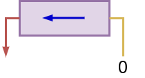  

逻辑右移&emsp;&emsp;高位添0，低位移丢  
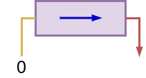  

例如：  
对机器数&emsp;01010011 进行操作  

逻辑左移&emsp;10100110  

算术左移&emsp;00100110
> 对于算术左移，机器数最高位的0表示符号位，所以符号位不参与移位，对数值位进行移位操作
在移位的过程当中，最高位的1被丢弃，为了能够记录被丢掉的最高位，移位过程当中，还可以使用带进位的移位  
将最高位移位到进位位当中

例如：  
对机器数&emsp;10110010 进行操作  

逻辑右移&emsp;01011001  

逻辑左移&emsp;01101100  
> 这里假设用补码形式表示  

# 加减运算  

## 补码加法运算公式  

### 加法  
整数：[A]补 + [B]补 = [A+B]补&emsp;(mod 2n+1)  
小数：[A]补 + [B]补 = [A+B]补&emsp;(mod 2)  

### 减法  
&emsp;&emsp;&emsp;A-B = A+(-B)  
正数：[A-B]补 = [A+(-B)]补 = [A]补 + [-B]补&emsp;(mod 2n+1)  
小数：[A-B]补 = [A+(-B)]补 = [A]补 + [-B]补&emsp;(mod 2)  

对整数来说，如果 mod 2n+1  
不管是正数还是负数，它的补码形式，都可以使用 x + 2n+1 的形式来表示  
根据这个规则，就不需要区分加数还是被加数，是正数还是负数  

同理，小数使用 x + 2 的形式来表示，不需要区分加数还是被加数，是正数还是负数  
> x 如果是正数，多出来的高位会被自动丢弃

对于补码的运算，不管是现在的加减法还是乘法操作，都要连同符号位一起进行计算  

在加减法当中，需要连同符号位一起相加，和的符号通过计算过程自动产生，符号位产生的进位，自动丢弃  

### 例题

举例：  
设 A = 0.1011, B = -0.0101  
求[A+B]补  

解：&emsp;[A]补 = 0.1011  
&emsp;&emsp;&emsp;[B]补 = 1.1011  

[A]补 + [B]补 = 10.0110  

$\therefore$ 符号位产生的进位自动丢弃  

$\therefore$ [A]补 + [B]补 = 0.0110  

---------

设 A = -9, B = -5  
求[A+B]补  

解：&emsp;[A]补 = 1,0111  
&emsp;&emsp;&emsp;[B]补 = 1,1011  

[A]补 + [B]补 = 11,0010  

$\therefore$ 符号位产生的进位自动丢弃  

$\therefore$ [A]补 + [B]补 = 1,0010 = [A+B]补  

> 验证：A+B = -1110，  

在将数字放到计算机当中，必须要考虑寄存器的长度，或者存储单元的长度，也就是机器数的字长  
> 例如，将-9变成机器数的时候，补码方式表示  
实际上是假设了数值位是4位，符号位占1位  
同样，A = 0.1011 变成A的补码，也是一种机器数的形式，在这种形式当中，依然是假设了数值部分是4位，符号位是1位  

> 在这里没有考虑机器数的长度  

所以这里必须要考虑机器数的长度，以及符号位和数值位的长度  

------

设机器字长为8位（含1位符号位），且 A = 15, B = 24, 用补码求 A - B  

解：&emsp;A = 15 = 0001111  
&emsp;&emsp;&emsp;B = 24 = 0011000  
&emsp;&emsp;&emsp;[A]补 = 0,0001111  
&emsp;&emsp;&emsp;[B]补 = 0,0011000  
&emsp;&emsp;&emsp;[-B]补 = 1,1101000  
&emsp;[A]补 + [-B]补 = 1,1110111 = [A - B]补  
&emsp;$\therefore$ A - B = -1001 = -9  

-----

设 x = 9/16，y = 11/16，用补码求x+y  

如果通过上面求小数的方法，可以求出：  
&emsp;&emsp;x + y = -0.1100 = -12/16  
这很明显是错的，正确的应该位20/16，这个值的大小超过了1，超过了小数定点机能够表示的范围  
> 原因就是在运算是，由于在运算时，符号位是参与运算的，所以这里两个正数进行相加时，符号位变成了1  
这种情况为**溢出**  

-----

设机器字长为8位（含1位符号位），且 A = -97，B = +41，用补码求A - B  

如果使用补码规则进行运算：  
&emsp;&emsp;A-B = +1110110 = +118  
这依然是一个错误的结果，正确的值应该为-138  
这里机器字长为8位，含有一位符号位为整数型的定点机，用补码表示的话，其表示范围为：  
&emsp;&emsp;-128~127  
这里正确的计算结果为-138，超出了这种机器数表示方式能够表示的范围  
这仍然是一种溢出，为上溢  

### 溢出判断

#### 一位符号位判断溢出

一个正数、一个负数，如果进行加法运算，不可能会发生溢出  
> 因为正的机器数、负的机器数都是在计算机当中进行表示的，本身不会发生溢出  
运算结果等于能够通过机器数表示出来的数  

参加操作的两个数（减法时即为被减数和“求补”以后的减数）符号相同，其结果的符号与原操作数的符号不同，即为溢出  
> 加法操作的两个操作数都是正数或都是负数，也就是符号相同，加法的结果的符号和原来的操作数不同，这就是溢出  

**硬件实现**  
最高有效位的进位 $\bigoplus$ 符号位的进位 = 1  
> 最高有效位的进位：数值的最高位在运算过程当中，产生的进位  
与符号位产生的进位进行异或  
异或：不相同为1，相同为0  

这两个进位如果不相同，就可以断定发生了溢出
两个加数相加  
> 如果是两个正数，符号位都是0  
数值的最高位如果产生了进位，这个进位就是1，并且这个进位会进到符号位  
符号位由于原来两个值都是0，虽然由数值位进位上来一个1，但并不会使得符号位的进位也为1，也就是进位为0  
这时就产生了溢出  

> 如果两个操作数都是负数，数值的最高位，向上没有进位  
因为两个操作数都是负数，两个符号位都是1，做加法运算时，这两个符号位就会产生进位，造成符号位变成0  
此时，就产生了溢出  

> 如果一个正数和一个负数相加，符号位一个是0，一个是1  
最高有效位如果产生进位  
因为符号位当中也有一个位是1，这两个1同样也会向上产生进位  
这两个进位是相同的，就不会产生溢出  
如果最高有效位没有产生进位  
符号位也就不会产生进位，不会产生溢出  

如：  
&emsp;&emsp;&emsp;1 $\bigoplus$ 0 = 1  
&emsp;&emsp;&emsp;0 $\bigoplus$ 1 = 1  
有溢出  

&emsp;&emsp;&emsp;0 $\bigoplus$ 0 = 0  
&emsp;&emsp;&emsp;1 $\bigoplus$ 1 = 0  
无溢出  

如果使用一位符号位来判断溢出，在硬件配置上，就需要记录符号位的进位，要记录最高有效位的进位，将这两个进位送入到异或电路  
如果异或电路的输出等于1，就将溢出标志置1，表示发生了溢出
如果溢出标志位0，表示没有发生溢出  

#### 两位符号位判断溢出

假设现在是纯小数的定点机当中的加法运算  

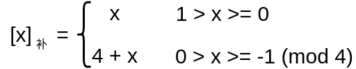  

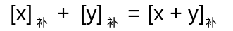  

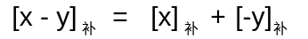  

结果的双符号位 `相同` &emsp;&emsp;&emsp;&emsp;未溢出  
结果的双符号位 `不相同` &emsp;&emsp;&emsp; 溢出  
> 例如，符号位为10或01  
在这种情况下，最左侧的符号位是真正的符号位  
最右侧的符号位实际上是数值运算的溢出部分  

**最高符号位代表真正符号**  

> 将补码的模由2改成4  
这样，如果x在0和1之间，它的补码就用x本身来表示  
如果x在0和-1之间，补码使用4+x表示  
这种形式的补码，要设置两位符号位  
即使x大于0，也在小数点前面加2个0，然后是小数点，数值部分和x相同  
如果是负数，采用四位模，经过这种变换，数值的符号位就变成两个1，然后是小数点，后面数值部分每位取反，末位加1  

----

如果是整数  
原来是使用2n+1 作为整数的模  
如果采用双符号位  
模就需要变成2n+2 

-----

小数可以以2为模，以4为模，以8为模，以2k为模  
如果以2k为模，补码形式符号位部分就占k位  

整数可以用2n+m 为模，m为从1开始的任何一个正整数  
如果以2n+m 为模，补码形式符号位部分就占m位  
> 正数的补码符号位就是m个0  
负数的补码符号位就是m个1  

#### 补码加减法的硬件配置  

A、X均 n+1 位  
核心就是 n+1位的加法器 ，由它完成两个补码的加法运算  
另外有两个寄存器：  
* 模型机当中的ACC(或A)，里面保存的是被加数  
* 模型机当中的X，里面保存的是加数或被减数  

GA和GS 是两个标记  
如果做加法，将GA置1  
如果做减法，将GS置1  
用减法标记GS控制求补逻辑  

为了支持减法运算，在减法运算当中，需要完成从B的补码到-B的补码的转换  
所以这个电路当中还有求补控制逻辑  
求补控制逻辑的作用：如果是减法运算，X当中保存的数据，就将其每位取反（包括符号位）  
> 对X当中的数进行求补运算，只需要在加法器和X寄存器之间加一个反向器就可以解决  
末位加1，就通过低位送来的进位，将其置1，来实现末位加1的操作

# 乘法运算  

## 笔算乘法的分析  

A = -0.1101 &emsp;&emsp;&emsp; B = 0.1011  

> 由于计算机当中的数是二进制数，乘的过程当中产生的部分积，要么是被乘数本身，要么是0  
所以比笔算乘法简单  

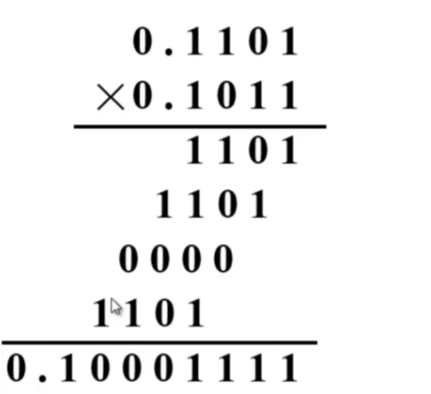  

通过将A和B的数值部分做乘法  
从最低位开始，乘数的最低位是1，那么第一个位积就是1101  
然后乘数的第二位是1，位积就是1101  
乘数的第三位是0，位积就是0000  
乘数的最后一位是1，位积是被乘数的数值部分  

可以看到，第二次的位积相对于第一次的位积，左移了一位  
依次类推，逐个左移一位  
最后完成四个位积的累加，就得到了乘法的数值部分：0.10001111  
根据这个值，就可以计算出A \* B = -0.10001111  乘积的符号通过心算得出  

这里数值部分是通过乘法规则计算得出  
符号是负值，因为参加运算的两个数，一个是正数一个是负数  

运算步骤：  
1. 符号位单独处理  
2. 乘数的某一位决定是否加被乘数  
3. 4个位积一起相加  
4. 乘积的位数扩大一倍  
> 原来乘数和被乘数的位数都为4位，现在乘积位8位  

符号位单独处理在计算机当中很好实现  
如果要实现原码的乘法，去处理符号位时，利用一个异或电路就可以完成符号的处理  

乘数的某一位决定是否加被乘数在计算机当中也很好实现  
可以将乘数放到移位寄存器当中，每判断一位，最低位是否等于1  
判断完之后将这个移位寄存器的值右移一位  
这样下次判断依然判断最低位  

通过多次累加的方式将4个位积一起相加  
被乘数的位置不动，位积每次相加时，右移一位，来替代被乘数左移一位，加法的效果是一样的  
每次判断完最低位，来决定是否相加，进行移位加法  
经过4个加法和移位，就可以得到最终积的数值部分  

乘积的位数扩大一倍在计算机当中也很好解决  
用两个寄存器来保存乘积的值  

## 笔算乘法的改进  

A \* B = A \* 0.1011  
&emsp;&emsp;&nbsp;&nbsp;= 0.1A + 0.00A + 0.001A + 0.0001A  
&emsp;&emsp;&nbsp;&nbsp;= 0.1A + 0.00A + 0.001(A + 0.1A)  
&emsp;&emsp;&nbsp;&nbsp;= 0.1A + 0.01[0\*A + 0.1(A + 0.1A)]  
&emsp;&emsp;&nbsp;&nbsp;= 0.1{A + 0.1[0\*A + 0.1(A + 0.1A)]}  
&emsp;&emsp;&nbsp;&nbsp;= 2-1{1\*A + 2-1[0\*A + 2-1(1\*A + 2-1(1\*A + 0))]}  

> 这里的0.1中的1是二进制数中的1，所以0.1在二进制当中可以换成2-1  
其中，最后的0是补进来的，表示进行加法操作的时候，给出的累加和的初始值  

> (1\*A + 0)中的1表示乘数当中最后一个数值位  
往左的第二个1表示乘数当中的倒数第二位  
依次类推  

> 这里的2-1 可以通过将部分积右移一位来实现  

部分积的初始值为0
1. 第一次操作，因为乘数的最低位等于1，所以要加上被乘数  
2. 加完之后对乘数进行一次移位操作，得到新的部分积  
3. 部分积 + 被乘数  
.  
.  
.  

最后一步： 右移一位，得结果  
> 这里会做n次加法，n次移位  
n是数值部分的位数  
此时数值部分的位数是4位，所以实际上是做了n次加法，n次移位，一共是8步  

### 改进后的笔算乘法过程  

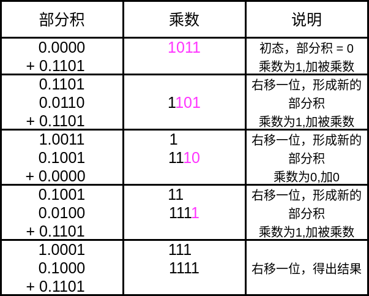  

> 部分积的初始值为0  
符号位单独处理  
乘数只写其数值部分  
需要根据乘数的最后一位，如果等于1，就需要将部分积加上被乘数的数值部分  
结果就是0.1101  
之后右移一位，即乘2-1  
右移之后，数值部分的最低位1移到了乘数部分的最高位，扔掉了乘数的最低位  

> 现在乘数部分只保留了3位与乘数有关的101，乘数的最高位1其实是部分积的最低位  
现在再判断乘数的最低位，依然是1，就需要加上被乘数的数值部分  
把加的结果右移一位，部分积被移出的部分还是在乘数当中，此时乘数剩两位  
最低位为0，所以对部分积加0  
加完之后再右移一位，形成新的部分积  
此时乘数有四位数，这四位数当中有三位数是部分积的低位，和乘数相关的就只剩下一位最低位1  
因为被乘数的最低位为1，仍然需要加上被乘数的数值部分  
最后再右移一位得到数值结果  

> 结果的符号位需要通过异或电路来获得  

### 小结

* 乘法运算可用加和移位实现  
n = 4，加4次，移4次  

* 由乘数的末位决定被乘数是否与原部分积相加，然后右移一位形成新的部分积，同时乘数右移一位（末位丢弃），空出高位存放部分积的低位  

* 被乘数只与部分积的高位相加  
> 在模型机当中，被乘数可以让在x寄存器当中，乘数放在乘商寄存器当中  
乘法的累加值的高位放到ACC寄存器
ACC寄存器的值，数值部分的长度随着右移而加长，低位被移到了MQ寄存器当中，MQ寄存器当中保存的乘数也在逐渐的进行右移  
每一次移位操作都会把乘数用过的最低位移丢，根据新的最低位来判断是否需要加上被乘数  
另外被乘数只适合与部分积的高位相加  
在模型机当中，被乘数只和ACC当中保存的部分积的高位相加，和MQ当中保存的部分积的低位不相加，不做操作  

* 从硬件上，需要3个寄存器
> X寄存器用于保存被乘数，ACC寄存器存放部分积的高位，MQ存放乘数的剩余部分以及部分积的低位  

> 三个寄存器当中X寄存器不需要拥有移位功能  
ACC和MQ寄存器需要有移位功能  

> 还需要一个全加器  
要实现被乘数与部分积高位相加的操作  
这个全加器需要n+1位，而不是2n+1位  
因为加法操作时加的是高位部分（n位被乘数)  

## 原码的乘法运算  

### 原码一位乘运算规则

以小数为例  
设[x]原 = x0.x1x2 ... xn  
[y]原 = y0.y1y2 ... yn  
> x0和y0是符号位，正数时为0，负数时为1  

在计算原码乘法时，用x乘y的原码，符号位单独计算，用异或来进行  
数值部分，乘法计算过程当中，只计算数值部分  
[x$\cdot$y] = (x0$\bigoplus$y0).(0.x1x2...xn)(0.y1y2...yn)  
&emsp;&emsp;&nbsp;=(x0$\bigoplus$y0).x\*y\*  

x\* = 0.x1x2...xn&emsp;&emsp;是x的绝对值  
y\* = 0.y1y2...yn&emsp;&emsp;是y的绝对值  

乘积的符号位单独处理：x0$\bigoplus$y0  
数值部分为绝对值相乘：x\*$\cdot$y\*  

### 原码一位乘递推公式

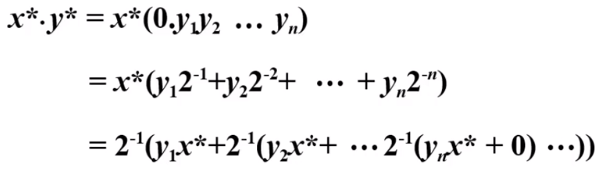  

首先部分积为0  
根据乘数的最低位来决定是否要加上被乘数的数值部分  
加完之后，同样需要右移一次形成新的部分积  
> yn要么等于1，要么等于0

从这个公式里面，依然是通过n次加法，n次移位，完成原码的乘法

## 补码的乘法运算  

# 除法运算  

