# 无符号数

## 数的相关概念

**数码**：数制中表示**基本数值大小**的**不同数字符号**

> 例如：
>
> 十进制有10个数码：0、1、2、3、4、5、6、7、8、9
>
> 二进制有2个数码：0、1
>
> 八进制有8个数码：0、1、2、3、4、5、6、7
>
> 十六进制有16个数码：0、1、2、3、4、5、6、7、8、9、A、B、C、D、E、F

---

**数位**：一个数中，每一个数字所占的位置

> 数码在这个数中的位置

> 以十进制 123 为例：
>
> 从左到右，从0开始递增
>
> 3的数位为：0（数位为0的数字为3）
>
> 2的数位为：1（数位为1的数字为2）
>
> 1的数位为：2（数位为2的数字为1）

---

**位数**：一个自然数中数位的个数

> 以二进制为例，就是这个二进制有多少位
>
> 1010：这个二进制数的位数为4

---

**基数**：数制所使用数码的个数

> 例如：
>
> 二进制的基数为2
>
> 十进制的基数为10

---

**位权**：数制中某一位上的1所表示的数值的大小（**所处位置的价值**）

> 例如：
>
> 十进制的123，1的位权是100，2的位权是10，3的位权是1

> 二进制中的1011，从右向左：
>
> 数位为0的位权为：1
>
> 数位为1的位权为：2
>
> 数位为2的位权为：4
>
> 数位为3的位权为：8

## 无符号数的相关概念

无符号数只有数值部分，将其转换为二进制，然后用计算机当中的寄存器或存储器，按照规定的长度保存到计算机当中  

如果无符号数保存在寄存器当中，寄存器的长度就直接反映了无符号数的表示范围  
> 假如无符号数保存在8位长的寄存器当中，表示范围就是： 
00000000~11111111 
用十进制表示就是：0~255  

> 假如无符号数保存在16位长的寄存器当中，表示范围就是： 
0000000000000000~1111111111111111 
用十进制表示就是：0~65535  

> 当寄存器位数为3时，此时可以表示的范围：000～111 
一共是23种组合 
当寄存器的位数为4时，此时可以表示的范围：0000～1111 
一共是24种组合 
当第4位的值为1，其余都为0：1000，这个4位数的值为24-1 
4位二进制：1010&emsp;=&emsp;1000&emsp;+&emsp;0010 
此时的十进制值可以表示为：24-1+22-1&emsp;=&emsp;10 
当4位都为1：1111&emsp;= 1000&emsp;+&emsp;0100&emsp;+&emsp;0010&emsp;+&emsp;0001 
也就是：24-1+23-1+22-1+21-1&emsp;=&emsp;15&emsp;=&emsp;2n-1  

**一共n位** 
**2n：n位可以表示的组合可能** 
**2n-1：第n位为1，其余都为0的值** 
**2n-1：n位都为1的值**  

# 有符号数

有符号数是指有正负号的数，包含符号部分和数值部分，一共两部分 
只需要将这两部分保存到计算机（寄存器或存储器）  

## 机器数和真值

保存在计算机当中的数，称为机器数 
平时用的数值，带有正负号的数值，称为真值  

在计算机当中，对于符号，需要对其进行数值化，用数据表示符号 
数的符号包括正号和负号，计算机当中的存储元件在存储信息时，可以存储低电平或高电平，将其形象的称为0或1 
就可以用0或1这两种状态来代表数字的符号 
例如数字：+0.1011 
保存在计算器当中，就需要保存三个部分的内容：  

* 数字的符号  
* 小数点的位置  
* 数值位  

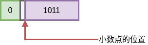  

符号可以用0或1来表示，假设用0表示正号，用1表示负号 
后面的1011直接存放在寄存器或存储器当中，表示数据的数值 
在计算机当中，没有专门的硬件来表示小数点，计算机中的小数点都是以约定的方式给出  

例如数字：-0.1011  

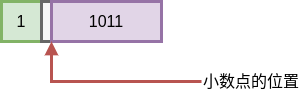  

例如数字：1011  

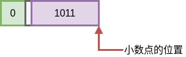  

例如数字：-1011
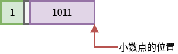  

**小数点是以约定的方式给出，没有任何硬件标识小数点的位置**  
> 小数点的位置在符号位的后面，就称为小数定点集
  小数点的位置在数值位的后面，就称为整数定点集  

## 原码表示法

**本质就是通过数值的绝对值，根据其正负号来决定符号位的值** 

### 整数

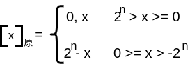  

> x为真值，n为数值位的位数
这里逗号不是小数点，只是用于方便阅读，将符号位标识出来，在计算机中不存储这个逗号  

**当x为正数时，遵循符号位为0，所以就只需在前面加上符号位即可**
**当x为负数时，遵循符号位为1，所以就只需在原负数的数值部分的前面加上1即可**  

> 如果此时的数值位为 4 位
>
> 这里由于x是负数，所以需要减去这个负数，也就是加上这个负数的数值部分，再在这个数值部分前面加1即可  

例如：
x = +1110            原码：0,1110  

> 最左边的0表示符号位，说明这个数据是一个正数或大于等于0的数  

x = -1110            原码：24 + 1110 = 1,1110  
> 这里符号位为1，再加上原数的绝对值，表示负数  

**原码表示法是带符号的绝对值表示**  

---------

### 小数

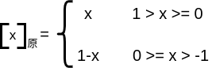  

小数的值在[0,1),他的原码就是真值本身  
> 用小数点前面的0代表是一个正数

小数的值在(-1,0]，就将小数点前面的那一位作为符号位，符号位的值为1
数值位一样

例如：
x = +0.1101             原码：0.1101  

> 数值部分小数点前的0表示小数点前面的第一位是0值
  原码部分小数点前的0表示这个数的符号  

x = -0.1101             原码：1-(-0.1101)=1.1101  

> 用小数点将符号位和数值部分隔开
  数据真的存放到计算机当中，小数点在计算机当中不需要存储，这里仅仅为人阅读方便加上来

### 原码表示的问题

------------

求 x = 0 的原码：  

[+0.0000]原 = 0.0000  

[-0.0000]原 = 1.0000  

[+0]原 = 0,0000  

[-0]原 = 1,0000  

所以根据表示得出：[+0]原 != [-0]原  

-------------

用原码作加法时：  

|要求|数1|数2|实际操作|结果符号|
|:--:|:--:|:--:|:--:|:--:|
|加法|正|正|加|正|
|加法|正|负|减|可正可负|
|加法|负|正|减|可正可负|
|加法|负|负|加|负|  

同样是加法的过程，如果用原码表示，可能作加法，也可能作减法
对运算器来说是比较麻烦的  

-----------

### 引出补码
1. 需要解决0有两种表示的方式
1. 需要找到一个与负数等价的正数来代替这个负数，使得 实际的`减` 操作 ————> 实际的`加` 操作  

> 不管是加法运算还是减法运算，在运算器当中都统一成加法运算  

## 补码表示法

### 补的概念

对于时钟： 
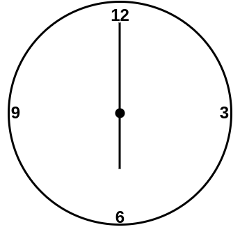  

此时现在的时间为6点，需要将时钟调整到3点
有两种调整方法：

1. 逆时针：  
> 假设逆时针为减法操作，从6点调整到3点
  逆时针拨动3个小时
  此时只需要：6-3=3

2. 顺时针：
> 假设顺时针为加法操作，从6点调整到3点
  顺时针拨动9个小时
  此时只需要：6+9=15

虽然逆时针的运算和顺时针的运算最后的值分别为：3、15
但是时钟有一个特性：时间显示**以12为模**

> 如果显示的时间到12，实际上就归0，接着向1运动

所以对于顺时针运算后的值为15，在时钟上就显示为：15-12=3
时钟最终就变为3点

所以像时钟这样的，有模的，能够记录数据的设备
以12为模，在这类设备上，可以用+9代替-3
就称+9是-3以12为模的**补数**，减3和加9会得到同样的效果
记作：-3 $\equiv$ +9（mod 12）
同理：-4 $\equiv$ +8（mod 12）
同样：-5 $\equiv$ +7（mod 12）
从而将减法变换为加法  

结论：
**一个负数加上 “模” 即得该负数的补数**
**一个正数和一个负数互为补数时，它们绝对值之和即为模数**  

计算机中的数据存储设备和时钟相似

例如需要存放一个正数，并且规定存放正数的寄存器的位数是4位
也就意味着对这个寄存器进行计数时，这个计数器的模为16
一旦进行加法操作时，值大于或等于16，进位部分将会**自动丢掉**

例如：（mod 16）1011 ————> 0000
通过加法：1011 + 0101 = 10000 $\equiv$ 0000

> 因为计数器是4位计数器，现在得到的值是5位的值，最高位的1就会自然被丢掉  

也可以通过减法：1011 - 1011 = 0000  

可见 -1011 可用 +0101 代替
记作：-1011 $\equiv$ +0101（mod 24）
同理：-011 $\equiv$ +101（mod 23）  

推出：对于十进制数值 -0.1001 $\equiv$ +1.0111（mod 2）  

**通过补数，可以将减法替换为加法**  

### 正数的补数即为其本身

两个互为补数的数：-1011和+0101（mod 24）
分别加上模 +10000
结果为：+0101和+10101  

> 这里+10101因为最多表示四位信息，就自动丢弃最高位的1  

结果仍互为补数：-1011 $\equiv$ +0101（mod24）  和  +0101 $\equiv$ +0101 （mod24）

就会引出一个问题：-1011 $\equiv$ +0101 和 +0101 $\equiv$ +0101
这个补数+0101究竟是用于表示+0101还是-1011

简单的解决方法就是：
0,0101 用来表示+0101（正数的补数）
1,0101 用来表示-1011（负数的补数）  

> 符号位和数值位用逗号分开  

根据上面的简单解决方法，现在的问题就是怎么实现：
在符号位部分，对正数的补数添加一个0，对负数的补数添加一个1  

在之前求补数时，使用的是24的模
此时负数的补码表示为1,0101
对于0101，如果要变成10101，就需要再加上一个24  

一个很好的解决方案就是将模提升到25  

此时对于-1011的补码：100000-1011=10101
此时对于+0101的补码：100000+0101=100101 $\equiv$ 00101  

> 只有5位表示位，自动舍去最高位1  

### 补码的定义

整数：
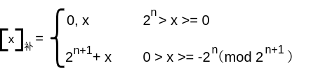  

> x为真值，n为正数的位数  

例如：
x = +1010&emsp;&emsp;&emsp;&emsp;补码：0,1010
x = -1011000&emsp;&emsp;&emsp;&emsp;补码：27+1 + (-1011000)=1,010100  

> 100000000 - 1011000 = 10101000
  用逗号将符号位和数值部分隔开

小数：  

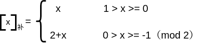  

真值，小数点后面的有效数字，想写多长就写多长
但是在计算机当中，x的补码是一个机器数，机器数有位数约定  

> 例如，真值数值部分是8位，机器数数值部分只能表示6位
  真值当中的最后两位就会被扔掉或舍入处理
  此时，补码的值和真值并不相同  

**所以我们存放的数据受到计算机硬件资源的限制**
**或计算机体系结构定义的数据长度的限制**  

例如：
x = +0.1110&emsp;&emsp;&emsp;&emsp;补码：0.1110
x = -0.1100000&emsp;&emsp;&emsp;补码：2 +（-0.1100000）= 1.0100000  

> 10.0000000 - 0.1100000 = 1.0100000
用小数点将符号位和数值部分隔开  

----------

**求补码的快捷方式**  

设 x = -1010  

[x]补 = 24+1 - 1010
=100000 - 1010
= 1,0110  

等同于：
[x]补 = 24+1 - 1010
=11111 + 1 - 1010
=10101 + 1
= 1,0110  

因为[x]原 = 1,1010
所以对于求x的补码也就是：
[x]原  除了符号位，原码的数值位都取反，末位加1
**前提条件是真值为负值**
否则，原码和补码形式都是一样的，符号位都是0  

**当真值为负时，补码可用原码除符号位，每位取反，末位加1求得**  

例如：  

---

已知[x]补 = 0.0001
求x
解：由定义得    x = +0.0001  

---

已知[x]补 = 1.0001
求x
由定义得
x = [x]补 - 2
= 1.0001 - 10.0000
= -0.1111  

---

对于[x]补 = 1.0001
求x还有另外的方法：
[x]补 ——> [x]原 = 1.1111
所以直接推出x = -0.1111  

---

例如：
已知[x]补 = 1,1110
求x
解：由定义得：x = [x]补 -24+1
= 1,1110 - 100000
= -0010  

---

对于[x]补 = 1,1110
求x还有另外的方法：
[x]补 ——> [x]原 = 1,0010
所以直接推出x = -0010  

---

**当真值为负时，原码可用补码除符号位，每位取反，末位加1求得**  

> 这里先取反再加1，是先减1再取反的逆运算，效果是一样的  

---

对于0：
机器给定5位：
真值：+0000&emsp;&emsp;原码：0,0000&emsp;&emsp;补码：0,0000
真值：-0000&emsp;&emsp;原码：1,0000&emsp;&emsp;补码：10,0000
真值：+0.0000&emsp;&emsp;原码：0.0000&emsp;&emsp;补码：0.0000
真值：-0.0000&emsp;&emsp;原码：1.0000&emsp;&emsp;补码：10.0000  

**对于负数的0，由于限定位数，自动舍弃最高位的1**
**形成0的补码形式只有一种**  

## 反码表示法

整数：  

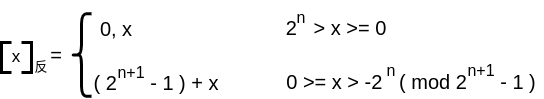  
> x为真值，n为正数的位数

反码也是一种机器数的表示形式，受到计算机对字长规定的限制以及存储资源的限制  

例如：
x = +1101&emsp;&emsp;&emsp;&emsp;反码：0,1101
x = -1101&emsp;&emsp;&emsp;&emsp;反码：（24+1 -1）- 1101 = 1,0010  

> 11111 - 1101 = 1,0010
  用逗号将符号位和数值部分隔开  

---

小数：  

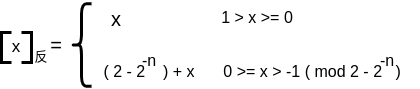  
> x为真值，n为正数的位数  

例如：
x = +0.1101&emsp;&emsp;&emsp;&emsp;反码：0.1101
x = -0.1010&emsp;&emsp;&emsp;&emsp;反码：（2-2-4）- 0.1010 = 1.0101  

> 1.1111 - 0.1010 = 1.0101
  用小数点将符号位和数值部分隔开  

---

[x]反 = 0,1110 &emsp;&emsp;&emsp;&emsp;x = +1110
[x]反 = 1,1110 &emsp;&emsp;&emsp;&emsp;x = [x]反 -（24+1 -1）= -0001  

> 1,1110 - 11111 = -0001  

---

求0的反码
x = +0.0000 &emsp;&emsp;&emsp;&emsp; [+0.0000]反 = 0.0000
x = -0.0000 &emsp;&emsp;&emsp;&emsp; [-0.0000]反 = 1.1111  

同理：对于整数：
[+0]反 = 0,0000 &emsp;&emsp; [-0]反 = 1,1111  

$\therefore$ [+0]反 $\neq$ [-0]反  

## 三种机器数的总结

1. 最高位为符号位，书写上用“,”（整数）或“.”（小数）将数值部分和符号位隔开  
2. 对于正数，原码=补码=反码  
3. 对于负数，符号位为1，其数值部分
    补码：原码除符号位外，每位取反末位加1
    反码：原码除符号位外，每位取反

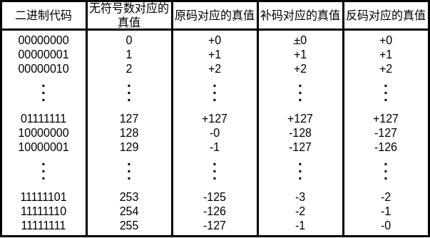  

---

**已知[y]补 &emsp;&emsp; 求[-y]补**  

设[y]补 = y0.y1y2 $\cdots$ yn  
> 这些y都是0和1  

第一种情况：
假设y是正数
$\therefore$ y0 = 0
$\therefore$ [y]补 = 0.y1y2 $\cdots$ yn
$\therefore$ y = 0.y1y2 $\cdots$ yn
$\therefore$ -y = -0.y1y2 $\cdots$ yn
$\therefore$ [-y]补 = 1.$\overline{y}$1$\overline{y}$2 $\cdots$ $\overline{y}$n + 2-n  

> $\overline{y}$1$\overline{y}$2 $\cdots$ $\overline{y}$n 表示为 y1y2 $\cdots$ yn 的补
  最后 +2-n 也就是 +1  

y的补码和-y的补码形式上的关系：
符号位相反，所有的数值位都相反，并且末位需要+1，才能从y的补码得到-y的补码
**[y]补连同符号位在内，每位取反，末位加1，即得[y]补**  

第二种情况：
假设y是负数
$\therefore$ y0 = 1
$\therefore$ [y]补 = 1.y1y2 $\cdots$ yn
$\therefore$ [y]原 = 1.$\overline{y}$1$\overline{y}$2 $\cdots$ $\overline{y}$n + 2-n
$\therefore$ y = -( 0.$\overline{y}$1$\overline{y}$2 $\cdots$ $\overline{y}$n + 2-n )
$\therefore$ -y = 0.$\overline{y}$1$\overline{y}$2 $\cdots$ $\overline{y}$n + 2-n
$\therefore$ [-y]补 = 0.$\overline{y}$1$\overline{y}$2 $\cdots$ $\overline{y}$n + 2-n  

> $\overline{y}$1$\overline{y}$2 $\cdots$ $\overline{y}$n 表示为 y1y2 $\cdots$ yn 的补  

**[y]补连同符号位在内，每位取反，末位加1，即得[y]补**  

## 移码表示法

在计算机内部数据的表示当中，补码表示很难直接判断其真值大小
例如：  
|十进制|二进制|补码|
|:---:|:---:|:---:|
|x = +21|+10101|0,10101|
|x = -21|-10101|1,01011|
|x = +31|+11111|0,11111|
|x = -31|-11111|1,00001|
> 此时，当使用补码进行数值大小的比较时
  会得到1,01011 大于 0,10101
  1,00001 大于 0,11111
  这是错误的  

此时，如果将之前补码的2n+1改为2n
也就是x + 25
+10101 + 100000 = 110101
-10101 + 100000 = 001011
+11111 + 100000 = 111111
-11111 + 100000 = 000001  

> 此时，在比较大小时，就是正确的  

### 移码定义

[x]移 = 2n + x（2n > x $\geq$ -2n）  
> x为真值，n为正数的位数  

移码在数轴上的表示
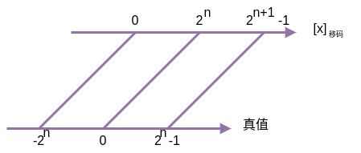  

例如：
x = 10100
[x]移 = 25 + 10100 = 1,10100  

---

x = -10100
[x]移 = 25 - 10100 = 0,01100  

> 用逗号将符号位和数值部分隔开  

需要注意：  
1. 不管是正数还是负数，都是加2n  
2. 这个定义只有整数形式的定义，没有小数形式的定义  
> 这点和移码在计算机的数据表示当中的作用有关
  **因为移码的大小很好判断，所以移码通常用来表示浮点数据表示的阶码部分**，阶码都是整数，所以移码的定义中，只给出了整数的定义，没有给出小数形式的定义  

### 移码和补码的比较

设 x = +1100100
[x]移 = 27 + 1100100 = 1,1100100
[x]补 = 0,1100100  

x大于0时，补码和移码也就是符号位不同，数值位完全相同  

---

设 x = -1100100
[x]移 = 27 - 1100100 = 0,0011100
[x]补 = 1,0011100  

x小于0时，补码和移码也就是符号位不同，数值位完全相同  

**移码和补码只差一个符号位，数值位完全相同**  

移码和补码之间的转换也就变得非常方便
只需要将相应的符号位加上一个非门进行取反，就从补码得到移码，从移码得到补码  

### 真值、补码和移码的对照表

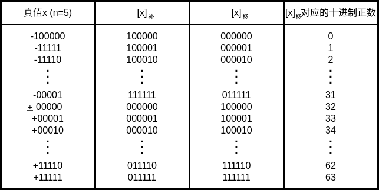  

### 移码的特点

当 x = 0 时，[+0]移 = 25 + 0 = 1,00000
&emsp;&emsp;&emsp;&emsp;&emsp;&nbsp;&nbsp;[-0]移 = 25 - 0 = 1,00000  

$\therefore$ [+0]移 = [-0]移  

> 如果机器的字长为6位，数值部分占了5位，符号占了1位
  n的值表示数值位的位数
  25需要表示出来就需要6位（100000），也便于区分符号  

当 n = 5 时，最小的真值为-25 = -100000
[-100000]移 = 25 - 100000 = 000000  

可见，最小真值的移码为全0  

**用移码表示浮点数的阶码**
**能方便地判断浮点数的阶码大小**

