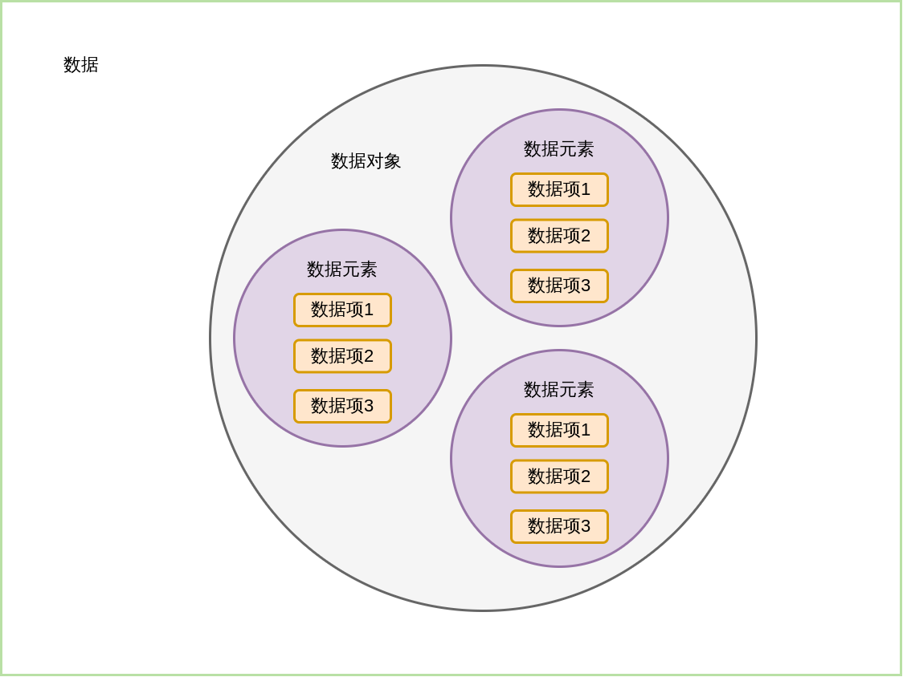

## 绪论

### 基本概念和术语

#### 数据
: 是描述客观事物的符号，是计算机中可以操作的对象，是能被计算机识别，并输入给计算机处理的符号集合  

> 不仅包括整型、浮点型这些数值类型，还包括字符及声音、图像、视频等非数值类型  

这里说的数据，其实就是符号，这些符号必须具备两个前提：
* 可以输入到计算机中
* 能被计算机程序处理

> 对于整型、实型等数值类型，可以进行数值计算  
> 对于字符数据类型，就需要进行非数值的处理  
> 而声音、图像、视频等其实是可以通过编码的手段变成字符数据来处理  

---

#### 导图
   

---

#### 数据元素
: 是组成数据的、有一定意义的基本单位，在计算机中通常作为整体处理，也被称为记录  

>例如：  
>在人类中，人就是数据元素  
>
>在出禽类中，牛、马、羊、猪、鸡、鸭等动物都是出禽类的数据元素  

---

#### 数据项
: 一个数据元素可以由若干个数据项组成  

> 例如：  
> 人这样的数据元素，可以有眼睛、耳朵、鼻子、嘴巴、手、脚这些数据项，也可以有姓名、年龄、性别、家庭地址、联系电话、邮政编码等数据项  
> 
> 具体有哪些数据项，需要由所需要的系统来决定  

数据项是数据不可分割的**最小单位**  

---

#### 数据对象
: 是性质相同的数据元素的集合，是数据的子集  

性质相同是指数据元素具有相同数量和类型的数据项  

> 例如：  
> 人都有姓名、生日、性别等相同的数据项  

因为数据对象是数据的子集，并且在实际应用中，处理的数据元素通常具有相同的性质  
所以在不产生混淆的情况下，都将数据对象称为数据  

---

#### 数据结构
: 不同数据元素之间不是独立的，而是存在特定的关系，就将这些关系称为结构  
