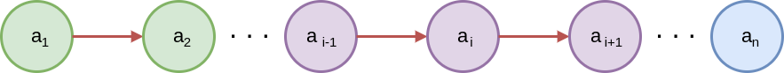

## 线性表

线性表  
: 零个或多个数据元素的有限序列  

序列  
: 元素之间是有顺序的  
若元素存在多个
* 第一个元素无前驱  
* 最后一个元素无后继  
* 其他每个元素都有且只有一个前驱和后继  


有限  
: 元素个数是有限的  
在计算机中处理的对象是有限的，那种无限的数列，只存在于数学的概念中  

---

使用数学语言定义

  

如果将线性表记为上图所示：
* a<sub>i-1</sub> 是 a<sub>i</sub> 的**直接前驱**
* a<sub>i+1</sub> 是 a<sub>i</sub> 的**直接后继**
* 线性表元素的个数 n（n >= 0）定义为**线性表长度**，当 n = 0 时，称为**空表**
* 在非空表中的每个数据元素都有一个确定的位置，如 a<sub>1</sub> 是第一个数据元素，a<sub>n</sub> 是最后一个数据元素，a<sub>i</sub> 是第 i 个数据元素，称 i 为数据元素 a<sub>i</sub> 在线性表中的位序


### 抽象数据类型

```cpp
ADT 线性表（List）
Data
    线性表的数据对象集合为（a1，a2，...，an）
    每个元素的类型均为 DataType
    其中，除第一个元素 a1 外，每个元素有且只有一个直接前驱，除最后一个元素 an 外，每个元素有且只有一个直接后继元素
    数据元素之间的关系是一对一的关系。
Operation
    InitList(*L)：初始化操作，建立一个空的线性表 L
    ListEmpty(L)：若线性表为空，返回 true，否则返回 false
    ClearList(*L)：将线性表清空
    GetElem(L, i, *e)：将线性表 L 中的第 i 个位置的元素值返回给 e
    LocateElem(L, e)：在线性表 L 中查找与给定值 e 相等的元素
                      如果查找成功，返回该元素在表中序号表示成功；否则，返回0表示失败
    ListInsert(*L, i, e)：在线性表 L 中的第 i 个位置插入新元素 e
    ListDelete(*L, i, *e)：删除线性表 L 中第 i 个位置元素，并用 e 返回其值
    ListLength(L)：返回线性表 L 的元素个数
endADT
```


### 顺序存储结构


